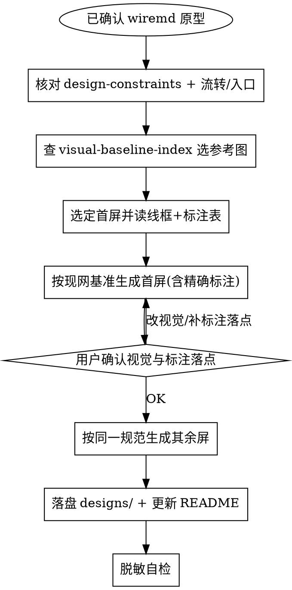

# 原型 → 蓝鲸设计稿（高保真简易稿）

> **定位**：接在 `prototype-wireframe` 之后。线框已对齐结构与交互后，用本 skill 产出符合蓝鲸规范、带编号交互标注的设计稿，供评审 / 交付设计师 / 研发对照实现。
>
> **不是**替代正式 Figma 视觉定稿；是「现网视觉对齐 + 交互标注完整」的简易高保真交付物。

## 与上游 skill 的关系

| 阶段 | Skill | 产物 |
|------|-------|------|
| 低保真线框 | `prototype-wireframe` | `screens/*.md` + `shots/*.png` + README |
| 蓝鲸设计稿 | **本 skill** | `designs/*.png`（含红色 ❶❷❸ 标注） |

若尚无线框原型 → 先走 `prototype-wireframe`，不要凭空出设计稿。

## 触发场景

- 用户说「出设计稿」「生成设计稿」「按蓝鲸规范出稿」「原型转设计稿」
- 用户确认线框后要求「补设计稿 / 补交互标注」
- 已有 `prototypes/output/<feature>/` 线框，需要 `designs/` 交付物

## 前置条件

1. 存在完整原型目录：`prototypes/output/<feature-name>/`
   - `screens/*.md`（线框真源 + `<!-- ❶ -->` callout）
   - `shots/*.png`（线框截图）
   - `README.md`（每屏编号交互说明表）
2. 用户已确认用哪套原型；未指定时列出候选并请用户选择。
3. **必须**使用现网截图视觉基准（见下一步「查索引选图」），不得只靠色板口头描述。
4. **必须**遵守通用设计约束：[design-constraints.md](design-constraints.md)（现网壳、遮罩、互斥、流转、入口、主旁路、标注落点、文档同步）。

## 工作流程



### 0a. 核对通用约束与流转（强制，出稿前）

打开并遵循 **[design-constraints.md](design-constraints.md)**，至少确认：

1. **流转**：多步是否留在同一入口语境；有无「下一步跳到互斥面板」
2. **入口**：维护/异常屏是否写清真实操作入口（非无入口说明书页）
3. **主旁路**：不选新能力时，步骤/按钮如何置灰；是否需要单独一稿
4. **容器**：Dialog 是否带遮罩；是否伪造现网不存在的壳

流转别扭 → **先改线框/README/spec**，再出设计稿。

### 0. 查索引选现网参考图（强制，每屏）

出任何一屏设计稿前，**必须**打开并遵循：

**[visual-baseline-index.md](visual-baseline-index.md)**

步骤：

1. 根据线框判断本屏 UI 模式（外壳 / Dialog / 侧滑 / 流程编辑 / 节点配置 / 全局变量 / 任务详情…）。
2. 在索引「按 UI 模式选图」表中选出 **2–5 张** `output/playwright/bkflow-engine-admin/*.png`。
3. 生成时把这些路径传入 `reference_image_paths`（顺序：外壳 → 主容器 → 弹层细节 → 本屏 `shots` → 已确认上一屏 `designs`）。
4. Prompt 写明：视觉必须贴近参考截图，禁止白顶栏、禁止用 checkbox 替代 `${x}` 等（见索引「易错对照」）。

未查索引、未传入现网参考图 → **禁止**声称设计稿已对齐蓝鲸现网。

### 1. 选定首屏

- 默认推荐该方案**最有代表性的主视图**，或用户指定的屏号。
- **必须先出 1 屏请用户确认**，再批量出其余屏。不要一次出完全部后再问。

### 2. 读取输入（每屏必做）

对目标屏同时读取：

1. `screens/NN-*.md` — 结构、控件、状态、`<!-- ❶ -->` 标注原文
2. `shots/NN-*.png` — 线框布局参照
3. README 中该屏的「编号 | 元素 | 交互说明」表 — 标注文案以表为准
4. **本屏选中的现网基准图**（来自步骤 0）— 外壳 / 容器 / 控件形态
5. （若有）已确认的上一屏 `designs/*.png` — 保持同系列风格

### 3. 生成设计稿（GenerateImage）

用图像生成工具产出**产品级 UI 截图观感**（非线框、非手绘），并满足：

**视觉（现网优先，色板兜底）**

- **以传入的 `bkflow-engine-admin` 截图为像素级风格基准**，色板见 [reference.md](reference.md)
- 主色 `#3a84ff`；正文 `#313238` / `#63656e`；次要 `#979ba5`
- 成功 `#2dcb56`、警告 `#ff9c01`、危险 `#ea3636`
- 边框 `#dcdee5`；浅底 `#f5f7fa`；圆角约 2px；扁平、无紫渐变、无玻璃拟态
- **顶栏为深色**（与现网一致），不是白顶栏
- 中文 UI；字体观感接近 PingFang SC / 微软雅黑

**内容**

- 结构、字段、状态、控件类型与线框一致（含成功 / 失败 / 异常态）
- 控件形态对齐现网：节点输出用 `${x}`、Dialog 按钮居中、侧滑按钮左下等（见索引易错对照）
- **Dialog 带半透明遮罩**；改造已有页时布局跟截图，不自创整页结构
- Mock 用业务语义数据，不用「测试1」「aaa」
- **主旁路**：新能力默认路径 +「不选新能力」时的置灰/单步确定（见 design-constraints §5）

**交互标注（强制，且必须精确落点）**

- 红色实心圆编号 ❶❷❸… + **细红引线**
- 旁注白底红框/红字短中文，文案对齐 README 交互表（可略压缩，不可丢关键规则）
- **落点规则（MUST）**：
  1. 每个编号的圆点或引线终点，必须落在文案所描述的**具体控件/区块**上
  2. 文案写「弹窗内 / 实时校验 / 下拉 / 底栏按钮」时，引线必须指向弹窗内对应区域，**禁止**只堆在图右侧、箭头悬空或指到无关表格
  3. 优先把编号圆点贴在目标旁（短引线），避免所有 callout 挤在远离目标的一列
  4. 生成后目视核对：编号 ↔ README 元素列 ↔ 图上落点 三者一致；不一致则重出该屏
- 标注是交付物一部分；**禁止**只出干净 UI 不带标注

**脱敏（强制）**

- 顶栏用户名用 `admin`，**禁止**真实人名 / 内部账号（参考图里的真实账号不得照抄）
- 空间名用 `演示空间 (100)`，**禁止**照抄参考图里的「xxx测试空间」
- 成员列表、凭证名等用通用业务假数据
- 生成后目视 + `strings` 扫描，确认无内部人名明文

详细色板、prompt 模板见 [reference.md](reference.md)；选图见 [visual-baseline-index.md](visual-baseline-index.md)。

### 4. 用户确认首屏

展示首屏后明确询问：

- 视觉（现网外壳 / 主色 / 组件形态 / 遮罩）是否 OK
- 交互标注是否齐全，**且每条引线是否指到正确控件**
- 流转与入口是否合理（有无跳互斥面板、维护屏有无入口）

用户要求改视觉或补标注落点 → 只改该屏重出，再确认。  
用户改流转/入口 → 先改 README/screens/spec（及 TAPD），再重出相关屏。  
用户确认 → 进入步骤 5。

### 5. 批量其余屏

- 同一视觉规范、同一标注落点标准、同一脱敏规则
- **同系列弹框锁定（MUST）**：若首屏已确认且为 Dialog/侧滑入口，后续屏必须把**已确认的 `designs/01-*.png` 放在 `reference_image_paths` 第一位**，复用同一弹框外壳（宽度/遮罩/标题栏/底栏），只改线框要求的内部内容。详见 [design-constraints.md](design-constraints.md) §2.1
- 每屏仍须：查索引选图 → 读 `screens` + README 表 → 生成；`shots` 只作内容结构，不作弹框外形
- Prompt 写明：`Reuse EXACT Dialog chrome from first reference; only change inner content`
- 可并行生成多屏；生成后与首屏并排目视，弹框外轮廓不一致 → 重出该屏
- 落盘文件名与线框编号对齐：`designs/NN-<name>.png`

### 6. 落盘与 README

```
prototypes/output/<feature-name>/
├── screens/
├── shots/
├── designs/                 # 本 skill 产出
│   ├── 01-<name>.png
│   └── ...
└── README.md                # 目录表增加 designs/ 一行
```

在 README「目录」表增加：

```markdown
| `designs/*.png` | 蓝鲸风格简易设计稿（含红色交互标注），基于线框 + 现网截图基准产出 |
```

可选：在各屏节落后增加「设计稿」链接。

### 7. 脱敏自检（提交前）

```bash
for f in prototypes/output/<feature-name>/designs/*.png; do
  strings "$f" | grep -iE 'danny|@tencent|woa\.com' && echo "LEAK $f"
done
```

有命中 → 重出该屏后再提交。

## 强制规则（MUST）

| 规则 | 说明 |
|------|------|
| **先有线框** | 基于 `prototype-wireframe` 产物，不凭空设计 |
| **先读通用约束** | 遵守 [design-constraints.md](design-constraints.md) |
| **先查索引选图** | 每屏用 [visual-baseline-index.md](visual-baseline-index.md) 选现网截图作 `reference_image_paths` |
| **先一后全** | 先出 1 屏确认，再批量其余屏 |
| **同系列弹框锁定** | 已确认首屏后，后续屏复用同一 Dialog/侧滑外壳（见 design-constraints §2.1） |
| **现网视觉** | 深色顶栏 / 侧滑 / Dialog+遮罩 / `${x}` 等对齐 `bkflow-engine-admin`；改造页不自创整页结构 |
| **互斥与流转** | 不叠开互斥面板；多步向导不跨语境跳转；事后入口与创建向导解耦 |
| **入口可感知** | 维护/异常屏标明真实操作入口 |
| **主旁路齐全** | 不选新能力时步骤/按钮置灰或单独出稿 |
| **标注精确落点** | 编号引线必须指向文案对应控件，禁止悬空或指错 |
| **改流转同步文档** | 同步 README/screens/spec（及 TAPD） |
| **脱敏** | 禁止真实内部用户名、真实人名空间名 |
| **编号对齐** | `designs/NN-*.png` 与 `screens/NN-*.md` 一一对应 |

## 反模式（禁止）

| 错误做法 | 正确做法 |
|----------|----------|
| 无线框直接出「漂亮 UI」 | 先完成 / 读取 wiremd 原型 |
| 不查索引、不传现网截图 | 每屏按索引选 2–5 张基准图 |
| 白顶栏 / checkbox 输出 / 自创整页布局 | 对照索引「易错对照」与参考图 |
| Dialog 无遮罩 | 半透明遮罩压暗背景 |
| 伪造现网不存在的面板壳 | 容器对齐截图/代码（Dialog / sideslider） |
| 互斥面板同屏叠开；向导下一步跳语境 | 同语境多步；事后入口单独成屏 |
| 维护态无入口的说明书拼贴页 | 图上/README 写清从哪点进来 |
| 只出「选了新能力」主路径 | 旁路置灰或单独一稿（如不聚合） |
| 一次出完全部再给用户看 | 首屏确认后再批量 |
| 后续屏另起一套弹框壳 | 锁定已确认 `designs/01` 外壳，只改内部 |
| 用线框 shot 当弹框外形基准 | shot 只定内容；外形跟已确认设计稿/现网 Dialog |
| 只出干净 UI、无交互标注 | 必须带 ❶❷❸ 与引线说明 |
| 标注堆在右侧、引线不指目标 | 圆点贴目标，文案与落点一致 |
| 改了流转只改图不改文档 | 同步 README/spec/TAPD |
| 顶栏照抄参考图真实账号 | 统一 `admin` / `演示空间 (100)` |

## 参考

- **通用设计约束（评审沉淀，必读）**：[design-constraints.md](design-constraints.md)
- **现网截图索引（选图必读）**：[visual-baseline-index.md](visual-baseline-index.md)
- 蓝鲸视觉 token、prompt 模板、自检清单：[reference.md](reference.md)
- 上游线框流程：`.ai/skills/prototype-wireframe/SKILL.md`
- 线框操作指南：`.ai/docs/guides/prototyping-workflow.md`
- 完整样例：`prototypes/output/space-config-redesign/designs/`、`prototypes/output/parallel-variable-aggregation/designs/`
