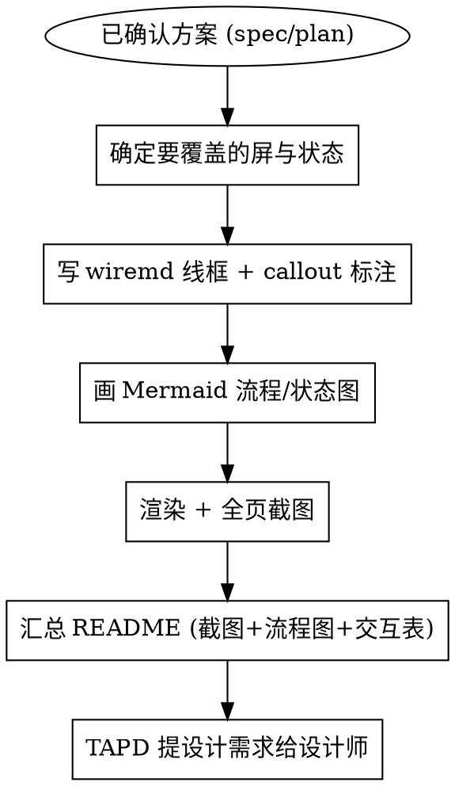

# 原型产出与提设计需求（wiremd 线框流程）

> **核心理念**：原型即纯文本。用 [wiremd](https://github.com/teezeit/wiremd) 写低保真线框（可 diff、可版本化、可导 Figma），用 [Mermaid](https://mermaid.js.org/) 画全局交互/状态流，用截图内嵌成一份可交付 README，再在 TAPD 提设计需求交给设计师出高保真稿。
>
> **低保真是刻意的**：线框只表达"结构 + 交互细节"，视觉（配色/字体/圆角/间距）交给设计师按蓝鲸 bk-magic-vue 设计系统定稿。

## 这是唯一方式

BKFlow 的原型产出统一走本流程。已废弃、不再使用：

- ~~`prototype-generator`（纯 HTML 工具包 `prototypes/base.html` + `bkflow-prototype.css/js`）~~
- ~~`ui-prototype`（直接改真实 Vue 页面当原型）~~

需求确认后想直接进入编码实现，属于 `writing-plans` / `test-driven-development` 的范畴，不再用"改 Vue 当原型"这种方式先行。

## 触发场景

- 用户说「做个原型」「设计一下页面」「出个交互稿」「给设计师出稿」「提设计需求」「prototype xxx」
- 一个方案（新页面 / 页面改版 / 新 UI 模块）需要交给设计师出高保真设计稿
- 需要在编码前，用可评审的形式对齐交互细节

## 前置条件

原型必须建立在**已确认的方案**之上，不要凭空发挥：

1. 若方案尚未成形 → 先走 `brainstorming` skill 澄清意图与方案。
2. 原型应对应一份 `docs/specs/YYYY-MM-DD-<topic>-design.md`（设计文档）和 / 或 `docs/plans/YYYY-MM-DD-<feature>.md`（实现计划）。原型 README 必须回链这两份文档。
3. 若涉及后端已有数据模型（改造类页面），先读后端 Model / Config / Serializer，按真实字段与 `choices` 设计控件，不靠猜。

## 工作流程



### 1. 确定要覆盖的屏与状态（全状态覆盖）

- 列出方案涉及的所有页面 / 面板 / 步骤，每个独立状态各出一屏。
- **禁止只出一个 Tab / 一种状态**：列表 + 详情、弹窗打开态、成功 / 失败 / 校验异常态都要单独体现。
- 每屏对应 `prototypes/output/<feature-name>/screens/NN-<name>.md` 一个源文件。

### 2. 写 wiremd 线框 + callout 交互标注

- 每屏一个 `screens/*.md`，用 wiremd 语法搭结构（容器 / 表单 / 表格 / 按钮 / 徽标）。
- **交互标注写成 `<!-- ❶ ... -->` HTML 注释**（渲染时 `--show-comments` 显示），用编号 ❶❷❸ 对应界面元素。
- 标注必须覆盖：保存时机（即时 / 失焦 / 手动）、校验规则与失败表现、状态指示（已配置 / 默认 / 异常）、危险操作二次确认、特殊控件行为、导航跳转。
- Mock 数据要有真实业务语义（流程名、空间、凭证、任务状态），不用「测试1」「aaa」「foo」。
- 语法细节、已知坑与规避见 `.ai/docs/guides/prototyping-workflow.md`。

### 3. 画 Mermaid 流程 / 状态图

- 用 `flowchart` 画全局导航与操作流，用 `stateDiagram-v2` 画验证 / 交互状态机，用 `flowchart LR` 画数据联动。
- 放进 README（GitHub 与多数 Markdown 预览器可直接渲染），补足线框无法表达的"跨屏流转"。

### 4. 渲染 + 全页截图

- 用 `npx @eclectic-ai/wiremd` 把 `screens/*.md` 渲染成 sketch 手绘风 HTML。
- 用 Playwright 对每屏做**全页截图**，存 `shots/*.png`。
- **HTML 产物不入库**：README 内嵌截图即可，需要交互查看时按 guide 命令现渲染。

### 5. 汇总可交付 README

`prototypes/output/<feature-name>/README.md` 包含：

- 概览 + 关联 spec / plan 链接（回链 `docs/specs/`、`docs/plans/`）。
- Mermaid 流程 / 状态图。
- 每屏一节：截图 + 编号交互说明表（`| 编号 | 元素 | 交互说明 |`）。
- 预览与渲染命令（引用 guide）。
- 补充说明（媒体位待补、视觉以 bk-magic-vue 为准、全状态覆盖情况）。

### 6. 在 TAPD 提设计需求给设计师

- 先用 `tapd-workitem-sync` 确定 / 获取本次功能的**父需求单** ID。
- 在其下创建一条**子需求单**指派给设计师，描述里包含：方案一句话背景 + spec / plan / 原型 README 的链接 + 关键交互要点 + 期望产出（高保真设计稿 / 交互稿）。
- 具体 TAPD 字段与创建方式见 `.ai/docs/guides/prototyping-workflow.md` 的「提设计需求」一节。

## 产物目录约定

```
prototypes/output/<feature-name>/
├── README.md          # 概览 + Mermaid 流程图 + 每屏截图 + 编号交互说明表
├── screens/           # wiremd 线框源文件（唯一真源，可 diff / 迭代 / 导 Figma）
│   ├── 01-<name>.md
│   └── ...
└── shots/             # 各屏全页截图（README 内嵌）
    ├── 01-<name>.png
    └── ...
```

- `screens/*.md` 是**唯一真源**：改一行重渲染即可，天然可版本化 diff、可 AI 迭代、可导出 Figma。
- `shots/*.png` 是展示用截图。
- HTML 不保存进仓库。

## 强制规则（MUST）

| 规则 | 说明 |
|------|------|
| **先有方案** | 原型基于已确认的 spec/plan，缺则先 brainstorming |
| **全状态覆盖** | 有几个 Tab / 步骤 / 状态就出几屏，含成功 / 失败 / 异常态 |
| **交互标注** | 每屏用 `<!-- ❶ -->` callout 标注交互，README 汇成编号说明表 |
| **纯文本真源** | 线框以 `screens/*.md` 为准，可 diff；HTML 不入库 |
| **真实 Mock** | 用接近真实业务的数据，不用占位符 |
| **先读后端** | 改造类页面先读 Model/Config/Serializer，按真实字段设计控件 |
| **回链文档** | README 回链对应 `docs/specs/` 与 `docs/plans/` |
| **提设计需求** | 产出后在 TAPD 建子需求单交付设计师，附全部链接 |
| **低保真** | 只表达结构与交互，视觉交给设计师定稿 |

## 反模式（禁止）

| 错误做法 | 正确做法 |
|----------|----------|
| 用旧 HTML 工具包 / 改 Vue 页面当原型 | 一律用 wiremd 线框流程 |
| 只出一屏让人脑补其他状态 | 每个状态各出一屏，全状态覆盖 |
| 交互只写文字、图上不标 | 用 `<!-- ❶ -->` callout 标在图上 |
| 追求高保真配色/像素 | 低保真线框，视觉留给设计师 |
| 把 HTML 产物提交进仓库 | HTML 现渲染，仓库只留 `screens/*.md` + 截图 |
| 产出原型就完事 | 必须在 TAPD 提设计需求闭环 |

## 参考

- 工具链、wiremd 语法速查、已知坑、渲染 / 截图 / Figma 命令、提设计需求模板：`.ai/docs/guides/prototyping-workflow.md`
- 通用 UI 设计原则：`.ai/skills/prototype-wireframe/reference/design-principles.md`
- TAPD 单据创建：`.ai/skills/tapd-workitem-sync/SKILL.md`
- 已跑通的完整样例：`prototypes/output/space-config-redesign/`（随空间配置改版特性分支入库）
