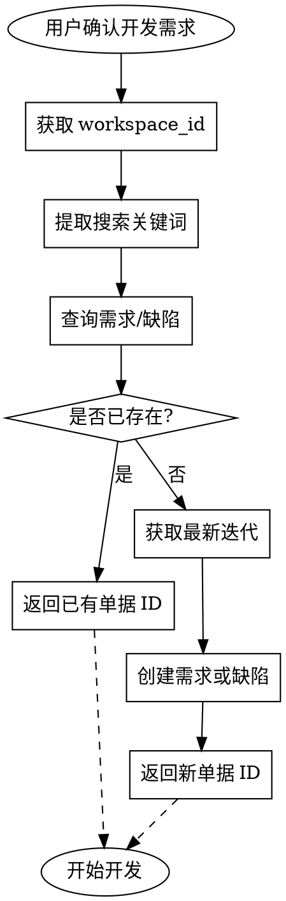

# TAPD 工作项同步

在用户确认开发需求后、开始开发前，确保 TAPD 当前空间中存在对应单据；若已存在则直接返回 ID，否则创建并返回 ID。

## 触发场景

- 用户确认了开发需求（或缺陷），即将开始实现
- 用户要求「创建 TAPD 需求」「同步到 TAPD」「确保有 TAPD 单据」
- 执行 writing-plans 或 executing-plans 前，需要关联 TAPD 单据

## 工作流程



### 1. 获取 workspace_id

- **用户指定**：若用户提供 `workspace_id` 或项目名，直接使用
- **项目推断**：bk-flow 项目对应 TAPD 空间 **BKFlow**，`workspace_id = 70120217`
- **未指定时**：调用 `get_user_participant_projects`，从返回列表中按项目名匹配

### 2. 提取搜索关键词

从开发需求中提取 2–5 个核心关键词，用于模糊匹配：

- 需求标题中的核心名词、动词
- 功能模块名、特性名
- 避免过短（如单字）或过长（整句）

示例：需求「构建研发 skills」→ 关键词 `构建研发skills` 或 `研发skills`

### 3. 查询是否已存在

**需求（stories）**：调用 `get_stories_or_tasks`：

```
workspace_id, options: { entity_type: "stories", name: "%关键词%", limit: 10 }
```

**缺陷（bugs）**：调用 `get_bug`：

```
workspace_id, options: { title: "%关键词%", limit: 10 }
```

**匹配逻辑**：遍历返回结果，若任一单据的 `name`（需求）或 `title`（缺陷）包含关键词，或关键词包含单据标题的核心部分，视为匹配。

### 4. 若已存在 → 返回单据 ID

- 使用**短 ID** 格式：完整 ID 形如 `1070120217131972327`，短 ID 为后 9 位 `131972327`
- 返回格式：`TAPD 单据 ID：131972327`
- 可附带链接：`https://tapd.woa.com/70120217/prong/stories/view/131972327`

### 5. 若不存在 → 创建单据

**获取最新迭代**：调用 `get_iterations`：

```
workspace_id, options: { status: "open", order: "enddate desc", limit: 5 }
```

取第一条（enddate 最晚的开放迭代）的 `id` 作为 `iteration_id`。

**创建需求**：调用 `create_story_or_task`：

```
workspace_id, name: "汇总后的需求标题", options: { entity_type: "stories", iteration_id, description }
```

**创建缺陷**：调用 `create_bug`：

```
workspace_id, title: "汇总后的缺陷标题", options: { iteration_id, description }
```

**汇总规则**：

- 需求：将开发需求要点归纳为 1–2 句标题 + 可选详细描述
- 缺陷：将问题现象、复现步骤、预期/实际结果归纳为标题 + 描述

### 6. 返回新单据 ID

- 从创建返回的 `data.Story.id` 或 `data.Bug.id` 提取短 ID
- 返回格式同上，并说明「已创建新需求/缺陷」

## 单据类型判断

- 用户明确说「缺陷」「bug」「问题」→ 创建缺陷
- 默认 → 创建需求（stories）

## 项目 workspace 映射

| 项目 | TAPD 空间名 | workspace_id |
|------|-------------|--------------|
| bk-flow | BKFlow | 70120217 |

其他项目可通过 `get_user_participant_projects` 查询。

## 输出格式

无论找到或新建，最终必须返回：

```
TAPD 单据 ID：{短ID}
```

可选：附上可点击的 TAPD 链接。

## 参考

- TAPD MCP 工具用法：见 [reference.md](reference.md)
