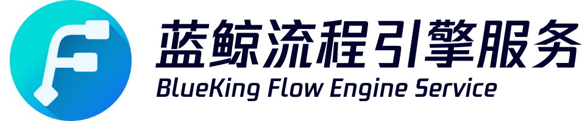
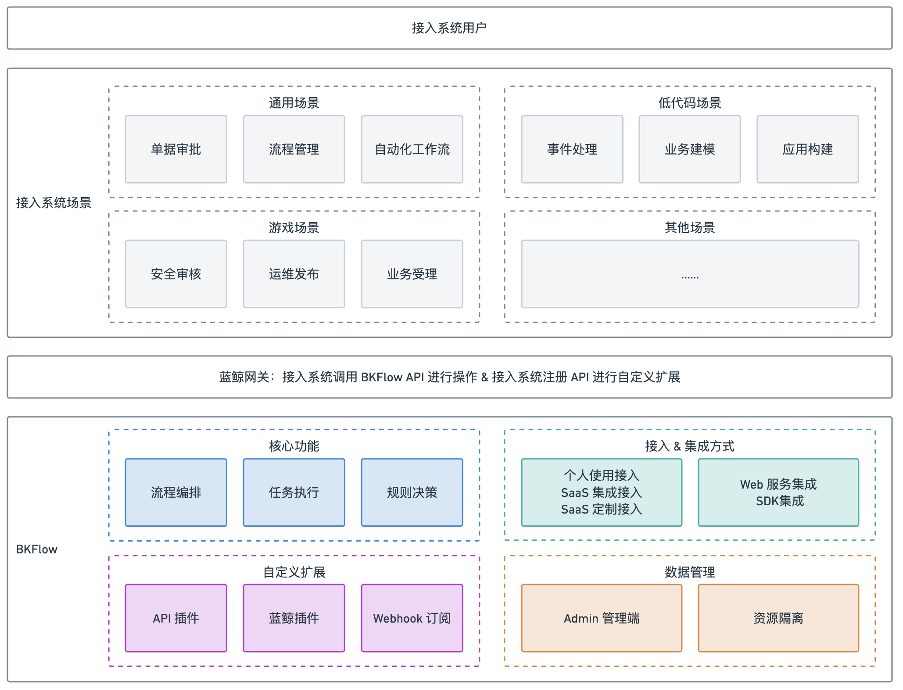

---

蓝鲸流程引擎服务 BKFlow 是一款基于 Python 实现的面向平台、高效灵活的流程引擎平台，旨在助力接入系统快速获取流程执行能力。

BKFlow 提供三大核心功能服务：
- 流程编排和画布嵌入：直观地创建、编辑和管理流程，支持自定义权限控制。
- 流程任务执行能力：通过 API 实现流程任务的创建、执行和控制。
- 决策引擎能力：可在流程中进行规则管理和决策。

## Overview

- [产品介绍](./docs/guide/introduction.md)
- [产品架构](./docs/guide/architecture.md)
- [术语解释](./docs/guide/term.md)
- [能力开源](./docs/guide/open_source.md)

## Features

 作为一个流程引擎服务平台，BKFlow 提供了丰富的功能特色，以满足接入系统的更多需求。
- **流程编排画布嵌入**：BKFlow 提供了流程编排的画布嵌入能力，接入系统可以将 BKFlow 的流程编排画布直接嵌入到您的系统中，以便接入系统的用户可以直观地创建、编辑和管理流程，同时支持接入系统对用户访问进行权限控制。
- **流程任务执行能力**：BKFlow 提供了流程任务执行能力，接入系统可以通过调用 BKFlow 的 API 来实现流程任务的执行和控制。
- **高度可扩展&自定义能力**：BKFlow 通过支持蓝鲸插件和 API 插件，让接入系统及其用户可以进行自定义扩展，满足接入系统的业务场景扩展。
- **支持多种接入方式**：BKFlow 支持不同的接入方式，接入系统可以根据需要自行实现画布和流程模版能力，仅接入任务执行能力。
- **支持多种集成方式**：BKFlow 已开源部分核心模块，接入系统可以根据需要采用不同的集成方式，包括 Web 服务集成和 SDK 集成。
- **数据管理能力**：BKFlow 为接入系统提供了 Admin 管理端，方便接入系统管理员进行数据管理；同时，BKFlow 提供了 Webhook 订阅机制，方便接入系统进行流程任务感知和自动化。

了解更多功能，请参考[产品白皮书](https://bk.tencent.com/docs/)

## Getting started

- [服务接入方式](./docs/guide/system_access.md)
- [体验 & 快速接入](./docs/guide/quick_start.md)
- [接入系统业务拓展](./docs/guide/system_extensions.md)

# Support
- [源码](https://github.com/TencentBlueKing/bkflow/tree/master)
- [wiki](https://github.com/TencentBlueKing/bkflow/wiki)
- [白皮书](https://bk.tencent.com/docs/)
- [蓝鲸论坛](https://bk.tencent.com/s-mart/community)
- [蓝鲸 DevOps 在线视频教程](https://bk.tencent.com/s-mart/video/)
- 联系我们，加入腾讯蓝鲸运维开发交流群：878501914

# BlueKing Community
- [BK-SOPS](https://github.com/TencentBlueKing/bk-sops)：标准运维（SOPS）是通过可视化的图形界面进行任务流程编排和执行的系统，是蓝鲸体系中一款轻量级的调度编排类 SaaS 产品。
- [BK-CMDB](https://github.com/Tencent/bk-cmdb)：蓝鲸配置平台（蓝鲸 CMDB）是一个面向资产及应用的企业级配置管理平台。
- [BK-CI](https://github.com/Tencent/bk-ci)：蓝鲸持续集成平台是一个开源的持续集成和持续交付系统，可以轻松将你的研发流程呈现到你面前。
- [BK-BCS](https://github.com/Tencent/bk-bcs)：蓝鲸容器管理平台是以容器技术为基础，为微服务业务提供编排管理的基础服务平台。
- [BK-PaaS](https://github.com/Tencent/bk-paas)：蓝鲸 PaaS 平台是一个开放式的开发平台，让开发者可以方便快捷地创建、开发、部署和管理 SaaS 应用。
- [BK-JOB](https://github.com/Tencent/bk-job)：蓝鲸作业平台(Job)是一套运维脚本管理系统，具备海量任务并发处理能力。

# License
基于 MIT 协议， 详细请参考 [LICENSE](LICENSE)。
