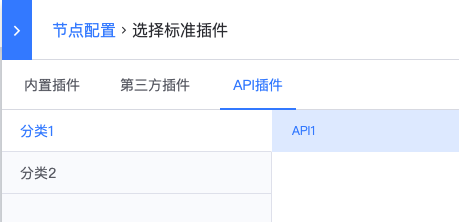
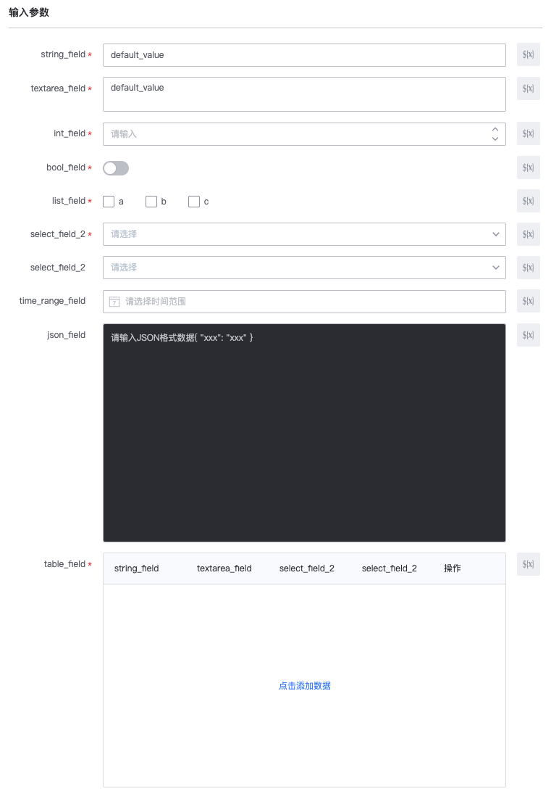
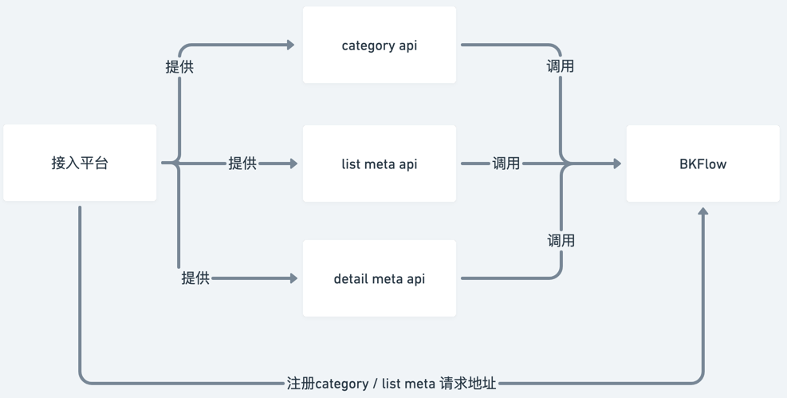
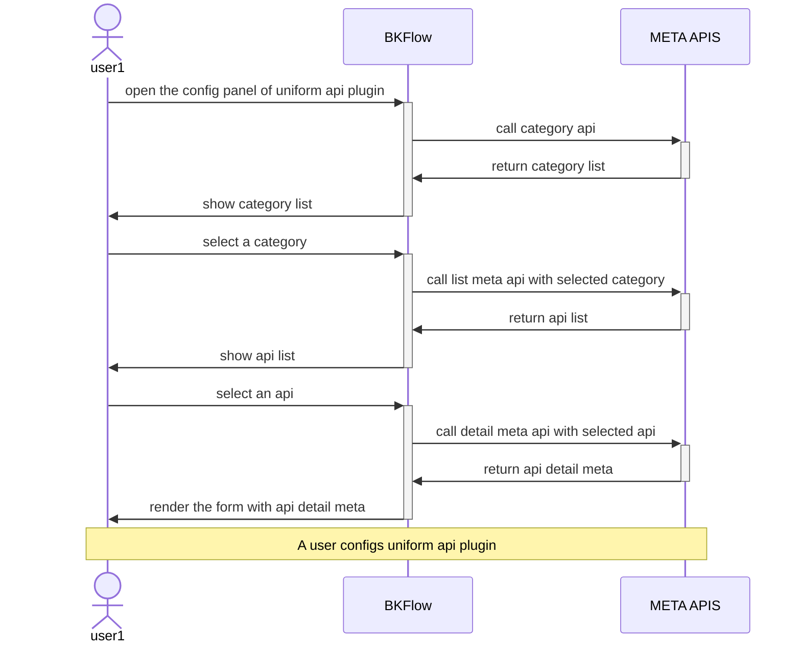
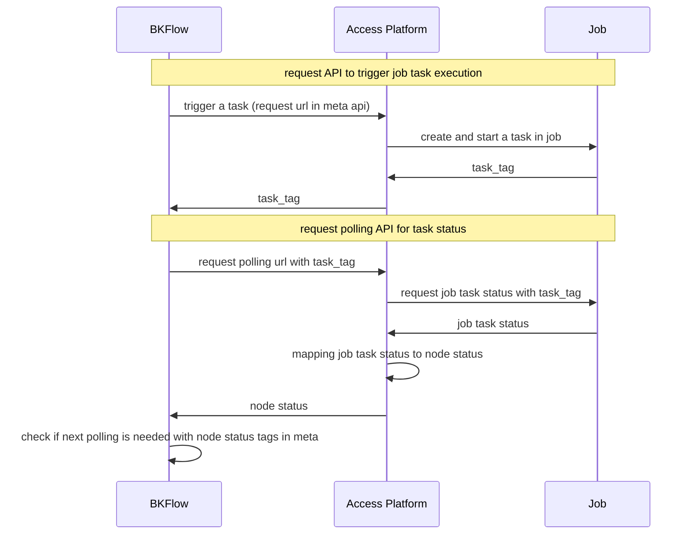
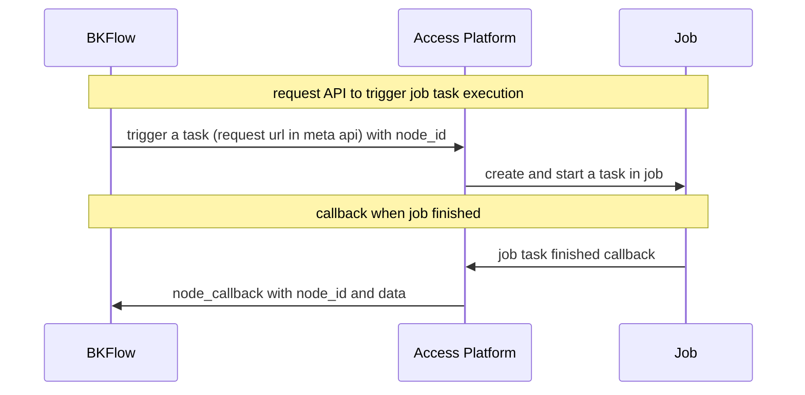

# API 插件开发

API 插件可以帮助接入系统开发者在 BKFlow 上实现自己的业务需求拓展。

接入系统开发者只需开发满足 API 统一协议的接口并注册到蓝鲸 APIGW，在完成【uniform_api】空间配置后，即可在 BKFlow 批量注册对应的 API 插件，接入系统用户可以直接与这些插件进行表单交互并执行这些插件。配合上 BKFlow 自带的流程执行能力，接入系统的用户可以轻松配置出符合自己业务需求的自动化工作流。

## API 统一协议

在 BKFlow 中，统一 API 的调用逻辑被统一封装到同一个插件【API插件】中，插件通过从遵循协议的接口中拉取元数据，可以动态地将接口调用所需的参数渲染为表单，供接入系统的用户更加直观方便地填写，效果如下：





因为需要获取接口的描述数据，所以如果接入系统希望使用【API插件】，需要提供以下几个元数据接口，并注册到 BKFlow 的对应空间配置下：
1. category api：用于获取接口分类信息
2. list meta api：用于获取接口列表数据
3. detail meta api：用于获取接口详情的元数据

category api 和 list meta api 用于获取接口列表，每个具体的接口可以映射成一个插件。

detail meta api 用于获取具体接口的元数据，通过插件表单。



当用户打开插件的配置面版时，交互顺序如下:


下面，我们分别来介绍上述三种接口的协议。

### category api

对于category api，接口需要全量返回分类，该接口的输入输出：

1. 输入：GET 方法，形如 category_api/?scope_value=xx&scope_type=xx，其中，scope_value 和 scope_type 是当前流程对应字段的值，代表该流程在接入系统中所属的空间（如项目或业务），接入系统可以依据这两个参数返回对应空间下的接口分类信息。
2. 输出：接口返回标准三段结构，result为 True 时展示接口列表，False 时展示错误提示。
``` json
{
  "result": true,
  "message": "",
  "data": [
    {"name": "c1", "id": "c1"},
    {"name": "c2", "id": "c2"}
  ]
}
```

### list meta api
对于list meta api，需要提供api id 和对应的detail mata api地址，接口支持分页，该接口输入输出：

1. 输入：GET方法，分页参数采用limit + offset的协议，需要支持根据 scope_type、scope_value 和 分类进行过滤，形如：list_mata_api/?limit=50&offset=0&scope_type=xx&scope_value=xxx&category=xxx。
2. 输出：接口返回标准三段结构，result为True时展示接口列表，False时展示错误提示

**apis 数组中每个对象支持的字段：**
- `id`（必填）：API 的唯一标识
- `name`（必填）：API 的名称
- `meta_url`（必填）：拉取 API 详细信息的 URL
- `version`（可选）：指定使用的uniform_api插件版本
  - 默认值为 `"v2.0.0"`，如果不指定version字段，系统会使用v2.0.0版本
  - 如需使用新特性（如 `enable_standard_response` 配置和 `headers` 配置），需要指定 `"v3.0.0"`
  - 支持的版本值：`"v2.0.0"`、`"v3.0.0"`
``` json
{
    "result": true,
    "message": "",
    "data": {
        "total": 1,
        "apis": [
            {
                "id": "api1",
                "name": "API1",
                "meta_url": "xxxx", // 拉取 api 信息的 url
                "version": "v3.0.0" // 可选，指定使用的uniform_api插件版本，默认为 "v2.0.0"，如需使用新特性（enable_standard_response、headers配置）需指定 "v3.0.0"
            }
        ]
    }
}
```

### detail meta api
基于选中的api，BKFlow 会从上述的detail meta api中获取接口的详细信息，接口的输入输出：
1. 输入：GET方法
2. 输出：接口返回标准三段结构，result为True时展示接口列表，False时展示错误提示

``` json
{
  "result": true,
  "message": "",
  "data": {
    "id": "api1",
    "name": "api1",
    "url": "https://{some apigw host}/xxxx", // 执行时实际调用的 api 注意必须要符合网关API的格式
    "methods": [
      "GET"
    ],
    "inputs": [
      {
        "key": "xxx",
        "name": "xxx",
        "desc": "xxxx",
        "required": true,
        "type": "string",  // 可选，描述字段类型，如果没有form_type会基于该字段尝试映射对应的表单
        "form_type": "input",  // 可选，默认输入框
        "options": ["a", "b"],  // 可选，当type为list或者form_type为checkout/select等表单时
        "default": "abc"  // 可选
      }
    ],
    "outputs": [
      {
        "key": "xxx",
        "name": "xxx",
        "desc": "xxx",
        "type": "string"  // 可选，默认文本输出
      }
    ]
  }
}
```
- 基于inputs和outputs字段，动态进行表单生成
	- 字段类型(type)与表单类型映射关系：
		- string -> 输入框
		- list -> checkbox，需要提供options字段
		- int -> 整数输入框
		- bool -> switcher
- 基于methods字段，允许的请求方法
- 如果需要在输入表单中增加表格，需要指定 form_type 为 table，同时在字段下增加 table 描述字段，描述如下：

``` json
{
  "table": {
    "meta": {
      "read_only": false,
      "import": false,
      "export": false
    },
    "fields": [
      {
        "key": "xxx",
        "name": "xxx",
        "desc": "xxxx",  // 可选
        "required": true,
        "type": "string",  // 可选，描述字段类型，如果没有form_type会基于该字段尝试映射对应的表单
        "form_type": "input",  // 可选，默认输入框，不能为 table
        "options": ["a", "b"],  // 可选，当type为list或者
        "default": "abc"  // 可选
      }
    ]
  }
}
```

下面是一个合法的 meta 接口返回的完整协议，主要展示各种表单项的定义方式：

``` json
{
  "result": true,
  "message": "",
  "data": {
    "id": "api2",
    "name": "api2",
    "url": "https://{some apigw host}/xxxx", // 执行时实际调用的 api
    "methods": [
      "GET"
    ],
    "inputs": [
      {
        "key": "string_field",
        "name": "string_field",
        "required": true,
        "type": "string",
        "default": "default_value"
      },
      {
        "key": "textarea_field",
        "name": "textarea_field",
        "required": true,
        "type": "string",
        "form_type": "textarea",
        "default": "default_value"
      },
      {
        "key": "int_field",
        "name": "int_field",
        "required": true,
        "type": "int"
      },
      {
        "key": "bool_field",
        "name": "bool_field",
        "required": true,
        "type": "bool"
      },
      {
        "key": "list_field",
        "name": "list_field",
        "required": true,
        "type": "list",
        "options": [
          "a",
          "b",
          "c"
        ]
      },
      {
        "key": "select_field_1",
        "name": "select_field_2",
        "required": true,
        "type": "string",
        "options": [
          "a",
          "b",
          "c"
        ]
      },
      {
        "key": "select_field_2",
        "name": "select_field_2",
        "type": "string",
        "options": [
          {
            "text": "abc",
            "value": "ddd"
          },
          {
            "text": "def",
            "value": "aaa"
          }
        ]
      },
      {
        "key": "table_field",
        "name": "table_field",
        "required": true,
        "type": "list",
        "form_type": "table",
        "table": {
          "fields": [
            {
              "key": "string_field",
              "name": "string_field",
              "required": true,
              "type": "string",
              "default": "default_value"
            },
            {
              "key": "textarea_field",
              "name": "textarea_field",
              "required": true,
              "type": "string",
              "form_type": "textarea",
              "default": "default_value"
            },
            {
              "key": "select_field_1",
              "name": "select_field_2",
              "required": true,
              "type": "string",
              "options": [
                "a",
                "b",
                "c"
              ]
            },
            {
              "key": "select_field_2",
              "name": "select_field_2",
              "type": "string",
              "options": [
                {
                  "text": "abc",
                  "value": "ddd"
                },
                {
                  "text": "def",
                  "value": "aaa"
                }
              ]
            }
          ]
        }
      }
    ]
  }
}
```

## API 插件配置说明

**版本要求：** 以下配置项（`enable_standard_response` 和 `headers`）需要在使用 uniform_api 插件时指定 `version` 字段为 `"v3.0.0"` 才能生效。如果未指定 `version` 字段或指定为 `"v2.0.0"`，这些配置将不会生效。

### enable_standard_response 配置

`enable_standard_response` 配置用于控制 API 插件对响应格式的判断方式。该配置在空间配置的 `uniform_api` 配置中的 `common` 部分设置。

**版本要求：** 此配置仅在 `version` 字段为 `"v3.0.0"` 时生效。

**配置位置：**
在空间配置的 `uniform_api` 配置中，通过 `common.enable_standard_response` 字段设置。

**配置值：**
- `true` 或 `"true"`：启用标准响应模式
- `false` 或 `"false"`：使用非标准响应模式（默认）

**标准响应模式（enable_standard_response = true）：**
- 使用 HTTP 状态码判断请求是否成功
- HTTP 状态码在 200-299 范围内视为成功
- 响应数据可以是 JSON 格式或非 JSON 格式
- 如果响应是 JSON 格式，直接返回 JSON 数据
- 如果响应不是 JSON 格式，返回原始响应体（字符串）

**非标准响应模式（enable_standard_response = false）：**
- 使用 JSON 响应的 `result` 字段判断请求是否成功
- 响应必须是有效的 JSON 格式
- `result` 字段为 `true` 时视为成功，`false` 时视为失败
- 响应数据从 JSON 响应中提取

**配置示例：**
```json
{
  "api": {
    "default": {
      "meta_apis": "https://example.com/api/meta",
      "api_categories": "https://example.com/api/categories",
      "display_name": "示例API"
    }
  },
  "common": {
    "enable_standard_response": "true"
  }
}
```

### headers 配置

`headers` 配置用于为 API 插件添加自定义 HTTP 请求头。该配置在空间配置的 `uniform_api` 配置中的每个 API 配置项下设置。

**版本要求：** 此配置仅在 `version` 字段为 `"v3.0.0"` 时生效。

**配置位置：**
在空间配置的 `uniform_api` 配置中，通过 `api.{api_key}.headers` 字段设置。

**配置格式：**
`headers` 是一个字典类型，key 为 HTTP 头名称，value 为 HTTP 头值。value 支持变量替换。

**支持的变量：**
在 headers 配置中，可以使用以下变量，系统会在请求时自动替换：
- `${_system.operator}`：操作人（创建任务的用户）
- `${_system.task_id}`：任务ID
- `${_system.task_name}`：任务名称
- `${_system.space_id}`：空间ID
- `${_system.scope_type}`：作用域类型
- `${_system.scope_value}`：作用域值

**变量替换规则：**
- 变量可以在 header value 的任意位置使用
- 如果 header value 中包含多个变量，所有变量都会被替换
- 如果变量不存在，将使用空字符串替换

**headers 合并规则：**
- 系统会先生成默认的 API 网关认证 headers（包含 `bk_app_code`、`bk_app_secret` 等）
- 然后合并配置的 headers，配置的 headers 优先级更高，会覆盖同名的默认 headers
- 如果配置的 headers 中某个 key 在默认 headers 中不存在，则添加该 header

**配置示例：**
```json
{
  "api": {
    "default": {
      "meta_apis": "https://example.com/api/meta",
      "api_categories": "https://example.com/api/categories",
      "display_name": "示例API",
      "headers": {
        "X-Custom-Header": "custom_value",
        "X-Operator": "${_system.operator}",
        "X-Task-Id": "${_system.task_id}",
        "X-Space-Id": "${_system.space_id}"
      }
    }
  }
}
```

**注意事项：**
- headers 配置会应用到该 API 配置下的所有接口调用（包括触发接口和轮询接口）
- 如果配置了多个 API（通过不同的 api_key），每个 API 可以配置不同的 headers
- 系统会根据请求的 URL 域名匹配对应的 API 配置，如果无法匹配，则使用第一个 API 配置或默认配置

## 让 API 插件支持请求后轮询

**背景**

部分功能可能无法通过单次 API 调用完成，比如 Job 任务通过单次 API 调用只能完成触发操作，触发后流程节点会继续往下流转，无法等待任务完成和根据任务执行状态来控制流程执行。

为了满足该场景，API 插件支持在调用后进行轮询 (polling) 调用，并根据轮询结果来控制节点的状态和执行逻辑。

**样例**

这里以一个接入方 (Access Platform) 提供 API 接口并调用 Job 平台任务为例：



**操作**

作为接入方，如果希望提供的 API 接口支持轮询，需要：
1. API 默认 url 接口返回可以作为 `task_tag` 标识的字段
2. 提供对应的轮询接口 polling_url，接口接收 `task_tag` 请求参数作为需要查询状态的任务标识
3. 在 detail meta api 中声明对应的协议字段，包括轮询接口地址、`task_tag` 标识、节点状态流转判断标识等

下面是一个定义了轮询配置的示例（此处省略其他无关字段)：
``` json
// detail meta api response
{
    "url": "{{api_url}}",  // 触发任务的 url
    "methods": ["POST"],
    "polling": {
        "url": "{{polling_url}}",  // 状态的轮询接口，必须接收 get 方法，需要接收参数 task_tag，形如 url/?task_tag={task_tag_key}
        "task_tag_key": "task_tag",  // {{api_url}} API 响应中可以用来作为任务标识的字段，执行过程中会用对应字段的值填入后进行请求，如果响应存在多级字段，可以通过 `.` 进行拼接，如 data.task_tag
        "success_tag": {
            "key": "status",  // polling_url 响应中用于识别状态成功的字段路径（支持 jmespath 语法）
            "value": "success",  // 状态成功的值（只支持字符串和数字类型）
            "data_key": "data.result"  // 可选，成功时从响应中提取输出数据的字段路径（支持 jmespath 语法），提取的数据会设置到节点的 data 输出中
        },
        "fail_tag": {
            "key": "status",  // polling_url 响应中用于识别状态失败的字段路径（支持 jmespath 语法）
            "value": "fail",  // 状态失败的值（只支持字符串和数字类型）
            "msg_key": "error.message"  // 可选，失败时从响应中提取错误消息的字段路径（支持 jmespath 语法），提取的消息会设置到节点的 ex_data 输出中
        },
        "running_tag": {
            "key": "status",  // polling_url 响应中用于识别状态运行中的字段路径（支持 jmespath 语法）
            "value": "running"  // 状态运行中的值（只支持字符串和数字类型）
        }
    },
    ...
}

// {{api_url}} api response
{
   "result": true,
   "task_tag": 1234
}

// {{polling_url}} api response - 成功状态示例
{
    "result": true,
    "status": "success",
    "data": {
        "result": {
            "job_id": 5678,
            "output": "任务执行成功",
            "logs": ["log1", "log2"]
        }
    }
}
// 当轮询返回上述响应时，如果配置了 success_tag.data_key 为 "data.result"，
// 则节点的 data 输出会被设置为：{"job_id": 5678, "output": "任务执行成功", "logs": ["log1", "log2"]}

// {{polling_url}} api response - 失败状态示例
{
    "result": true,
    "status": "fail",
    "error": {
        "message": "任务执行失败：资源不足"
    }
}
// 当轮询返回上述响应时，如果配置了 fail_tag.msg_key 为 "error.message"，
// 则节点的 ex_data 输出会被设置为："任务执行失败：资源不足"
// 如果没有配置 msg_key，则使用默认错误消息
```

## 让 API 插件支持请求后回调

**背景**

部分功能可能无法通过单次 API 调用完成，比如 Job 任务通过单次 API 调用只能完成触发操作，触发后流程节点会继续往下流转，无法等待任务完成和根据任务执行状态来控制流程执行。

为了满足该场景，API 插件支持被调用方进行回调，来告知 API 插件任务已执行完成。

**样例**

这里以一个接入方 (Access Platform) 提供 API 接口并调用 Job 平台任务为例：



**操作**

作为接入方，如果希望提供的 API 接口支持回调，需要：
1. 获取任务触发时的 node_id 参数，并记录
2. 进行任务触发和执行，并通过轮询或回调监听任务状态
3. 当任务执行完成后，通过 bkflow operate_task_node 接口，通过 node_id 和 data 参数进行回调

下面是一个定义了回调配置的示例（省略其他无关字段)：
``` json
// detail meta api response
{
  "result": true,
  "data": {
      "url": "{{api_url}}",  // 触发任务的 url
      "methods": ["POST"],
      "callback": {
          "success_tag": {
              "key": "status",  // callback 数据中用于识别状态成功的字段路径（支持 jmespath 语法）
              "value": "success",  // 状态成功的值（只支持字符串和数字类型）
              "data_key": "result.data"  // 可选，成功时从回调数据中提取输出数据的字段路径（支持 jmespath 语法），提取的数据会设置到节点的 data 输出中
          },
          "fail_tag": {
              "key": "status",  // callback 数据中用于识别状态失败的字段路径（支持 jmespath 语法）
              "value": "fail",  // 状态失败的值（只支持字符串和数字类型）
              "msg_key": "error.message"  // 可选，失败时从回调数据中提取错误消息的字段路径（支持 jmespath 语法），提取的消息会设置到节点的 ex_data 输出中
          }
      },
      ...
  },
  "message": ""
}

// callback request data - 成功状态示例
{
    "status": "success",
    "result": {
        "data": {
            "job_id": 5678,
            "output": "任务执行成功",
            "logs": ["log1", "log2"]
        }
    }
}
// 当回调数据为上述内容时，如果配置了 success_tag.data_key 为 "result.data"，
// 则节点的 data 输出会被设置为：{"job_id": 5678, "output": "任务执行成功", "logs": ["log1", "log2"]}

// callback request data - 失败状态示例
{
    "status": "fail",
    "error": {
        "message": "任务执行失败：资源不足"
    }
}
// 当回调数据为上述内容时，如果配置了 fail_tag.msg_key 为 "error.message"，
// 则节点的 ex_data 输出会被设置为："任务执行失败：资源不足"
// 如果没有配置 msg_key，则使用默认错误消息
```

**数据同步说明：**

1. **轮询模式数据同步**：
   - 当轮询接口返回成功状态时，如果配置了 `success_tag.data_key`，系统会使用 jmespath 从响应中提取数据并设置到节点的 `data` 输出中
   - 当轮询接口返回失败状态时，如果配置了 `fail_tag.msg_key`，系统会使用 jmespath 从响应中提取错误消息并设置到节点的 `ex_data` 输出中；如果没有配置 `msg_key`，则使用默认的错误消息

2. **回调模式数据同步**：
   - 当回调数据表示成功状态时，如果配置了 `success_tag.data_key`，系统会使用 jmespath 从回调数据中提取数据并设置到节点的 `data` 输出中
   - 当回调数据表示失败状态时，如果配置了 `fail_tag.msg_key`，系统会使用 jmespath 从回调数据中提取错误消息并设置到节点的 `ex_data` 输出中；如果没有配置 `msg_key`，则使用默认的错误消息

3. **jmespath 语法支持**：
   - `data_key` 和 `msg_key` 都支持 jmespath 语法，可以提取嵌套字段
   - 例如：`"data.result"` 可以提取 `{"data": {"result": "value"}}` 中的 `"value"`
   - 例如：`"items[0].name"` 可以提取数组第一个元素的 name 字段

