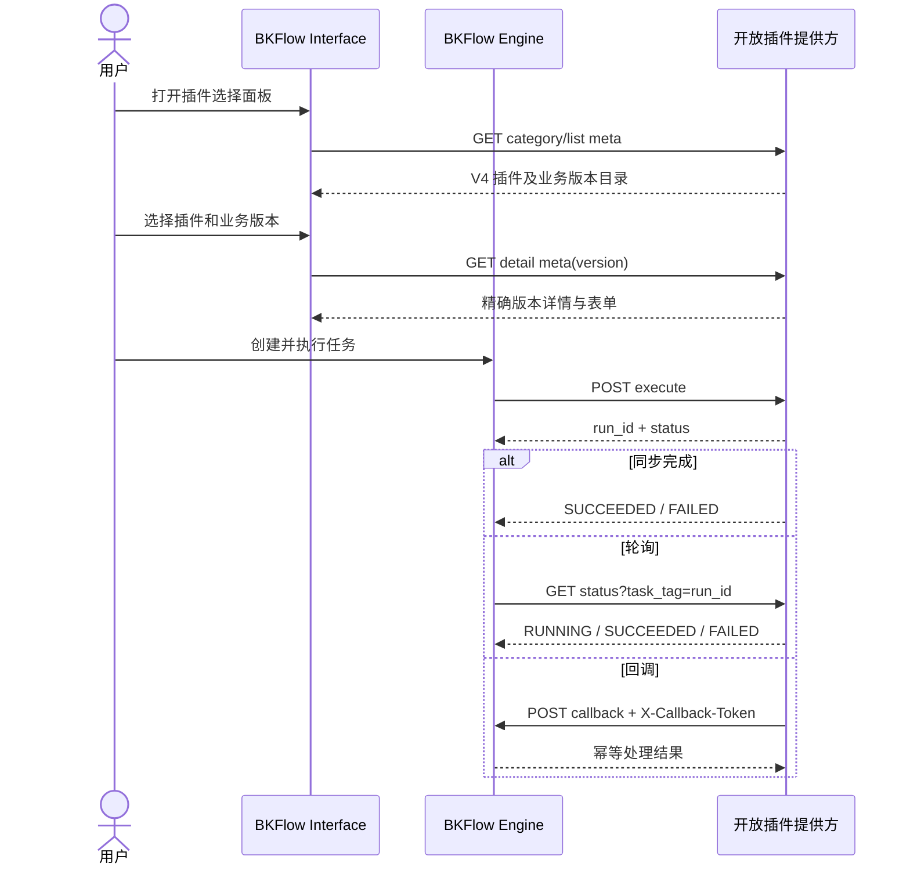

# API 插件 V4.0.0 开放协议

本文面向向 BKFlow 提供开放插件的接入系统开发者，说明 `uniform_api v4.0.0` 的目录、详情、表单、执行、轮询、回调和取消协议。

V2/V3 接入方请继续参考 [API 插件开发](api_plugin.md)。V4 是新增协议，不会自动升级、迁移或改写已有 V2/V3 插件和流程节点。

## 1. 核心概念

V4 必须区分包装协议版本和插件业务版本：

| 字段 | 含义 | 示例 |
| --- | --- | --- |
| `wrapper_version` | BKFlow `uniform_api` 包装协议版本，V4 固定为 `v4.0.0` | `v4.0.0` |
| `plugin_version` | 开放插件自身的业务版本 | `1.2.0` |
| `default_version` | 新建节点默认选择的业务版本 | `1.2.0` |
| `latest_version` | 目录声明的最新业务版本，仅用于展示和选择 | `1.3.0` |
| `versions` | 当前允许新建或编辑节点选择的业务版本列表 | `["1.2.0", "1.3.0"]` |

以下约束适用于整个协议：

- `wrapper_version` 和 `plugin_version` 不能混用。
- 已保存节点必须继续请求节点中记录的精确 `plugin_version`，不能自动回退到 `default_version` 或 `latest_version`。
- `plugin_id` 使用目录列表项的 `id`；`plugin_code` 是接入系统内部实现标识，两者可以相同，也可以不同。
- `source_key` 标识 BKFlow 空间配置中的 API 插件来源，由 BKFlow 在详情和执行请求中透传。

## 2. 通用响应格式

除回调请求外，目录、详情、执行、轮询和取消接口都应返回 JSON 三段结构：

```json
{
  "result": true,
  "message": "",
  "data": {}
}
```

字段说明：

| 字段 | 类型 | 必填 | 说明 |
| --- | --- | --- | --- |
| `result` | boolean | 是 | 本次接口调用是否成功 |
| `message` | string | 是 | 失败原因；成功时可为空字符串 |
| `data` | object/array | 是 | 具体协议数据 |

V4 的执行和轮询接口必须返回可解析的 JSON。即使空间开启了按 HTTP 状态码判断成功的配置，BKFlow 仍需从响应的 `data` 中读取 `open_plugin_run_id`、`status` 和 `outputs`。

## 3. 整体交互



## 4. 分类接口

分类接口与 V2/V3 保持一致。

请求：

```http
GET /categories?scope_type=biz&scope_value=2
```

响应：

```json
{
  "result": true,
  "message": "",
  "data": [
    {
      "id": "job",
      "name": "作业平台"
    }
  ]
}
```

接入方应全量返回当前空间可见的分类。`id` 和 `name` 必填。

## 5. 插件目录接口

### 5.1 请求

目录接口使用 GET 方法，支持 `limit + offset` 分页，并应支持空间和分类过滤：

```http
GET /plugins?limit=50&offset=0&scope_type=biz&scope_value=2&category=job
```

### 5.2 响应

```json
{
  "result": true,
  "message": "",
  "data": {
    "total": 1,
    "apis": [
      {
        "id": "open_plugin_001",
        "name": "JOB 执行作业",
        "plugin_source": "builtin",
        "plugin_code": "job_execute_task",
        "wrapper_version": "v4.0.0",
        "default_version": "1.2.0",
        "latest_version": "1.3.0",
        "versions": ["1.2.0", "1.3.0"],
        "meta_url_template": "https://example.com/open-plugins/open_plugin_001?version={version}",
        "category": "job",
        "description": "执行作业平台任务"
      }
    ]
  }
}
```

V4 列表项字段：

| 字段 | 类型 | 必填 | 说明 |
| --- | --- | --- | --- |
| `id` | string | 是 | 当前来源内稳定且唯一的插件 ID，执行时作为 `plugin_id` |
| `name` | string | 是 | 插件展示名称 |
| `plugin_source` | string | 是 | 提供方定义的插件来源，例如 `builtin`、`third_party` |
| `plugin_code` | string | 是 | 提供方内部插件实现标识 |
| `wrapper_version` | string | 是 | 固定为 `v4.0.0` |
| `default_version` | string | 是 | 新建节点默认业务版本，必须包含在 `versions` 中 |
| `latest_version` | string | 是 | 最新业务版本，必须包含在 `versions` 中 |
| `versions` | string[] | 是 | 非空的可选业务版本列表 |
| `meta_url_template` | string | 是 | 详情地址模板，必须包含可替换的 `{version}` |
| `category` | string | 否 | 分类 ID |
| `description` | string | 否 | 插件说明 |

同一个目录接口可以同时返回旧协议和 V4 列表项。旧列表项继续使用 `meta_url + version`；V4 列表项使用上表的多版本字段。不要在 V4 列表项中用旧 `version` 字段表达业务版本。

## 6. 插件详情接口

### 6.1 请求

BKFlow 将用户选中的业务版本替换到 `meta_url_template` 的 `{version}` 中，并以 GET 方法请求详情。请求还会携带来源和空间信息：

```http
GET /open-plugins/open_plugin_001?version=1.2.0&source_key=sops&scope_type=biz&scope_value=2
```

提供方必须返回请求的精确版本。如果版本不存在或已下架，应返回 `result=false`，不能静默返回默认版本。

### 6.2 基础详情响应

```json
{
  "result": true,
  "message": "",
  "data": {
    "id": "open_plugin_001",
    "name": "JOB 执行作业",
    "desc": "执行作业平台任务",
    "plugin_source": "builtin",
    "plugin_code": "job_execute_task",
    "plugin_version": "1.2.0",
    "wrapper_version": "v4.0.0",
    "url": "https://example.com/open-plugin-runs",
    "methods": ["POST"],
    "credential_key": "open_plugin_gateway",
    "inputs": [
      {
        "key": "target_ip",
        "name": "目标 IP",
        "desc": "作业执行目标",
        "required": true,
        "type": "string",
        "form_type": "input"
      }
    ],
    "outputs": [
      {
        "key": "job_instance_id",
        "name": "作业实例 ID",
        "desc": "作业平台实例标识",
        "type": "string"
      }
    ],
    "forms": {
      "input": null,
      "output": null
    },
    "form_context": {},
    "polling": {
      "url": "https://example.com/open-plugin-runs/status",
      "task_tag_key": "open_plugin_run_id",
      "success_tag": {
        "key": "status",
        "value": "SUCCEEDED",
        "data_key": "outputs"
      },
      "fail_tag": {
        "key": "status",
        "value": "FAILED",
        "msg_key": "error_message"
      },
      "running_tag": {
        "key": "status",
        "value": "RUNNING"
      }
    }
  }
}
```

关键字段：

| 字段 | 类型 | 必填 | 说明 |
| --- | --- | --- | --- |
| `id` | string | 是 | 应与目录列表项 `id` 一致 |
| `name` | string | 是 | 插件展示名称 |
| `plugin_source` | string | 是 | 应与目录列表项一致 |
| `plugin_code` | string | 是 | 应与目录列表项一致 |
| `plugin_version` | string | 是 | 必须等于本次请求的业务版本 |
| `wrapper_version` | string | 是 | 固定为 `v4.0.0` |
| `url` | string | 是 | 执行入口，必须是 BKFlow 允许访问的 APIGW 地址 |
| `methods` | string[] | 是 | 非空，仅支持 `GET`、`POST`；V4 执行入口推荐使用 `POST` |
| `inputs` | object[] | 是 | 输入字段列表；没有输入时返回空数组 |
| `outputs` | object[] | 是 | 输出字段列表；没有输出时返回空数组 |
| `forms` | object | 否 | 原生输入/输出表单描述；未提供时根据 `inputs/form_schema` 构造通用表单 |
| `form_schema` | object | 否 | 通用 JSON Schema；存在 `properties` 时优先于 `inputs` 生成通用表单 |
| `form_context` | object | 否 | 原生表单运行上下文 |
| `polling` | object | 条件必填 | 使用轮询时必填；省略或返回 `{}` 表示不轮询 |
| `callback` | object | 条件必填 | 使用回调时建议返回 `{"enabled": true}` |
| `credential_key` | string | 否 | 执行、轮询和取消请求使用的凭证标识 |

`polling` 的兼容规则：

- 同步插件或仅依赖回调的插件可以省略 `polling`，也可以返回 `"polling": {}`，两者均表示不启用轮询。
- 非空对象仍须完整包含 `url`、`task_tag_key`、`success_tag`、`fail_tag`、`running_tag`；三个状态标记须为包含 `key`、`value` 的对象，并满足各字段的类型约束。
- 不接受 `null`、数组、字符串等非对象类型，也不接受仅含部分字段的非空配置。
- 这项兼容不改变运行状态要求：仅回调时使用 `WAITING_CALLBACK`；返回 `CREATED` 或 `RUNNING` 仍必须提供完整的轮询配置。

## 7. 表单协议

### 7.1 通用表单

当 `forms.input` 为 `null` 或未提供时，BKFlow 使用 `form_schema` 或 `inputs` 构造通用表单：

- `form_schema.properties` 存在时优先使用 `form_schema`。
- 否则按 `inputs` 中的 `type`、`form_type`、`options`、`default` 等字段生成表单。
- 这种降级仅适用于提供方没有声明原生表单的情况。提供方明确声明的原生表单加载失败时，BKFlow 会报告错误，不会静默降级。

### 7.2 原生表单描述

`forms` 固定包含 `input` 和 `output`，每项可以为 `null` 或表单描述对象：

```json
{
  "forms": {
    "input": {
      "type": "renderform",
      "key": "job_execute_task",
      "data": [
        {
          "type": "input",
          "tag_code": "target_ip",
          "attrs": {
            "name": "目标 IP"
          }
        }
      ],
      "is_embedded": true,
      "base": null
    },
    "output": null
  }
}
```

支持的表单类型：

| `type` | `data` | 其他要求 | 说明 |
| --- | --- | --- | --- |
| `component_js` | JavaScript 内容或脚本 URL | `key` 必填；`is_embedded` 标识是否内嵌；`base` 可选 | 脚本执行后必须向 `$.atoms[key]` 注册表单 |
| `renderform` | RenderForm 数组/对象，或 JavaScript 内容/URL | 字符串形式时 `key` 必填 | 直接使用 RenderForm 描述，或执行脚本获得描述 |
| `jsonschema` | JSON Schema 对象 | `data` 必须是对象 | 使用 JSON Schema 表单渲染 |
| `api_plugin_json` | API 插件详情对象 | `data` 必须是对象 | 根据 `form_schema/inputs` 构造通用 RenderForm；通常无需由提供方显式声明 |

`component_js` 和字符串形式的 `renderform` 会在 BKFlow 页面执行接入方提供的 JavaScript，只能用于受信任来源。脚本 URL、`base` 和动态数据接口需要满足浏览器 CORS 要求。

### 7.3 `form_context`

`form_context` 是提供给原生表单的纯 JSON 上下文，可使用的字段包括：

- `site_url`
- `project`
- `biz_cc_id`
- `component`
- `variable`
- `template`
- `instance`
- `bk_plugin_api_host`

BKFlow 会在页面侧补充 `getInput`、`getOutput`、`getNodeStatus`、`getProjectId` 等公共函数。对于 `site_url` 和 `bk_plugin_api_host` 声明的跨域 Origin，浏览器请求会携带凭证，因此提供方必须配置精确的允许 Origin 和 `Access-Control-Allow-Credentials: true`，不能与通配符 Origin 混用。

## 8. 执行协议

BKFlow 按详情中的 `url + methods` 调用执行入口。推荐统一使用：

```http
POST /open-plugin-runs
Content-Type: application/json
```

请求体：

```json
{
  "source_key": "sops",
  "plugin_id": "open_plugin_001",
  "plugin_version": "1.2.0",
  "client_request_id": "task-123-node-node_a-attempt-1",
  "callback_url": "https://bkflow.example/callback/encrypted-node-token/",
  "callback_token": "opaque-callback-token",
  "inputs": {
    "target_ip": "127.0.0.1"
  },
  "context": {
    "scope_type": "biz",
    "scope_value": "2",
    "operator": "admin",
    "space_id": 10,
    "task_id": 123,
    "node_id": "node_a",
    "task_name": "执行作业"
  }
}
```

字段说明：

| 字段 | 类型 | 必填 | 说明 |
| --- | --- | --- | --- |
| `source_key` | string | 是 | API 插件来源标识 |
| `plugin_id` | string | 是 | 目录列表项 `id` |
| `plugin_version` | string | 是 | 节点保存的精确业务版本 |
| `client_request_id` | string | 是 | 单次节点触发意图的幂等键 |
| `callback_url` | string | 是 | 本次执行动态生成的 BKFlow 回调地址 |
| `callback_token` | string | 是 | 本次执行动态签发的回调令牌，应作为不透明字符串保存和回传 |
| `inputs` | object | 是 | 用户在表单中填写的业务输入 |
| `context` | object | 否 | BKFlow 运行上下文；字段可能为空，提供方不能把它作为用户可控鉴权凭证 |

提供方必须按 `source_key + client_request_id` 保证执行幂等：同一个触发意图的重复请求不能创建多个运行实例，应返回已存在的 `open_plugin_run_id`。新的人工重试会生成新的 `client_request_id`。

### 8.1 同步完成响应

即使同步完成，也必须返回 `open_plugin_run_id`：

```json
{
  "result": true,
  "message": "",
  "data": {
    "open_plugin_run_id": "run-001",
    "status": "SUCCEEDED",
    "outputs": {
      "job_instance_id": 1001
    }
  }
}
```

### 8.2 异步执行响应

轮询模式：

```json
{
  "result": true,
  "message": "",
  "data": {
    "open_plugin_run_id": "run-001",
    "status": "RUNNING"
  }
}
```

回调模式：

```json
{
  "result": true,
  "message": "",
  "data": {
    "open_plugin_run_id": "run-001",
    "status": "WAITING_CALLBACK"
  }
}
```

## 9. 运行状态

| 状态 | 含义 | BKFlow 行为 |
| --- | --- | --- |
| `CREATED` | 已创建，尚未开始 | 配置了 polling 时继续轮询 |
| `RUNNING` | 正在执行 | 配置了 polling 时继续轮询 |
| `WAITING_CALLBACK` | 等待提供方回调 | 等待 callback；若同时配置 polling，则 polling 作为兜底 |
| `SUCCEEDED` | 执行成功 | 读取 `outputs` 并结束节点 |
| `FAILED` | 执行失败 | 读取 `error_message` 并失败结束节点 |
| `CANCELLED` | 已取消 | 按失败终态结束节点 |

`CREATED` 或 `RUNNING` 必须配合 polling。仅使用 callback 的插件应返回 `WAITING_CALLBACK`，否则 BKFlow 无法继续调度。

## 10. 轮询协议

详情中配置 polling 后，BKFlow 每次使用 GET 请求状态接口，并至少携带：

```http
GET /open-plugin-runs/status?task_tag=run-001
```

提供方应按 `task_tag` 查询对应的 `open_plugin_run_id`。请求还可能包含任务上下文字段，提供方应忽略不识别的附加参数。

运行中响应：

```json
{
  "result": true,
  "message": "",
  "data": {
    "open_plugin_run_id": "run-001",
    "status": "RUNNING"
  }
}
```

成功响应：

```json
{
  "result": true,
  "message": "",
  "data": {
    "open_plugin_run_id": "run-001",
    "status": "SUCCEEDED",
    "outputs": {
      "job_instance_id": 1001
    }
  }
}
```

失败响应：

```json
{
  "result": true,
  "message": "",
  "data": {
    "open_plugin_run_id": "run-001",
    "status": "FAILED",
    "error_message": "job execution failed"
  }
}
```

当前 V4 detail 仍要求 polling 中提供 `task_tag_key`、`success_tag`、`fail_tag` 和 `running_tag`，建议按第 6 节示例填写；V4 运行时以统一的 `status/outputs/error_message` 字段处理状态。

## 11. 回调协议

提供方应把 execute 请求中收到的 `callback_url` 和 `callback_token` 与 `open_plugin_run_id` 一起保存。执行进入终态后，向该次请求专属的 `callback_url` 发起 POST：

```http
POST <callback_url>
Content-Type: application/json
X-Callback-Token: <callback_token>
```

成功回调：

```json
{
  "open_plugin_run_id": "run-001",
  "status": "SUCCEEDED",
  "outputs": {
    "job_instance_id": 1001
  }
}
```

失败回调：

```json
{
  "open_plugin_run_id": "run-001",
  "status": "FAILED",
  "error_message": "job execution failed",
  "truncated": false,
  "truncated_fields": []
}
```

回调字段：

| 字段 | 类型 | 必填 | 说明 |
| --- | --- | --- | --- |
| `open_plugin_run_id` | string | 是 | 必须与 execute 响应一致 |
| `status` | string | 是 | 回调应使用 `SUCCEEDED`、`FAILED` 或 `CANCELLED` 终态 |
| `outputs` | object | 成功时建议 | 插件输出 |
| `error_message` | string | 失败时建议 | 失败原因 |
| `truncated` | boolean | 否 | 输出是否发生截断 |
| `truncated_fields` | string[] | 否 | 被截断的输出字段 |

BKFlow 会校验回调令牌的签名、有效期、任务、节点、节点版本、`client_request_id` 和 `open_plugin_run_id` 映射。缺少、过期或不匹配的 token 会被拒绝。合法的重复回调会幂等返回成功，不会重复推进节点状态。

## 12. 取消协议

BKFlow 在用户终止任务或节点时异步请求取消入口：

```http
POST <execute_url去掉末尾斜杠>/<open_plugin_run_id>/cancel
Content-Type: application/json

{}
```

例如执行地址为 `https://example.com/open-plugin-runs/`，运行 ID 为 `run-001`，取消地址为：

```text
https://example.com/open-plugin-runs/run-001/cancel
```

取消响应：

```json
{
  "result": true,
  "message": "",
  "data": {
    "open_plugin_run_id": "run-001",
    "status": "CANCELLED"
  }
}
```

取消请求是尽力而为的异步操作。提供方应自行保证取消幂等，并校验运行实例属于当前调用凭证和来源。

## 13. 向下兼容与发布要求

### 13.1 V2/V3 兼容边界

- V4 通过 `component.code=uniform_api`、`wrapper_version=v4.0.0`、`source_key` 和 `plugin_id` 严格识别，不根据插件 code 或字段形态猜测协议。
- 已有 V2/V3 节点继续使用原 `meta_url + version`、原 JSON Schema 表单和原执行逻辑。
- 打开或保存旧节点不会把它自动升级为 V4，也不会把旧包装器版本改成 `v4.0.0`。
- V4 的 `context` 是新增可选字段；提供方应容忍缺少该字段的历史调用。

### 13.2 发布与开放顺序

V4 同时涉及 Interface 的目录/详情能力和 Engine 的执行/回调/取消能力。推荐顺序：

1. 先发布提供方的加法协议能力，但暂不向用户目录暴露 V4 插件。
2. 发布 BKFlow Interface，并确认没有空间授权或目录项会让用户配置 V4 节点。
3. 发布包含 `uniform_api v4.0.0` 的 BKFlow Engine。
4. 完成目录、详情、同步执行、轮询、回调和取消验证后，再开放 V4 插件授权或目录可见性。

如果能通过授权、特性开关或目录过滤确保暂时没有用户创建 V4 节点，可以先发布 Interface 再发布 Engine。该顺序不代表 Engine 可以长期缺失 V4：一旦用户能够保存或执行 V4 节点，目标 Engine 必须已经包含 `uniform_api v4.0.0`。

## 14. 接入检查清单

- [ ] 目录项同时返回 `wrapper_version=v4.0.0` 和完整业务版本列表。
- [ ] `default_version`、`latest_version` 都包含在 `versions` 中。
- [ ] `meta_url_template` 能按 `{version}` 返回精确版本详情。
- [ ] 详情返回的 `plugin_version` 与请求版本一致。
- [ ] `forms.input=null` 时，`form_schema/inputs` 可以渲染通用表单。
- [ ] 原生表单资源满足 CORS 和可信来源要求。
- [ ] execute 按 `client_request_id` 幂等，并始终返回 `open_plugin_run_id`。
- [ ] callback 原样回传 `callback_url` 和 `X-Callback-Token`。
- [ ] polling、callback 和 cancel 使用同一个 `open_plugin_run_id`。
- [ ] V4 可见性在 Engine 发布和联调完成前保持关闭。
