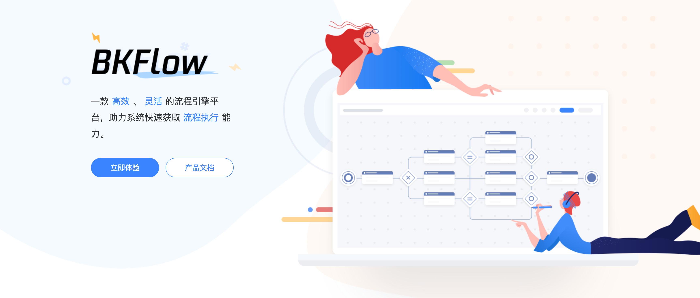

# 快速开始

## 功能体验

作为一个从来没有使用和对接过 BKFlow 的用户，可以通过 BKFlow Admin 管理端创建自己的空间，并以空间管理员身份完成相关功能的体验。

了解具体操作步骤，请参考[产品白皮书](https://bk.tencent.com/docs/)

## API 快速接入

BKFlow 的所有 API 通过蓝鲸 APIGW 进行注册并发布，接入系统可以通过申请调用权限并调用 API 完成接入。
1. 创建空间: [create_space api](../../bkflow/apigw/docs/zh/create_space.md)
2. 进行空间配置: [renew_space_config api](../../bkflow/apigw/docs/zh/renew_space_config.md)
3. 创建流程: [create_template api](../../bkflow/apigw/docs/zh/create_template.md)
4. 创建任务: [create_task api](../../bkflow/apigw/docs/zh/create_task.md)
5. 执行任务: [operate_task api](../../bkflow/apigw/docs/zh/operate_task.md)

至此，就完成了最基础的平台接入和流程执行。
