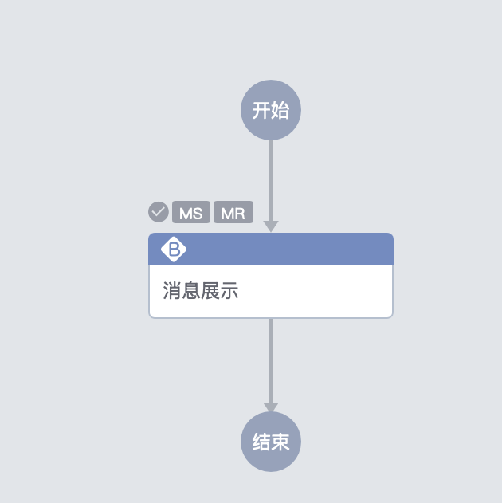

## superusers
**字段类型：** JSON

**字段含义：** 空间的管理员

配置方式:
在列表中添加空间管理员用户名。
```json
["admin1","admin2"]
```
**功能表现：** 对应用户获得空间管理员权限
## token_expiration
**字段类型：** TEXT

**字段含义：** 该空间下访问资源权限的token的过期时间，默认为1h。

**配置方式：** 

| 示例值  | 描述        |
|------|-----------|
| [n]m | m->minute |
| [n]h | h->hour   |
| [n]d | d->day    |
**说明：** 至少为1h。

**功能表现：** 该空间下访问资源权限的token的过期时间被修改为对应值

## token_auto_renewal
**字段类型：** TEXT

**字段含义：** 是否开启Token自动续期，默认为开启，token会在用户操作的过程中自动续期，避免用户操作过程中token失效的问题

**配置方式：** 

| 可选值   | 描述     |
|-------|--------|
| true  | 开启自动续期 |
| false | 不开启，到期后token过期 |

**功能表现：** 开启后token到期会自动延长一个周期

## callback_hooks
**字段类型：** JSON

**字段含义：** 回调url配置，请优先使用 apply_webhook_configs 进行回调配置

**配置方式：** 
``` json
{
    "url": "{callback_url}",
    "callback_types": [
        "template"
    ]
}
```
| 字段             | 类型       | 描述               |
|----------------|----------|------------------|
| callback_url   | string   | 回调所用的来自apigw的url |  
| callback_types | string[] | 资源类型列表           |  
**说明：** callback_url必须为来自apigw的url，callback_types为资源类型

**功能表现：** 在对应事件触发时回调该url
## uniform_api
**字段类型：** JSON

**字段含义：** 统一API插件配置

**配置方式：** 
``` json
{
    "api": {
        "{api_key}": {
            "meta_apis": "{meta_apis url}",
            "api_categories": "{api_categories url}",
            "display_name": "{display_name}",
        }
    }
}
```

| 名称	                | 类型	      | 说明               |
|--------------------|----------|------------------|
| api_key            | 	string	 | API插件的Key值       |
| meta_apis url      | 	string	 | 获取API接口元数据列表的url |
| api_categories url | 	string	 | 获取API接口分类列表的url  |
| display_name	      | string	  | API插件的展示名称       |
**说明：** API插件具体开发可参考：[API插件开发](api_plugin.md)

**功能表现：** 
```json
{
  "api": {
    "api_key": {
      "meta_apis": "https://xxx.com/xxx/uniform_api_list/",
      "display_name": "API插件",
      "api_categories": "https://xxx.com/xxx/uniform_api_category_list/"
    }
  }
}
```
（配置了名为API1的插件）


## canvas_mode
**字段类型：** TEXT

**字段含义：** 画布的呈现模式，默认为horizontal。

**配置方式：** 

| 可选值        | 描述   |
|------------|------|
| horizontal | 水平模式 |
| vertical   | 垂直模式 |
**说明：** 修改画布模式后，新建流程才会生效，不会影响原有流程

**功能表现：**  
horizontal:


vertical:


## gateway_expression
**字段类型：** TEXT

**字段含义：** 网关的分支条件中表达式的语法类型，默认为boolrule。

**配置方式：**

| 可选值      | 描述         |
|----------|------------|
| boolrule | boolrule语法 |
| FEEL     | FEEL语法     |
**说明：** 详情参考各语法文档：[boolrule](https://boolrule.readthedocs.io/en/latest/expressions.html#basic-comparison-operators) [FEEL](https://github.com/TencentBlueKing/bkflow-feel/blob/main/docs/grammer.md)

**功能表现：** 

## api_gateway_credential_name
**字段类型：** TEXT

**字段含义：** API_GATEWAY使用的凭证名称

**配置方式：** 输入API_GATEWAY使用的凭证名称

**功能表现：** 空间将会使用该凭证进行验证

## space_plugin_config
**字段类型：** JSON

**字段含义：** 空间插件配置，可以设置 只显示/隐藏插件，仅提供画布编辑，与实际执行权限无关。

**配置方式：** 
``` json
{
    "default": {
        "mode": "{allow_list/deny_list}",
        "plugin_codes": [
            "plugin_1",
            "plugin_2"
        ]
    }
}
```

| 键名称	         | 类型	        | 示例值	                       | 说明                 |
|--------------|------------|----------------------------|--------------------|
| mode	        | string	    | allow_list / deny_list     | 	只显示插件的列表 或 隐藏插件列表 |
| plugin_codes | 	string[]	 | ["display", "bk_example"]	 | 插件code列表           |

**功能表现：** 

①隐藏“消息展示”插件：
```json
{
    "default": {
        "mode": "deny_list",
        "plugin_codes": [
            "display"
        ]
    }
}
```

选择插件页面，消息展示消失。

②只显示“消息展示”插件:
```json
{
    "default": {
        "mode": "allow_list",
        "plugin_codes": [
            "display"
        ]
    }
}
```


