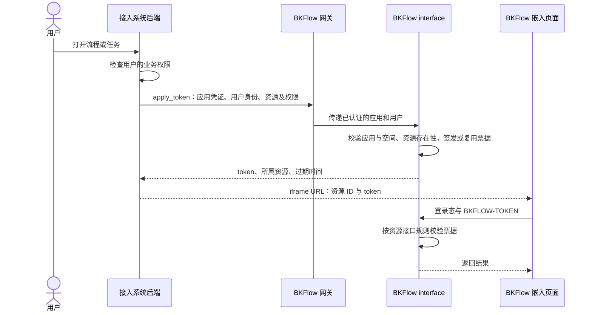

# Token 授权与接入说明

BKFlow 的 `BKFLOW-TOKEN` 是接入系统代用户申请的临时资源访问票据，主要用于嵌入画布、任务详情和调试页面，以及使用同类资源接口的 SDK 接入。票据约束用户、空间、资源和操作能力，用户身份仍由登录态或网关认证提供。

本文描述 2026-09-09 实现的组合票据与旧单项协议兼容行为。组合申请默认关闭；需部署包含本次迁移和全部消费者适配的版本后才可启用。部署版本不同时，应核对对应版本的权限类和配置；本地回归不表示 CI、生产部署或业务验收已完成。

## 1. 接入系统与 BKFlow 的职责

接入系统负责判断用户是否有权访问自己的业务资源，再以该用户身份向 BKFlow 申请合适的资源票据。BKFlow 校验调用应用是否属于目标空间、资源是否存在，并在资源访问时按接口权限规则约束操作。

`apply_token` 不会查询接入系统的业务权限。应用拥有空间的签发入口权限，不等于该应用的所有用户都应获得空间内任意资源权限；业务权限检查应发生在接入系统后端。



凭证之间的职责如下：

| 凭证 | 职责 |
| --- | --- |
| 网关应用凭证、用户身份及 JWT | 确认调用应用、用户及网关资源访问权限 |
| `BKFLOW-TOKEN` | 模板、任务、作用域等资源接口的授权票据 |
| `BKFLOW-INTERNAL-TOKEN` | interface、engine 等模块间的内部调用认证 |
| 开放插件回调 token | 约束某次插件执行的任务、节点、请求、版本和回调期限 |

浏览器直接访问 BKFlow 页面接口时使用登录态；经网关访问 SDK 资源时还须满足该网关资源的认证要求。不能把“需要资源 token”理解成可以省略这些身份认证。

## 2. 一张票据绑定什么

Token 是数据库记录，票据值为 32 位十六进制字符串，服务端通过该值查询权限。当前模型保存 token 原值，不是只保存其摘要。

| 字段 | 含义 |
| --- | --- |
| `token` | 票据值，也是记录主键 |
| `space_id` | 所属空间 |
| `user` | 被授权用户名 |
| `expired_time` | 服务端过期时间 |
| `grant_set_hash` | 完整授权集合摘要，用于检索和完整性校验，不对外返回 |

`TokenGrant` 是唯一授权来源，每条明细保存 `resource_type`、`resource_id`、`permission_type` 和单项摘要。单项票据有一条明细，组合票据有多条明细；用户、空间和过期时间仍只在主票据保存一份。任一明细缺失、重复、字段非法、单项摘要错误或集合摘要不一致时，整张票据无效。

例如，同一用户对模板 `100` 的 `VIEW` 与 `EDIT` 是两组不同授权，可放在同一张组合票据中。票据没有绑定浏览器会话、模板版本、流程内容指纹、审批单或调用次数，也没有单独的累计最长寿命字段。

实现见 [Token 模型](../../bkflow/permission/models.py)。

### 操作权限与任务展示标记为什么分开定义

Token 的资源类型和操作权限是两个维度。例如模板编辑表示为 `resource_type=TEMPLATE, permission_type=EDIT`，不需要再将资源信息写入 `permission_type`。任务详情的 `auth` 是扁平字符串数组，需要用 `FLOW_` 前缀区分所属模板的权限，因此使用独立的展示类型：

| 定义 | 当前值 | 用途 |
| --- | --- | --- |
| `TokenPermissionType` | `VIEW`、`EDIT`、`OPERATE`、`MOCK` | Token 的操作类型，供模型和权限校验使用 |
| `TaskAuthCode` | `VIEW`、`EDIT`、`OPERATE`、`MOCK`、`FLOW_VIEW`、`FLOW_EDIT`、`FLOW_MOCK` | 任务详情的常用展示标记；作用域权限直接使用原操作值，模板权限使用 `FLOW_*` |
| `Token.PERMISSION_TYPE` | `VIEW`、`EDIT`、`OPERATE`、`MOCK` | 兼容申请、撤销接口参数校验的操作类型集合 |
| `TASK_AUTH_CODES` | `VIEW`、`OPERATE`、`FLOW_VIEW`、`FLOW_EDIT`、`FLOW_MOCK` | 任务详情为管理员返回的默认 `auth` 集合，不是签发参数全集 |

`ApiGwTokenSerializer.permission_type` 引用的是 `Token.PERMISSION_TYPE`，不会使用 `TaskAuthCode` 扩展签发范围。申请模板编辑票据应传 `resource_type=TEMPLATE, permission_type=EDIT`；传 `permission_type=FLOW_EDIT` 会被参数 choices 校验拒绝。第 8 节说明 `FLOW_*` 如何在响应中产生。

旧版本的 `PermissionType` 将上述四种操作和三个 `FLOW_*` 标记放在同一个枚举中。拆分只调整 Python 类型和引用：授权明细中的 `permission_type` 值、接口接受的四种权限字符串及前端消费的 `auth` 数组均保持兼容。

这里描述的是模型声明和公开接口的参数限制；Django 字段 choices 本身不是数据库枚举约束，不能由此推断绕过接口直接写入的任意字符串一定会被数据库拒绝。参见[申请与撤销序列化器](../../bkflow/apigw/serializers/token.py)。

## 3. 申请与复用

网关入口为 `POST /space/{space_id}/apply_token/`，业务请求体如下：

```json
{
  "resource_type": "TEMPLATE",
  "resource_id": "100",
  "permission_type": "EDIT"
}
```

应用凭证和用户认证材料按部署网关的认证协议传递，不应放入 iframe URL。申请接口的 `appVerifiedRequired`、`userVerifiedRequired` 和 `resourcePermissionRequired` 均为 `true`，后端另校验调用应用的 `app_code` 与空间绑定应用一致。

`space_id` 取自 URL，用户名取自已认证的 `request.user.username`。请求体没有用于指定被授权人的 `user` 字段，填写额外的 `user` 不会切换签发对象。

签发过程如下：

1. 校验字段及目标资源存在性，并按完整三元组去重、排序。
2. 计算完整授权集合摘要，查找同一空间、用户和相同完整集合的未过期票据。
3. 持锁复查主票据、全部明细和摘要；若有多个候选，复用最晚过期的一张，开启自动续期时将过期时间更新为“当前时间 + 空间配置时长”。
4. 若没有有效候选，在同一事务内生成主票据并写入全部授权明细。

因此，同一用户反复打开同一资源可能复用同一张票据。字段组合没有数据库唯一约束，不能把复用行为理解成并发签发时严格只会产生一条记录。

旧单项响应的 `Token.to_json()` 返回 `space_id`、`user`、`resource_type`、`resource_id`、`token` 和 `expired_time`，不返回 `permission_type`；接入方应保留申请时使用的权限类型。

参见 [申请接口说明](../../bkflow/apigw/docs/zh/apply_token.md)、[申请实现](../../bkflow/apigw/views/apply_token.py)及[网关资源配置](../../bkflow/apigw/management/commands/data/api-resources.yml)。

### 同一接口申请多个授权

部署服务配置 `TOKEN_COMPOSITE_ENABLED` 默认关闭；设置 `BKAPP_TOKEN_COMPOSITE_ENABLED=true` 才启用新申请格式（仅字面量 `true`，大小写不敏感；`1`、`0`、`false` 均不启用）。开关只控制 grants 申请，关闭后已签发组合票据仍可消费、续期和撤销。

```json
{
  "grants": [
    {"resource_type": "TEMPLATE", "resource_id": "100", "permission_type": "MOCK"},
    {"resource_type": "TASK", "resource_id": "200", "permission_type": "OPERATE"}
  ]
}
```

`grants` 非空且原始条目数最多 32，先限制长度再按完整三元组去重和排序。每项使用旧字段校验，全部资源校验成功后才签发或续期；索引错误标为 `grants[0]` 等。相同用户、空间和完整集合可复用，顺序或重复项不影响；子集、超集、不同操作不能复用。并发允许多张等价票据，但每张均须原子保存完整明细。

新格式响应 data 包含 `space_id`、`user`、`token`、`expired_time`、`grants`，不返回顶层资源字段和内部摘要；旧响应由单项明细重建原字段集合。去重后仅一项时仍写入一条统一明细，并可与旧格式请求复用同一票据；响应结构始终跟随本次请求格式。时间编码沿用申请响应链路，UTC 示例为 `2026-09-09T05:00:00Z`，完整请求/响应见[申请接口说明](../../bkflow/apigw/docs/zh/apply_token.md)。

**顶层只要出现任意一个旧字段，就按旧单项格式处理并忽略 grants。** 缺少其他旧必填字段时仍报旧错误。新客户端只传 grants，不混用两种格式。不向已发出票据追加或替换授权；角色变化时撤销整张票据后重签。

示例票据可同时调试模板和操作普通任务，但不能把两项字段交叉拼成 `TEMPLATE/100/OPERATE`。前端仍携带一个 `BKFLOW-TOKEN`，无需逐动作切换。

## 4. 资源与权限范围

下面是主要资源权限类的能力关系。权限包含关系由各权限类的检查分支实现，并非一套适用于全部接口的统一权限等级；具体动作还取决于对应 ViewSet 的配置，见第 9 节。

| 资源类型 | 权限类型 | 主要能力 |
| --- | --- | --- |
| `TEMPLATE` | `VIEW` | 查看指定模板 |
| `TEMPLATE` | `EDIT` | 查看、编辑指定模板 |
| `TEMPLATE` | `MOCK` | 查看、编辑、调试指定模板，并访问、操作该模板创建的 MOCK 任务 |
| `TASK` | `VIEW` | 查看指定任务 |
| `TASK` | `OPERATE` | 查看、操作指定任务 |
| `SCOPE` | `VIEW` | 查看作用域内的模板和任务 |
| `SCOPE` | `EDIT` | 查看、编辑作用域内模板；任务权限类不会因此授予任务操作能力 |
| `SCOPE` | `OPERATE` | 查看、操作作用域内任务；模板侧另允许 `preview_task_tree` |
| `SCOPE` | `MOCK` | 作用域内模板的查看、编辑、调试，以及任务权限类中的查看、操作和 mock 数据访问 |

`MOCK` 是较强的调试授权。单步、全局调试等动作可能创建、启动或终止真实引擎任务，不能理解成仅可查看模拟数据。

模板 `MOCK` 访问任务时，`TaskMockTokenPermission` 要求任务的 `create_method == "MOCK"` 且所属模板匹配；作用域的任务权限类没有同样的创建方式限制。模板 `EDIT` 也不会自动授予普通任务的操作权限。

`DebugViewSet` 另外配置了动作权限：只读动作接受模板 `VIEW` 或 `MOCK`，写入调试状态和执行任务的动作要求 `MOCK`，并支持 scope `MOCK` 回退；不能将模板详情中的 `EDIT` 包含查看规则直接套到所有调试接口。

虽然资源枚举包含 `LABEL`，当前申请接口的资源存在性校验只支持 `TEMPLATE`、`TASK`、`SCOPE`，所以不能通过 `apply_token` 签发 `LABEL` 票据。申请序列化器也没有严格校验资源与权限的组合，例如接受某个权限字段不等于对应任务接口会认可该权限。

参见[模板权限](../../bkflow/template/permissions.py)、[任务权限](../../bkflow/interface/task/permissions.py)、[调试动作权限](../../bkflow/template/views/debug.py)和[申请参数校验](../../bkflow/apigw/serializers/token.py)。

## 5. 资源关系如何影响授权

### 模板

模板 ID 需要匹配。一个模板引用另一个模板，并不会自动赋予被引用模板的编辑权限。模板票据也没有绑定某个快照版本。

### 任务与子任务

任务 ID 可以直接匹配；不匹配时，校验逻辑会通过 engine 查询 `parent_task_info.task_id`，向上递归寻找票据对应的父任务。由此，父任务票据可以覆盖后代任务，子任务票据不能反向授权父任务。嵌套较深时，该校验会增加 engine 查询次数。

### 作用域

作用域使用 `scope_type_scope_value` 作为 `resource_id`，例如 `biz_100`。当前申请校验要求恰好一个下划线，并要求该空间已存在相同 scope 的模板；不能把它当作任意分隔格式或任意空 scope 的预授权入口。

校验时根据资源的当前 scope 属性判断，而不是使用签发时的资源列表快照。资源迁入或迁出作用域会影响授权范围。HTTP 消费者通过 `Token.verify()` 的 `target_resource_type` 明确传入 `TEMPLATE` 或 `TASK`，scope 按实际目标类型查找，避免模板与任务的相同 ID 混淆。只有单项 scope 票据在未传目标类型的旧式内部调用中保留模板优先、再查任务的回退；多项票据未传目标类型时拒绝该 scope 授权分支。

参见 [Token.verify](../../bkflow/permission/models.py) 和 [TokenResourceValidator](../../bkflow/apigw/serializers/token.py)。

## 6. 页面传递与后端校验

页面首次读取 URL query 中的 `token` 后，会写入前端状态与 `bkflow-token` Cookie，再从当前路由 query 中移除 token。之后请求统一携带 `Bkflow-TOKEN` 请求头。Cookie 当前设置保存一天，但服务端票据是否有效仍由数据库中的 `expired_time` 决定。

`TokenMiddleware` 只将 `HTTP_BKFLOW_TOKEN` 写入 `request.token`，真正的校验发生在资源权限类中。主模板、任务路径通过 `Token.verify()` 查询当前用户名、票据、资源类型和权限类型，再检查有效期和资源关系；传入空间时还会检查空间。

部分任务权限检查没有显式传入空间，视图随后从当前用户的有效票据取得所属空间，再选择对应 engine。interface 调用 engine 时使用内部模块 token 和内部空间请求头。空间隔离需要结合权限类、视图取空间逻辑及 engine 调用链核对。

系统管理员、空间管理员在配置允许时可通过同一 ViewSet 的其他权限分支访问资源。同一 ViewSet 内的 OR 关系不表示网关认证、资源权限与业务校验可以互相替代。接入方也不应假设所有 APIGW 资源都要求 `BKFLOW-TOKEN`：应检查该资源对应的后端权限类。

参见[页面初始化](../../frontend/src/App.vue)、[请求头注入](../../frontend/src/api/ajax.js)、[任务视图](../../bkflow/interface/task/view.py)和[内部调用客户端](../../bkflow/contrib/api/collections/task.py)。

## 7. 有效期、续期、撤销与清理

| 项目 | 当前行为 |
| --- | --- |
| `token_expiration` | 默认 `1h`，最短 1 小时 |
| 配置上限 | 部署配置 `BKAPP_TOKEN_EXPIRATION_MAX_EXPIRATION` 控制秒数，默认 `2592000`（30 天），用于校验空间配置 |
| `token_auto_renewal` | 字符串 `"true"` / `"false"`，默认开启 |
| 再次申请 | 复用有效票据时，开关开启才刷新到期时间 |
| 页面续期 | 编辑页、模板调试页为普通用户启动每 5 分钟一次的续期请求 |
| 撤销 | 将匹配记录的到期时间更新为当前时间 |
| 清理 | 每 10 分钟运行任务，默认清理过期超过 12 小时的记录；保留时长由 `TOKEN_RETENTION_TIME` 控制 |

普通业务请求中的 `Token.verify()` 不会自动续期。页面显式调用 `POST /api/permission/token/{token}/renewal/`，接口检查登录用户与票据用户相同，模型根据空间开关把到期时间设置为“当前时间 + 配置时长”。这不是到期后由后台自动延长，也不是按鼠标或键盘活动决定续期；其他客户端不能仅凭持续发送业务请求获得同样的效果。

修改 `token_expiration` 不会批量更新已签发票据，只会影响之后的签发或成功续期。30 天上限约束的是配置时长，当前没有独立的累计最长寿命限制；持续成功续期时，总存活时间可以超过单次有效期。续期持有主票据锁后重新检查当前有效期、用户及完整授权；到期或撤销后不能通过续期恢复。续期先完成时后续撤销覆盖它；撤销先完成时续期失败。申请复用也在持锁后复查。

撤销入口为 `POST /space/{space_id}/revoke_token/`，支持 `token`、`user`、`resource_type`、`resource_id` 和 `permission_type` 条件，多个条件共同过滤；组合票据的全部资源条件必须匹配同一条授权，命中后整张票据失效。返回 `N tokens revoke success` 中 N 统计不同主票据，已过期票据也计入，多条明细命中不重复计数。过滤不按父子任务、scope 成员或权限包含关系扩展。**提交空对象 `{}` 会撤销该空间全部票据。** 该入口要求应用和网关资源认证，并校验应用与空间绑定，但不要求网关用户认证。

例如，以下业务请求体用于精确撤销一张票据：

```json
{
  "token": "<BKFLOW_TOKEN>"
}
```

成功页面续期的 `expired_time` 保持旧协议：按服务默认时区（非请求当前活动时区）输出不带偏移的时间字符串；关闭续期开关时沿用数据库原时间的编码。内部有效期判断使用带时区时间。外层成功包装与内层续期结果均保持原字段；申请响应的时间编码不因此改变。

过期清理删除主票据时级联删除全部明细。撤销与过期清理不会终止已经运行的任务。它们作用于之后的资源访问校验；终止任务需要执行相应任务操作。票据也不与接入系统登录会话绑定，用户退出接入系统不会由上述机制自动触发撤销。

参见[空间配置](space_config.md)、[续期入口](../../bkflow/permission/views.py)、[撤销接口](../../bkflow/apigw/docs/zh/revoke_token.md)和[过期清理任务](../../bkflow/permission/tasks.py)。

## 8. `auth` 展示与当前请求票据

模板详情中的 `auth` 汇总当前用户对模板及 scope 持有的全部有效、授权完整票据权限，重复操作只显示一次。任务详情还汇总模板权限，并添加 `FLOW_` 前缀，如 `FLOW_VIEW`、`FLOW_EDIT`、`FLOW_MOCK`。这些是区分模板权限的展示标记，不是 `apply_token` 可签发的新权限类型。

代码通过 `TEMPLATE_PERMISSION_TO_TASK_AUTH` 显式映射模板的 `VIEW`、`EDIT`、`MOCK`。申请接口目前没有逐一限制资源与操作的组合，因此对 `TEMPLATE + OPERATE` 等组合保留旧的前缀拼接结果（如 `FLOW_OPERATE`），避免类型拆分改变已有响应。这不表示该标记会被前端识别，或模板接口因此获得操作能力；`TaskAuthCode` 也不作为历史 `auth` 值的封闭校验集合。

例如，用户持有目标任务的 `TASK + OPERATE` 票据，以及其所属模板的 `TEMPLATE + EDIT` 票据时，任务详情可以返回 `auth: ["OPERATE", "FLOW_EDIT"]`：前者表示任务操作权限，后者表示所属模板编辑权限。`FLOW_EDIT` 不会因此成为一张单独的票据，也不会让模板编辑权限自动获得普通任务的操作能力。

前端使用 `FLOW_VIEW`、`FLOW_EDIT`、`FLOW_MOCK` 判断任务页的查看流程等入口是否展示，使用 `OPERATE` 判断任务操作能力；参见[任务操作组件](../../frontend/src/views/task/TaskExecute/TaskOperation.vue)。保留 `FLOW_` 前缀可以避免任务的 `VIEW` 与所属模板的 `VIEW` 在扁平 `auth` 数组中混淆。

资源接口校验的是请求实际携带的那张票据。因此，即使页面 `auth` 包含 `EDIT`，仍携带旧 `VIEW` 票据的请求也不会因此自动升级。切换模板、任务或操作能力时，接入方需要确保页面使用相应票据，不能将 `auth` 聚合结果当成当前票据的授权声明。

参见[模板权限汇总](../../bkflow/template/serializers/template.py)和[任务权限汇总](../../bkflow/interface/task/view.py)。

## 9. 当前实现边界

本版本已统一主票据有效性、用户/空间绑定和完整授权检查；插件空间、决策表及 Uniform API 的 HTTP 路径也执行这些检查。scope 消费方传入实际模板/任务类型，避免相同数值 ID 混淆。插件票据仍保留原空间级能力，Uniform API 仍在同时有 template_id/task_id 时优先模板。

以下既有边界不属于本次动作权限改造范围：

- **动作权限映射需要逐接口核对。** 当前 `TemplateViewSet.EDIT_ABOVE_ACTIONS` 仅列出 `update`，发布、回滚等写动作没有列入其中。第 4 节描述主要权限语义，不能据此保证所有写动作都拒绝 `VIEW`。参见[模板视图](../../bkflow/template/views/template.py)。
- **单任务票据路径不能直接覆盖所有批量接口。** 当前任务 token 权限类依赖 URL 参数 `task_id`。无此参数的批量 action 不会因为请求体带有任务 ID 就自动通过，需要核对相应接口权限配置。管理员调用成功不代表普通用户的票据路径也已覆盖。

## 10. 接入排查顺序

1. 申请失败时，先确认网关应用、用户与资源权限，再确认应用是否绑定目标空间、目标资源是否存在。
2. 页面访问被拒绝时，检查实际发送的 `BKFLOW-TOKEN`、登录用户名和服务端到期时间，而不只看 URL 或 Cookie 是否还有值。
3. 页面展示与操作结果不一致时，区分 `auth` 聚合权限与当前票据，并确认当前动作接受的权限类型。
4. 长时间使用后失败时，检查是否调用了续期入口、续期开关及请求结果；普通业务请求不会自动续期。
5. 子任务、scope 或批量请求失败时，按实际资源关系和接口权限类检查，不要仅靠换成管理员账号判断问题已解决。

相关入口：[系统接入](system_access.md)、[空间配置](space_config.md)、[申请 token](../../bkflow/apigw/docs/zh/apply_token.md)、[撤销 token](../../bkflow/apigw/docs/zh/revoke_token.md)。

## 11. 上线与回退

1. 进入维护窗口，备份数据库，并停止所有旧版本的票据读取、签发、续期、撤销和过期清理进程。旧实例不得在迁移期间继续写旧字段。
2. 部署新代码并执行普通 `migrate`。`permission.0006` 先校验已有组合票据，再将全部历史单项（含过期和资源已删除记录）原值回填为一条授权明细和集合摘要；`permission.0007` 随后将摘要改为非空并删除主表旧资源字段。票据值、用户、空间、有效期和资源三元组不变，无需重签。
3. 全空的旧资源三元组会使迁移在任何数据变更前停止；未知枚举或部分空字段按原值迁移，不做静默修复，但运行时完整性校验会拒绝无效明细。已有组合票据缺明细、摘要错误等异常也会停止迁移，结构清理不会继续执行。排查并明确修复数据后再重试。
4. 迁移完成后读回旧票据，再启动全部新版本实例，先保持 `BKAPP_TOKEN_COMPOSITE_ENABLED=false`。确认旧协议、空间/用户隔离、过期拒绝及 SDK/页面调用正常后，才按环境验收结果启用 grants 申请。开关只控制组合申请，不控制已签发票据的读取、续期或撤销。
5. 数据库可从最新版本明确反向迁移到 `permission.0005`：结构迁移先恢复旧列，数据迁移再将有效单项明细还原到三元组并清除其摘要；多项票据保持 `0005` 的组合存储。若还需回退到不支持组合票据的更早代码，须先关闭入口并使所有多项票据失效，且另行验证更早迁移链路；关闭申请开关本身不构成数据库回退。

本地 MySQL 迁移、约束与并发测试只证明本地版本行为；外部审查、最新提交 CI、发布版本及真实业务验收以 [PR #913](https://github.com/TencentBlueKing/BKFlow/pull/913) 和对应环境记录为准。设计与迁移细节见[统一存储设计](../specs/2026-09-09-unified-token-storage-design.md)。
