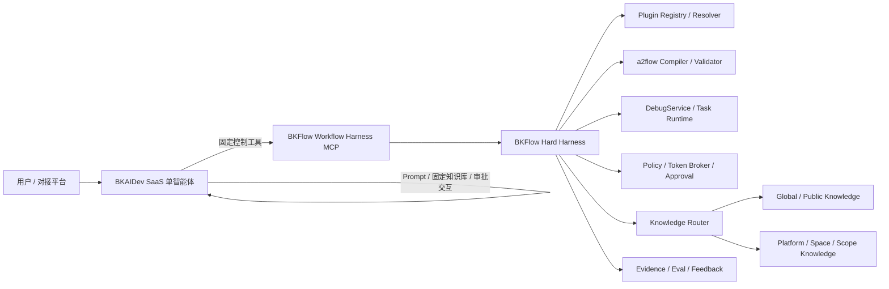
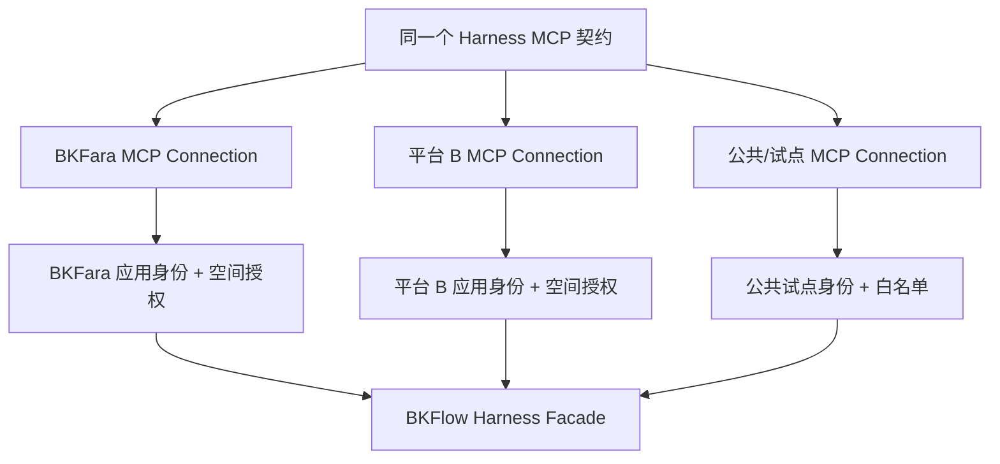
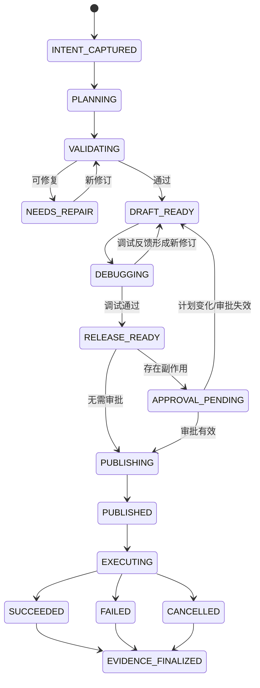
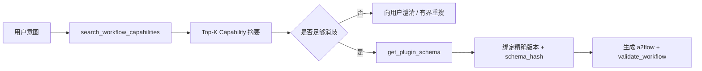
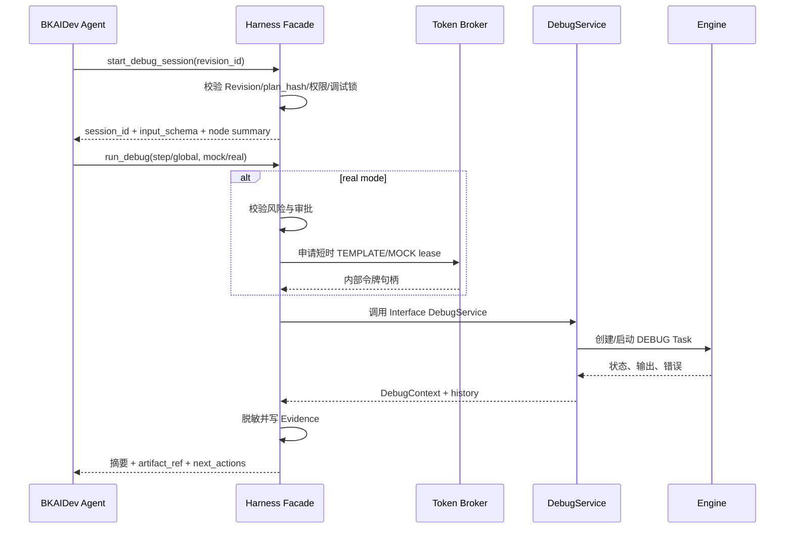
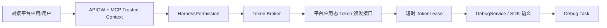
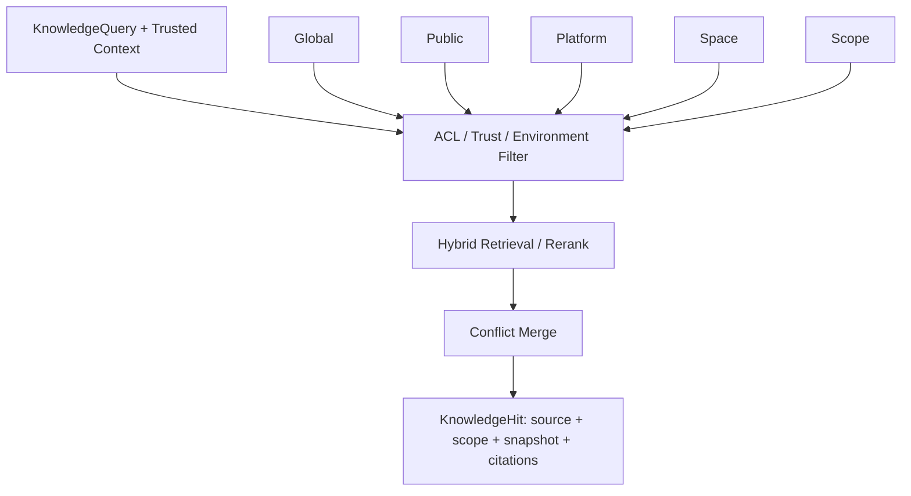
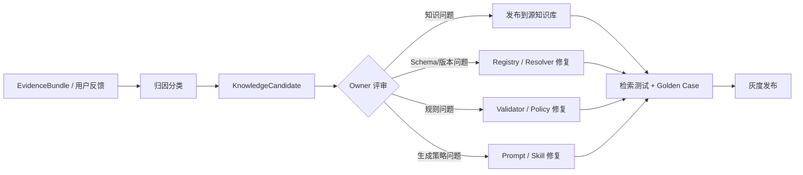
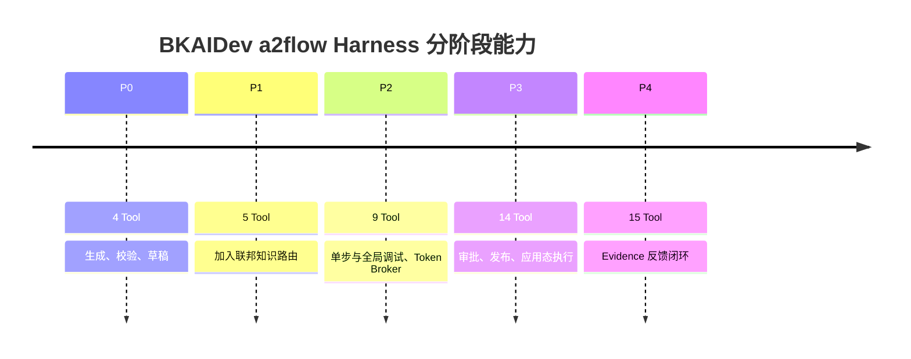

# BKAIDev 上的 BKFlow a2flow Harness 工程化设计

> 状态：设计已确认，待进入实施计划评审
>
> 日期：2026-09-01
>
> BKFlow 基线：`feat/a2flow@8a648f09f6192074eb4f71bb261edb864d6ce1f9`
>
> BKAIDev 产品依据：[智能体使用文档](https://iwiki.woa.com/p/4029461518)
>
> Tool Search 参考：[Claude Agent SDK Tool Search](https://code.claude.com/docs/en/agent-sdk/tool-search)

## 1. 设计结论

本方案的目标不是再定义一个“AI 能生成流程 JSON”的协议，而是交付一个可长期运营的 **AI 生成流程 Harness**：它能够理解需求、发现能力、按需取得精确 Schema、生成和修复 a2flow、执行单步/全局调试、完成审批、发布和运行，并把全过程沉淀为可验证、可追踪、可回放的证据。

最终方案确定为：

1. 使用 **BKAIDev SaaS 原生单智能体**承载对话、模型、Prompt、固定知识库、MCP 调用、审批交互、调试、发布渠道和运营能力，不以 AI-Agent SDK 或自建 Agent Framework 作为主路径。
2. 在 BKFlow Interface 侧建设 **Hard Harness**，承担状态机、能力事实、确定性校验、Token Broker、单步/全局调试、审批绑定、发布、执行、Evidence 和知识路由。
3. 对 BKAIDev 只提供 **1 个逻辑 MCP：`BKFlow Workflow Harness MCP`**，最终共 15 个稳定的控制 Tool；业务插件/API 作为可检索的能力数据，不动态展开为数百个 MCP Tool。
4. 参考 Claude Tool Search 的地方是“按需发现用于构建流程的业务插件/API 能力”，不是搜索这 15 个 Harness 控制 Tool。
5. 每个对接平台应用使用独立的 MCP 连接/凭证配置。逻辑 MCP 只维护一套，BKFara、其他平台应用分别拥有隔离的可信身份和授权范围。
6. P0 复用 BKAIDev 固定知识库；P1 增加轻量 `KnowledgeSourceBinding + Knowledge Router`，复用 BKAIDev/平台知识库的存储和检索，不在 BKFlow 重建完整知识库管理系统。
7. BKFlow 保存结构化生成状态和证据，不保存完整 AI 对话。BKAIDev 是对话事实源，BKFlow 是工作流工件、权限、调试、审批和运行事实源。



## 2. 范围与非目标

### 2.1 本期范围

- BKAIDev SaaS 中单智能体的配置、资源挂载、审批、调试、发布和灰度策略。
- BKFlow Harness MCP 的 15 个 Tool 契约和分阶段开放方式。
- `HarnessRun`、计划修订、校验、调试、审批、发布、执行和证据的数据模型与状态机。
- 插件/API 能力搜索、精确 Schema 获取、版本固定和漂移检测。
- `sdk_debug_*` 能力的 Harness 化封装，以及平台应用态 BKFlow Token 的可信颁发和使用。
- Global/Public/Platform/Space/Scope 五层知识的路由、ACL、发布和反馈闭环。
- 单步调试、全局调试、发布、执行、回放和评测。

### 2.2 明确不做

- 不自建通用 Agent Runtime、对话服务、模型路由、渠道管理或 BKAIDev 的替代品。
- 不在 BKFlow 建完整的知识文档编辑、切片、向量化、全文检索和运营后台。
- 不把实时插件 Schema、权限结果和动态资源复制到知识库作为权威事实。
- 不让模型直接调用 `sdk_debug_*`、底层 Engine API 或拿到 BKFlow Token。
- 不让模型直接生成和执行底层 `pipeline_tree`；模型生成 a2flow 候选，BKFlow 确定性转换。
- 不以“JSON 可解析”“模板创建成功”或“引擎任务结束”为业务成功；必须验证后置条件。
- 不自动删除、回滚已发布模板或运行中的任务。回滚采用配置、Tool allowlist、MCP 连接和功能开关。

## 3. 当前 `feat/a2flow` 能力盘点

状态含义：

- **已有**：当前分支源码和 APIGW 已具备，可复用。
- **需优化**：存在基础能力，但缺少 Harness 所需的统一契约、状态、权限、版本或证据。
- **缺失**：当前分支没有对应工程能力，需要新增。

| 领域 | 当前状态 | 当前证据 | Harness 需要的动作 |
| --- | --- | --- | --- |
| a2flow v2 模型 | 已有 | `pipeline_converter/converters/a2flow_v2/data_models.py` 已覆盖 Activity、SubProcess、网关、变量、失败策略、重试和超时 | 固定协议/兼容策略；补工件版本、来源和能力绑定 |
| 确定性转换 | 已有 | `A2FlowV2Converter`、Node/Gateway/Variable Builder、Plugin Resolver | 增加可复现指纹、SourceMap 和漂移校验 |
| 插件摘要搜索 | 已有 | `list_plugins` 聚合 component、remote_plugin、uniform_api，并按空间/Scope 过滤 | 建语义化 Search Projection、稳定 `capability_ref`、风险/质量/生命周期字段 |
| 精确插件 Schema | 已有 | `get_plugin_schema` 支持类型、版本、来源消歧 | 统一精确版本和 `schema_hash`；全链路强制复验 |
| a2flow dry-run | 已有 | `validate_a2flow` 调用 v2 Converter 并返回结构化转换错误 | 扩展数据流、权限、资源、风险、成本和后置条件检查；生成 `ValidationReport` |
| 从 a2flow 创建模板 | 已有 | `create_template_with_a2flow` 支持 v1/v2、草稿/自动发布参数 | 改造成幂等、有计划绑定、默认只建草稿的 `create_workflow_draft` |
| 单步调试 | 已有底座 | `DebugService.step_run`、节点 Mock、上下文变量、依赖/缺失变量判断 | Harness Tool 封装、Token Broker、Evidence、计划指纹和审批门禁 |
| 全局调试 | 已有底座 | `DebugService.global_run`、reset、terminate、history、共享调试锁 | Harness Session、模式策略、冲突提示、状态恢复和全局实跑审批 |
| 调试 APIGW | 已有但不宜直出 | `sdk_debug_context/input_schema/history/global_run/...` 共 10 个 SDK Operation | 不暴露给 Agent；聚合为 4 个 Harness Tool |
| 模板发布 | 已有底座 | `release_template`、模板快照/草稿/版本能力 | 增加 `ReleaseManifest`、`plan_hash`、审批绑定和发布前复验 |
| 任务执行与控制 | 已有底座 | `create_task`、`operate_task`、节点操作、任务状态/数据接口 | 聚合成 Agent 友好的 4 个 Tool，增加 Evidence 和后置条件 |
| BKFlow Token | 已有底座 | `permission.Token`、`TEMPLATE/MOCK` 权限、申请/撤销、SDK Permission | 新增对接平台可信颁发链和 Token Broker；令牌不得进入模型上下文 |
| Harness 状态与工件 | 缺失 | 当前状态分散在会话参数、模板、DebugContext 和任务 | 新增 Interface 侧 Harness 数据模型和状态机 |
| 知识联邦 | 缺失 | 仅能在 BKAIDev 固定挂载知识库 | 新增绑定元数据、ACL 路由、快照和候选闭环 |
| Evidence / EvalOps | 缺失 | 有日志、操作记录、Debug 历史、任务数据 | 新增脱敏证据包、回放 Fixture、Golden Case 和反馈入口 |
| MCP 产品化契约 | 缺失 | APIGW 是面向业务/画布 SDK 的原始接口 | 建 Harness Facade、统一 Envelope、错误分类、幂等和审计 |

当前分支已经具备 P0 的四个关键原材料，也具备 P2/P3 调试与运行底座，但尚未形成完整 Harness。主要缺口不是“再写一个协议”，而是将这些能力组织成受治理的状态机和稳定控制面。

## 4. BKAIDev 与 BKFlow 的职责边界

### 4.1 BKAIDev Soft Harness

BKAIDev 使用一个原生单智能体，负责：

- 接受自然语言需求并澄清目标、输入、约束、风险和验收标准。
- 管理 Role Prompt、模型、固定知识库、Skill 和快捷指令。
- 选择并调用 15 个 Harness 控制 Tool。
- 在产品界面展示 Tool 调用摘要、审批请求、调试结果和发布/执行结果。
- 管理智能体版本、渠道、使用权限、会话记录和运营数据。

BKAIDev 不负责：

- 判断真实空间权限、签发 BKFlow Token、持久化最终发布计划。
- 决定插件/Schema 的权威版本。
- 以 Prompt 代替确定性编译、校验、风险策略或运行时复验。
- 保存可以直接重放的敏感凭证或完整运行输出。

### 4.2 BKFlow Hard Harness

BKFlow Interface 侧新增 Harness Facade 和服务层，负责：

- 从可信调用链解析平台应用、真实用户、空间、Scope 和环境。
- 维护 `HarnessRun`、计划修订、校验、调试、审批、发布、执行和证据。
- 搜索授权能力，并在每个关键阶段重新 Resolve 精确版本和 Schema Hash。
- 计算 `plan_hash`，执行幂等、风险、预算、审批有效性和状态转移校验。
- 通过 Token Broker 获取短时、最小权限的 BKFlow Token，内部调用现有 Debug/Template/Task 服务。
- 路由知识源并确保 ACL 先于检索。
- 输出结构化、脱敏、可恢复的结果和 Evidence 引用。

### 4.3 对话上下文与流程上下文

| 上下文 | 权威系统 | 内容 |
| --- | --- | --- |
| 对话上下文 | BKAIDev | 用户消息、系统 Prompt、模型消息、Tool 调用历史、展示摘要 |
| 生成上下文 | BKFlow Interface | HarnessRun、意图快照、计划修订、能力绑定、校验报告、调试、审批、发布和执行引用 |
| 引擎运行上下文 | BKFlow Engine | 任务实例、节点状态、变量、回调和执行日志 |

一个 BKAIDev 会话可以创建多个 HarnessRun；一个 HarnessRun 也可以在会话压缩、页面刷新或渠道切换后继续。二者不能设计成 1:1。

## 5. MCP 拓扑与平台隔离

### 5.1 逻辑与物理拓扑

- 逻辑上只维护一个 `BKFlow Workflow Harness MCP`。
- 对每个对接平台应用创建一个独立连接配置，例如 BKFara 连接、其他平台连接。
- 每个连接绑定平台应用身份、允许空间/Scope、风险策略、环境和回调配置。
- 公共 Tool 契约和服务代码共用；连接凭证、授权边界和审计主体隔离。
- 中央 BKAIDev 应用不能凭自身身份访问 BKFara 私有空间；必须使用 BKFara 应用身份或显式委托。



### 5.2 BKAIDev 配置变量

可信部署变量由平台配置，不允许模型修改：

- `platform_key`
- `platform_app_binding`
- `default_space_binding`
- `allowed_scope_types`
- `risk_policy_version`
- `target_environment`
- `mcp_contract_version`

运行变量只保存非敏感引用：

- `run_id`
- `revision_id`
- `plan_hash`
- `draft_ref`
- `debug_session_id`
- `approval_request_id`
- `published_ref`
- `execution_id`

App Secret、BKFlow Token、用户票据、审批凭据、Credential 明文和完整敏感 Tool 输出不得成为 Prompt/角色变量。

## 6. Harness 状态与数据模型

### 6.1 状态机



### 6.2 Interface 侧核心模型

| 模型 | 关键字段 | 说明 |
| --- | --- | --- |
| `HarnessRun` | run_id、platform、actor、space、scope、status、policy_version | 一次独立的 AI 生成流程任务 |
| `WorkflowPlanRevision` | revision_id、run_id、intent_spec、canonical_a2flow、bindings、plan_hash、parent_revision | 不可变计划修订；修复产生新 Revision |
| `CapabilityBinding` | capability_ref、resolved_version、schema_hash、credential_ref、risk | 精确绑定业务能力，不保存凭证明文 |
| `ValidationReport` | revision_id、checkpoint、errors、warnings、risk_manifest、valid | validate/draft/debug/release/execute 各阶段报告 |
| `DebugSession` | session_id、revision_id、template_ref、mode、status、fingerprint | Harness 对 DebugContext 的隔离引用 |
| `ApprovalRequest` | approval_id、plan_hash、actor、approver、scope、risk、expires_at、status | 审批只对不可变计划有效 |
| `ExecutionRun` | execution_id、published_ref、task_ref、status、postconditions | 应用态任务执行和恢复引用 |
| `EvidenceBundle` | evidence_id、run_id、events、artifacts、redaction_version、outcome | 脱敏后的完整可验证证据 |
| `TokenLease` | lease_id、platform_app、actor、resource、permission、expires_at、status | 仅保存令牌租约元数据，不保存可读明文 |
| `KnowledgeSourceBinding` | binding_id、platform、space、scope、source_ref、trust、priority、snapshot | 知识源路由元数据 |
| `KnowledgeCandidate` | candidate_id、evidence_ref、target_source、content_ref、review_status | 由真实证据产生的知识候选 |

所有 Harness 状态位于 Interface 数据库，不写入 Engine 的 pipeline context。Engine 只维护执行所需状态。

### 6.3 `plan_hash`

`plan_hash` 由以下规范化内容计算：

- canonical a2flow；
- 全部 CapabilityBinding 的精确版本与 Schema Hash；
- space、scope 和目标环境；
- credential 引用和授权范围，不包含凭证明文；
- 执行、风险、重试、超时、补偿和后置条件策略。

不纳入：模型名称、对话措辞、展示文案、Token 明文和临时 Trace 元数据。

修改插件版本、关键参数、目标范围、目标环境、Credential 引用或风险策略都必须产生新 Revision 和新 `plan_hash`，并使旧审批失效。

## 7. 15 个 Harness Tool

### 7.1 设计原则

- 15 个 Tool 是稳定控制面，数量足够小，BKAIDev 可全量挂载。
- 业务插件/API 的数量可以很大，通过 `search_workflow_capabilities` 搜索后按需读取 Schema。
- Search Projection 只用于候选召回，不是运行事实。validate/draft/debug/release/execute 都重新 Resolve。
- 写操作都要求 `idempotency_key`；所有请求携带或派生 `run_id`、`revision_id`、`correlation_id`。
- 大对象存服务端，仅把摘要和 Artifact 引用返回模型。

### 7.2 Tool 清单与阶段

| # | Tool | 阶段 | 风险 | 核心职责 | 复用当前能力 |
| --- | --- | --- | --- | --- | --- |
| 1 | `search_workflow_capabilities` | P0 | L0 | 按意图、空间、Scope、风险和来源搜索业务插件/API 摘要 | `list_plugins` + Search Projection |
| 2 | `get_plugin_schema` | P0 | L0 | 取得一个精确候选的完整 Schema、版本和 Hash | `get_plugin_schema` |
| 3 | `validate_workflow` | P0 | L0 | 编译并生成结构化 ValidationReport | `validate_a2flow` + Validator 扩展 |
| 4 | `create_workflow_draft` | P0 | L1 | 幂等创建/更新 Harness 管理的模板草稿 | `create_template_with_a2flow` |
| 5 | `search_workflow_knowledge` | P1 | L0 | 按平台/空间/Scope 检索流程知识并返回来源和快照 | BKAIDev/平台知识库 + Router |
| 6 | `start_debug_session` | P2 | L1 | 为 Revision 建立调试会话、锁和输入 Schema | DebugContext / input_schema |
| 7 | `run_debug` | P2 | L1/L2 | 统一发起 step/global，支持 mock/real 策略 | step_run / global_run |
| 8 | `get_debug_session` | P2 | L0 | 查询上下文、历史、节点状态和 Evidence 摘要 | context / history |
| 9 | `control_debug_session` | P2 | L1 | reset/terminate/node_mock/context_var | 现有 4 类 SDK 调试操作 |
| 10 | `prepare_release` | P3 | L0 | 复验、生成 ReleaseManifest、风险摘要和审批请求 | Converter/Validator/Template Snapshot |
| 11 | `publish_workflow` | P3 | L2 | 校验审批和 plan_hash 后发布不可变模板版本 | `release_template` |
| 12 | `start_workflow_execution` | P3 | L2 | 以应用态身份创建并启动任务 | `create_task`/`start_task` |
| 13 | `get_workflow_execution` | P3 | L0 | 获取任务状态、事件、节点和后置条件 | task status/data APIs |
| 14 | `control_workflow_execution` | P3 | L2/L3 | pause/resume/revoke/retry/skip/callback 等受控操作 | operate_task / operate_task_node |
| 15 | `submit_generation_feedback` | P4 | L0 | 关联会话反馈、Evidence 和改进候选 | 新增 Feedback/Eval 服务 |

累计 Tool 数：P0 为 4，P1 为 5，P2 为 9，P3 为 14，P4 为 15。

只有在可行性 Spike 证明 BKAIDev 无法稳定保存或传递 `run_id`/会话元数据时，才增加第 16 个 `start_generation_run`。默认不增加，首个写操作可以幂等创建 HarnessRun。

### 7.3 统一请求/响应 Envelope

请求公共字段：

```json
{
  "run_id": "optional-on-first-write",
  "revision_id": "required-after-plan-created",
  "idempotency_key": "required-for-write",
  "expected_plan_hash": "required-for-gated-actions",
  "client_context": {
    "conversation_ref": "opaque-non-secret-reference",
    "agent_release": "versioned-release"
  }
}
```

真实平台应用、用户、空间和 Scope 必须由可信网关/MCP 连接注入，不能相信模型传入的同名字段。

响应公共字段：

```json
{
  "ok": true,
  "run_id": "...",
  "revision_id": "...",
  "plan_hash": "...",
  "status": "DRAFT_READY",
  "summary": "适合进入模型上下文的短摘要",
  "artifact_refs": [],
  "errors": [],
  "next_actions": [],
  "correlation_id": "..."
}
```

错误至少分为：`USER_INPUT`、`CAPABILITY_NOT_FOUND`、`AMBIGUOUS_CAPABILITY`、`SCHEMA_DRIFT`、`VALIDATION`、`PERMISSION`、`APPROVAL_REQUIRED`、`APPROVAL_INVALID`、`TOKEN_LEASE`、`DEBUG_CONFLICT`、`RUNTIME`、`POSTCONDITION`、`RETRYABLE_INFRA`。每个错误包含是否可修复、定位路径、建议动作和是否允许重试。

## 8. Tool Search 的正确落点

Claude Tool Search 的核心经验是：工具集合很大时，不把所有定义预装进上下文，而是先搜索、再按需加载少量相关工具。官方文档同时指出，小于约 10 个工具时全量加载通常更快；随着工具数增大，完整 Tool Definition 会占据大量上下文并降低选择准确率。

BKFlow 借鉴其“按需发现”思想，但落地对象不同：



- 15 个 Harness 控制 Tool 始终可见，不需要 Tool Search。
- 被搜索的是 component、remote plugin、uniform API、未来的 API 插件等“流程节点能力”。
- Search Projection 返回短摘要：`capability_ref`、名称、用途、适用/禁用场景、输入输出摘要、风险、权限、质量和版本提示。
- 精确 Schema 只对选中候选读取。
- 业务插件说明作为不可信业务数据，不能覆盖系统指令、扩大权限或直接触发执行。
- 不依赖 Claude 专有 `tool_reference` 协议；BKAIDev P0 用普通 MCP Tool + Schema 数据即可完成同等工程目标。

## 9. 调试设计：单步 + 全局

### 9.1 调试模式

| 模式 | 默认策略 | 审批 | 用途 |
| --- | --- | --- | --- |
| 单步 Mock | 默认允许 | 无或 L1 | 验证数据映射、条件和下游依赖 |
| 全局 Mock/沙箱 | 默认允许 | L1 | 验证完整拓扑、失败策略和输出聚合 |
| 单步 Real | 默认关闭 | L2，一次一节点 | 验证真实插件与动态资源 |
| 全局 Real | P3 才开放 | L2/L3 | 仅受控测试环境或明确白名单场景 |

### 9.2 调试序列



### 9.3 调试一致性和并发

- 当前 `DebugContext` 是 template-scoped 共享状态，默认一个模板同一时间只有一个 active session。
- Harness Session 必须绑定 `tree_fingerprint` 和 `plan_hash`；草稿变化后旧调试会话失效。
- 若产品需要同一模板并行调试，采用“克隆 Harness 草稿”隔离，不放宽共享锁。
- step_run 前必须检查依赖变量；缺失时返回上游节点和变量路径，不能凭空补值。
- reset 前返回 impact；reset/terminate/node mock/context var 统一通过 `control_debug_session`。
- 调试结果不能直接修改当前 Revision；模型提出修复后创建新 Revision，再重新 validate/debug。

## 10. Token Broker 与可信身份

### 10.1 为什么不能直接复用 SDK Tool

`sdk_debug_*` 的原始定位是前端画布 SDK。它依赖 BKFlow `TEMPLATE/MOCK` Token，而模型和 BKAIDev 通用 MCP 连接不应持有、展示或自行申请这种 Token。

因此 Harness 不能把这些 API 原样注册为 Tool，而应在服务端完成身份转换：



### 10.2 TokenLease 约束

TokenLease 必须绑定：

- 平台应用身份；
- 真实当前用户；
- BKFlow space；
- resource type/id；
- `MOCK` 或更小权限；
- HarnessRun、Revision 和 DebugSession；
- 过期时间、单次/有限次数使用和撤销状态。

Token 明文只存在于服务端内存或安全凭证通道，不写数据库可读字段、不进 Prompt、Tool 返回、Evidence、普通日志或错误堆栈。Token 过期时由 Broker 根据仍然有效的授权重新签发，不让 Agent 处理续期。

### 10.3 权限实现约束

BKFlow 当前 DRF permission class 之间是 OR 语义。后续若新增 `HarnessPermission`，必须在一个权限类/服务中同时完成平台应用、真实用户、空间、资源、动作、风险和审批校验，不能通过并列多个 permission class 假设 AND。

## 11. 联邦 Knowledge Router

### 11.1 是否新建知识库系统

结论：不建完整 BKFlow 知识库产品。分三层处理：

1. **知识内容层**：继续放在 BKAIDev 知识库、BKFara 知识库或其他平台已有知识库中，由各自 Owner 维护内容、切片、索引和检索质量。
2. **路由治理层**：BKFlow 只建设轻量 `KnowledgeSourceBinding + Knowledge Router`，决定当前平台/空间/Scope 可以检索哪些知识源，并记录快照、来源和审计。
3. **运行事实层**：插件版本、Schema、权限、动态资源和执行状态仍由 Registry/Resolver/Runtime 提供，不进入知识库权威区。

### 11.2 五层知识模型

| 层级 | 例子 | Owner | 共享范围 | 覆盖规则 |
| --- | --- | --- | --- | --- |
| Global | a2flow 协议硬约束、安全、权限、幂等、Token 禁令 | BKFlow | 所有空间 | 不可被业务知识覆盖 |
| Public | 标准运维公开流程、通用编排模式、公共插件指南 | BKFlow/社区 Owner | 所有可信空间 | 可被更具体业务偏好补充 |
| Platform | BKFara 故障分析/处置方法、平台术语 | 平台 Owner | 该平台绑定空间 | 只在对应平台生效 |
| Space | 某业务空间的资源、值班和变更规范 | Space Owner | 指定空间 | 优先于 Platform/Public 偏好 |
| Scope | 某项目/业务域/场景的流程和约束 | Scope Owner | 指定 Scope | 业务偏好最高优先级 |

有效知识集合：

`Global + Public + trusted Platform + Space + Scope`

硬规则 Global 不允许覆盖；业务偏好冲突时 `Scope > Space > Platform > Public`。所有知识必须先做 ACL 过滤，再执行关键词/向量检索和重排，不能“先搜全库、结果出来后再过滤”。



### 11.3 `KnowledgeSourceBinding`

至少包含：

- source provider 和不可猜测的 source ref；
- platform、space、scope type/value；
- trust level、priority、environment；
- allowed actors/apps 和数据分级；
- snapshot/version、有效期和最近验证时间；
- Owner、审核人和退役状态；
- 检索模式、Top-K 上限和结果脱敏策略。

P0 可按平台部署固定挂载知识库：公共部署挂 Global/Public，BKFara 部署再挂 BKFara。P1 才开放 `search_workflow_knowledge`，由 Router 动态选择已绑定知识源。

### 11.4 知识闭环



闭环步骤：

1. BKAIDev 记录对话、检索、Tool 调用和用户反馈；BKFlow 记录计划、校验、调试、审批、执行和后置条件。
2. 通过不透明关联引用把会话与 Evidence 对齐，先脱敏再归因。
3. 区分需求、知识、Prompt、Schema、Resolver、Validator、权限、插件、环境和后置条件问题。
4. 生成候选，不直接写入线上知识库。
5. 由目标知识源 Owner 审核来源、复现、适用范围、反例、敏感性和过期条件。
6. 发布到正确载体并形成版本；知识、Prompt、Skill、Registry、Validator 分别治理。
7. 运行检索测试和 Golden Case，灰度后观察质量变化。

## 12. 插件与 Schema 治理

### 12.1 Agent-ready Capability Manifest

每个可用于生成流程的能力至少提供：

- 稳定 `capability_ref`、类型、来源、精确版本、`schema_hash`；
- 名称、描述、别名、能力标签、适用和不适用场景；
- 输入/输出语义摘要和精确 JSON Schema；
- read/write/delete 副作用、风险等级和影响范围；
- 所需权限、凭据类型、网络目标和租户/空间限制；
- 幂等、超时、重试、并发、限流和成本；
- 同步、轮询、回调或异步生命周期；
- 前置条件、后置条件、成功证据和 False Success 风险；
- 补偿/回滚能力、不可逆说明；
- 正例、反例、Fixture、契约测试、Owner、SLA 和最近验证时间；
- 生命周期：`DRAFT -> VERIFIED -> PUBLISHED -> DEPRECATED -> RETIRED`。

只有 VERIFIED/PUBLISHED 且当前身份有权访问的能力进入搜索候选。DEPRECATED 可解释旧流程，默认不生成新流程；RETIRED 禁止新引用。

### 12.2 Schema 漂移检查点

以下阶段必须重新 Resolve：

1. `validate_workflow`
2. `create_workflow_draft`
3. `start_debug_session` / `run_debug`
4. `prepare_release` / `publish_workflow`
5. `start_workflow_execution`

不允许静默替换为 latest。若精确版本不可用或 Schema Hash 不一致，返回 `SCHEMA_DRIFT`，阻断当前动作并要求创建新 Revision、重新校验和重新审批。

## 13. 审批、幂等与安全

### 13.1 双层审批

- BKAIDev 审批解决“何时向谁展示并确认 Tool 调用”。
- BKFlow Policy 解决“真实身份是否有权做、审批是否仍绑定当前计划”。

审批凭据绑定：`plan_hash`、actor、approver、platform app、space/scope、环境、风险摘要、允许影响范围、Schema/插件版本、有效期和使用次数。

### 13.2 幂等

- 所有写 Tool 强制 `idempotency_key`，作用域至少包含 platform app、actor、space、Tool 和 HarnessRun。
- 相同 key + 相同请求返回原结果；相同 key + 不同请求返回冲突。
- 发布和执行必须以 `plan_hash` 作为幂等载荷的一部分。
- 异步任务重试只恢复现有 job，不重复创建模板、任务或外部副作用。

### 13.3 安全红线

- 跨租户/跨空间知识或能力泄漏为 0。
- 未审批真实副作用为 0。
- Token、Secret、票据、Credential 明文进入 Prompt/Tool 结果/Evidence/日志为 0。
- 重试导致重复写为 0。
- Schema 漂移被静默接受为 0。
- 插件描述和知识内容始终视为不可信数据，不能改变系统策略。

## 14. 分阶段实施

### P0：生成—校验—草稿最小闭环（4 Tool）

目标：在 BKAIDev SaaS 内完成“需求澄清 -> 能力搜索 -> 精确 Schema -> a2flow -> 校验 -> 草稿”。

交付：

- 配置单智能体、Role Prompt、可信部署变量、运行变量、模型、固定知识库和 Tool allowlist。
- 建 HarnessRun/Revision/CapabilityBinding/ValidationReport 的最小模型。
- 暴露 4 个 Tool，复用现有 4 个 APIGW 能力。
- 建统一 Envelope、错误分类、幂等、`plan_hash` 和能力 Resolve。
- 选择 10–20 个低/中风险高频能力补 Manifest。
- 建 30–50 条 Golden Case。

门禁：不编造插件/字段；无候选能停止并澄清；只按需读精确 Schema；校验错误可定位；草稿创建可幂等恢复；无发布和真实执行能力。

### P1：知识联邦（累计 5 Tool）

目标：解决平台/空间/业务域知识隔离和共享。

交付：

- 新增 `KnowledgeSourceBinding`、Router、ACL-before-retrieval、快照和审计。
- 暴露 `search_workflow_knowledge`。
- Global/Public 知识由 BKFlow Owner 管理；BKFara 等 Platform 知识由平台 Owner 管理；Space/Scope 由业务 Owner 管理。
- 建固定检索测试集和越权负例。

门禁：跨空间泄漏为 0；每个命中有来源、Scope、快照和信任级别；知识冲突按明确优先级处理；知识不能覆盖硬规则。

### P2：单步 + 全局调试（累计 9 Tool）

目标：把当前画布 SDK 调试能力封装成可审计的 Harness 调试能力。

交付：

- 新增 DebugSession、TokenLease、Token Broker 和 Evidence 事件。
- 暴露 start/run/get/control 四个调试 Tool。
- 支持 step/global、mock/real 策略；默认 mock/sandbox。
- 处理调试锁、断线恢复、树指纹、reset impact、缺失变量和调试历史。

门禁：Agent 看不到 Token；计划变化使 Session 失效；单步依赖判断正确；全局调试可终止/恢复；真实单步必须审批；一个模板只有一个 active session。

### P3：发布与应用态执行（累计 14 Tool）

目标：完成“调试通过 -> 审批 -> 发布 -> 执行 -> 后置条件”。

交付：

- 新增 ApprovalRequest、ReleaseManifest、ExecutionRun、EvidenceBundle。
- 暴露 prepare/publish/start/get/control 五个 Tool。
- 发布前、执行前重新 Resolve 全部能力并校验 `plan_hash`。
- 通过对接平台应用态身份创建/启动任务；支持暂停、恢复、撤销和节点控制。
- 全局 Real 调试只对白名单环境开放。

门禁：审批和不可变计划绑定；页面刷新不丢任务；关键计划变化使审批失效；引擎成功但业务失败能被 Postcondition 识别。

### P4：反馈与持续改进（累计 15 Tool）

目标：把真实使用结果闭环到知识、规则和回归资产。

交付：

- 暴露 `submit_generation_feedback`。
- 从 Evidence 生成 KnowledgeCandidate、Registry/Validator/Prompt/Skill/Eval 候选。
- Owner 审核、版本发布、灰度和回归。

门禁：反馈先脱敏；候选不自动进入线上知识；每个改进可追到 Evidence 和回归用例；高风险失败优先阻断而不是自动学习。



## 15. BKAIDev SaaS 配置方案

### 15.1 智能体形态

- 主体：单智能体“BKFlow 流程生成助手”。
- 每个平台使用同一 Agent 模板但独立发布/连接配置。
- 固定顺序的审批摘要或运营日报可后续用流程类智能体，不改变主 Harness。
- 只有在 SaaS 能力缺口被 Spike 量化后才评估 Agent Framework 二开。

### 15.2 Prompt 稳定规则

1. 先澄清目标、范围、输入、禁止事项和成功标准。
2. 先搜索业务能力摘要，再为少量候选取精确 Schema。
3. 不编造插件、版本、字段、空间、资源、权限和审批结果。
4. 所有 a2flow 必须经过 `validate_workflow`。
5. 修复产生新 Revision，只按结构化诊断做最小 Patch，并受最大轮次预算限制。
6. 默认只创建草稿；真实调试、发布、执行必须遵守 Tool 和服务端门禁。
7. 最终回答明确区分建议、草稿、已校验、已调试、已发布、已执行、业务已验证。

### 15.3 Agent Release 绑定

每次 BKAIDev 智能体发布记录：

- prompt version；
- model/version policy；
- MCP contract version；
- Tool allowlist；
- Global/Public/Platform 知识快照；
- risk policy version；
- Golden Case 基线和发布时间。

### 15.4 功能开关

按空间提供：

- `harness_enabled`
- `harness_knowledge_router_enabled`
- `harness_debug_enabled`
- `harness_real_step_enabled`
- `harness_publish_enabled`
- `harness_execution_enabled`
- `harness_feedback_enabled`

关停高阶段开关不能影响低阶段读/校验能力；总开关关闭后不创建新 HarnessRun，但保留已有 Evidence 和只读查询。

## 16. API、代码和迁移落点建议

进入实施计划时按以下模块拆分：

- `bkflow/harness/models.py`：HarnessRun、Revision、Binding、Report、Approval、Execution、Evidence、TokenLease、Knowledge binding/candidate。
- `bkflow/harness/services/`：state、artifact、resolver、validator、knowledge_router、token_broker、debug、release、execution、evidence。
- `bkflow/apigw/views/harness/`：15 个稳定 Operation，薄 View 调 Service。
- `bkflow/apigw/serializers/harness/`：强类型请求/响应和公共 Envelope。
- `bkflow/apigw/docs/zh/`：每个新 Operation 的网关文档。
- `bkflow/apigw/management/commands/data/api-resources.yml`：同步 APIGW 资源。
- `bkflow/apigw/management/commands/data/apigw-docs.zip`：按仓库规则同步文档包。
- `tests/interface/harness/`：服务、权限、状态机和模型测试。
- `tests/interface/apigw/`：Tool 契约、APIGW 身份和错误语义测试。

迁移使用 Django `makemigrations` 生成，不手写 migration。HarnessPermission 必须显式组合全部授权维度。

## 17. 测试与验收

### 17.1 单元测试

- 状态机合法/非法转移、Revision 不可变性和 plan_hash 稳定性。
- 幂等相同请求重放、不同请求冲突和异步恢复。
- Resolver 精确版本、Schema Hash、下线/撤权和缓存隔离。
- Knowledge Router 的平台/空间/Scope ACL、冲突优先级和快照。
- Token Broker 最小权限、过期、撤销、用户/资源不匹配。
- Debug 单步依赖、Mock/Real 策略、锁冲突、reset impact 和指纹漂移。
- 审批失效、发布前复验、后置条件和 Evidence 脱敏。

### 17.2 契约与权限测试

- 15 个 MCP Tool 的 JSON Schema 快照和兼容检查。
- APIGW 平台应用、真实用户、space、scope、resource、risk 和 approval 全部维度。
- 验证 DRF OR 语义不会造成 HarnessPermission 旁路。
- Tool 输入中的伪造 actor/space/platform 字段不能覆盖可信上下文。
- Token/Secret/票据不会出现在响应、日志和 Evidence。

### 17.3 E2E 场景

1. 公共知识 + 标准运维公开流程生成。
2. BKFara 平台知识 + 故障分析/处置流程生成。
3. Space/Scope 私有知识命中和跨空间负例。
4. 同名插件消歧、零候选、有界重搜和恶意插件描述。
5. 生成中插件升级/撤权/Schema 漂移。
6. 单步 Mock、单步 Real 审批、全局 Mock、调试冲突和 Token 过期。
7. 草稿修改导致调试 Session/审批失效。
8. 发布重试、执行重试、页面刷新、断线恢复和取消。
9. 引擎成功但后置条件失败的 False Success。
10. 反馈进入候选、Owner 评审、回归和灰度发布。

### 17.4 Tool Search 对照实验

在同一模型、Prompt、Registry 快照、身份/空间、Fixture 下比较：

- A：把授权插件完整 Schema 全量前置；
- B：固定 Harness Tool + 摘要搜索 + 按需 Schema；
- C：B + 语义召回/重排。

观察 Capability Recall@K、正确选择率、首轮校验通过率、人工修改量、Schema/总 Token、Tool 请求数、端到端 p95。先满足质量和安全门禁，再决定是否启用更复杂语义召回；不以 Token 下降单独作为上线依据。

## 18. 指标

- Intent Completion Rate、平均澄清轮次。
- Capability Recall@K、精确 Resolve 成功率、无权限候选泄漏率。
- a2flow Parse/Compile Pass、校验一次通过率。
- 自动修复成功率、平均修复轮次、Human Edit Distance。
- Step/Global Debug Pass、真实调用审批拒绝率、调试冲突率。
- Release/Execution 成功率、恢复率、重复副作用数。
- Verified Outcome Rate、False Success Rate。
- 知识 Retrieval Precision/Recall、采纳率、过期知识致错率。
- Failure-to-Regression Latency、Evidence 完整率和脱敏违规数。

硬门禁：跨租户泄漏、未授权真实动作、Secret 暴露、重复写、静默 Schema 漂移均为 0。

## 19. 灰度与回滚

灰度顺序：

1. 离线 Golden Case。
2. BKAIDev Agent Debug。
3. BKFara 测试空间白名单。
4. 仅生成/校验。
5. 允许创建草稿。
6. 允许 Mock 调试。
7. 允许审批后的单步 Real。
8. 允许发布。
9. 允许应用态执行。
10. 扩展平台和空间。

回滚手段：

- 回滚 BKAIDev Agent Release、Prompt、模型或知识快照。
- 从 Tool allowlist 移除高阶段 Tool。
- 暂停特定平台 MCP Connection。
- 关闭对应空间功能开关。
- Registry 将问题能力设为 DEPRECATED/RETIRED。

回滚不删除 HarnessRun/Evidence，不自动回滚已发布模板，不自动撤销运行中任务；这类动作必须通过受控业务操作完成。

## 20. 首轮可行性 Spike

实施前用小规模 Spike 验证四件事，并把结果作为 P0/P2 入口门禁：

1. BKAIDev 是否能在会话压缩、页面刷新和多轮 Tool 调用中稳定保存/回传 `run_id`、`revision_id` 和 `plan_hash`。若失败，启用第 16 个 `start_generation_run`。
2. BKAIDev MCP 连接是否能稳定透传平台应用和真实用户身份，并区分不同平台连接。
3. BKAIDev Tool 审批能否展示计划摘要、恢复异步调用并把审批结果关联回 `approval_request_id`。
4. 大结果、异步调试/执行状态和 Artifact 引用在页面/API/其他渠道中的恢复行为。

Spike 不阻塞 P0 的普通 MCP Tool + 服务端 Artifact 方案；失败项必须通过显式接口和状态补偿，不能依赖 Prompt 记忆。

## 21. 实施工作包

| 工作包 | 责任方 | 产出 |
| --- | --- | --- |
| A. BKAIDev Agent 模板 | BKAIDev 空间管理员 + BKFlow 产品 | Prompt、变量、模型、知识、Tool、审批、发布、渠道、运营基线 |
| B. Harness Core | BKFlow Interface | 状态机、Revision、plan_hash、Artifact、统一 Envelope、幂等 |
| C. Capability Governance | Plugin 平台 + Owner | Search Projection、Manifest、版本、Schema Hash、生命周期、Fixture |
| D. Knowledge Federation | BKFlow + 平台/Space Owner | Binding、Router、ACL、快照、候选和发布闭环 |
| E. Debug & Token Broker | BKFlow + 对接平台 | step/global Tool、应用态授权、TokenLease、Evidence |
| F. Release & Runtime | BKFlow Runtime | 审批、ReleaseManifest、发布、执行、恢复、后置条件 |
| G. EvalOps | Eval Owner + 业务 Owner | Golden Case、检索测试、回放、指标和发布门禁 |

## 22. 上线准入结论

只有同时满足以下条件，才算 Harness 能力上线，而不是 Demo：

1. BKAIDev 使用 SaaS 原生智能体发布，且平台/用户/空间身份链已真实联调。
2. 15 个 Tool 以阶段 allowlist 开放；业务插件通过搜索与 Schema 数据按需加载。
3. 所有关键动作绑定 HarnessRun、Revision 和 plan_hash。
4. 插件精确版本/Schema Hash 在 validate、draft、debug、release、execute 全部复验。
5. 单步/全局调试有 Mock/Real 策略、Token Broker、并发锁和 Evidence。
6. 知识路由满足 Global/Public/Platform/Space/Scope 隔离，ACL 先于检索。
7. BKAIDev 审批和 BKFlow 服务端 Policy 均通过，审批变化可使旧计划失效。
8. 发布/执行可恢复、可幂等，且能识别 False Success。
9. 反馈只进入候选区，经过 Owner、回归和灰度后才发布。
10. 安全硬门禁和阶段验收全部通过。

这套设计把 a2flow 从“模型输出格式”提升为受 Harness 管理的版本化流程工件；BKAIDev 提供可运营的智能体产品面，BKFlow 提供不可绕过的确定性控制面，两者共同完成 AI 生成流程从建议到真实业务结果的可信闭环。
