# 并行网关变量聚合 · 交互原型与高保真设计稿

- 关联 spec：`docs/specs/2026-07-09-parallel-variable-aggregation-design.md`
- 关联 ADR：`docs/specs/2026-06-29-aggregate-variable-vs-node-adr.md`
- 关联 TAPD：`https://tapd.woa.com/tapd_fe/70120217/story/detail/1070120217135616034`
- 高保真稿用 HTML/CSS 按蓝鲸 MagicBox 视觉规范编写，布局参照现网 BKFlow（深色顶栏与导航、节点配置侧滑、全局变量侧滑），浏览器 2 倍图截图
- 2026-09-24：低保真线框与简易稿升级为高保真稿，并按评审意见修订（去掉「先保存为草稿」、不再展示运行期命名空间、值结构统一为 `{"branch", "value"}`、弹窗主按钮在前）；线框已移除，交互与文案以 `hifi/` 为准

## 目录

| 路径 | 说明 |
|------|------|
| `README.md` | 设计要点 + 流程图 + 高保真稿与逐项标注说明 |
| `hifi/*.html` | 高保真页面源文件（`style.css`、`frame.js` 为公共框架，`flow.js` 画布，`ext.css`、`agg.js` 为本需求扩展） |
| `designs/*.png` | 高保真设计稿（3840 宽，右侧为标注说明） |

## 预览与渲染

```bash
cd prototypes/output/parallel-variable-aggregation

# 浏览器直接打开 hifi/*.html 即可预览；截图：
bash hifi/shoot.sh          # 全部页面
bash hifi/shoot.sh 03 07    # 指定页面
```

---

## 已确认的设计要点

1. **方案形态**：聚合变量类型，不新增独立的聚合节点（见 ADR）。
2. **入口**：节点配置里把输出参数勾选为全局变量时触发，弹窗内三步向导「创建方式 / 聚合方式 / 引用确认」；不跳转顶栏「全局变量」侧滑，后者只用于事后编辑。
3. **触发分流**：空间开关关闭或不在并行分支内时按现状创建；同一分支已有同名输出时阻断；同名变量已是聚合变量时自动并入；跨并行分支同名时才打开向导。第一个分支勾选时仍创建普通变量。
4. **值结构**：列表 `[{"branch": "branch_1", "value": ...}, ...]`，字典 `{"branch_1": ..., "branch_2": ...}`。分支标识按并行网关出线顺序编号；来源节点不写进值，只在向导、变量列表和运行结果里展示。
5. **下游引用**：升级前逐条列出引用位置，与单个值比较的分支条件标记「需改写」；系统不自动改写，勾选确认后才能完成。不提供「先保存为草稿」（未开启版本管理的空间没有草稿）。
6. **删除来源**：删除作为来源的节点前弹确认；只剩 1 个来源时默认勾选「降级为普通变量」，可取消，取消后变量列表显示「建议降级」。
7. **运行结果**：任务的全局变量侧滑显示「已写入 N/M」和分支来源表；失败或被跳过的分支没有输出，不出现在值里。
8. **上线控制**：空间开关 `parallel_var_aggregation` 默认关闭，关闭时勾选、保存、执行与现网一致。
9. **与现网的差异**：现网输出参数勾选为全局变量时不经过 `ReuseVarDialog`（它只用于输入参数），实现时需新建向导组件，样式可参考 `ReuseVarDialog`。

## 全局交互流程

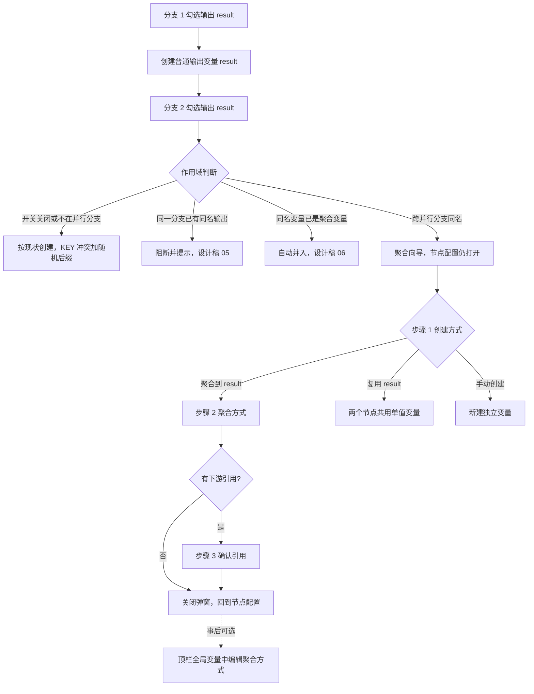

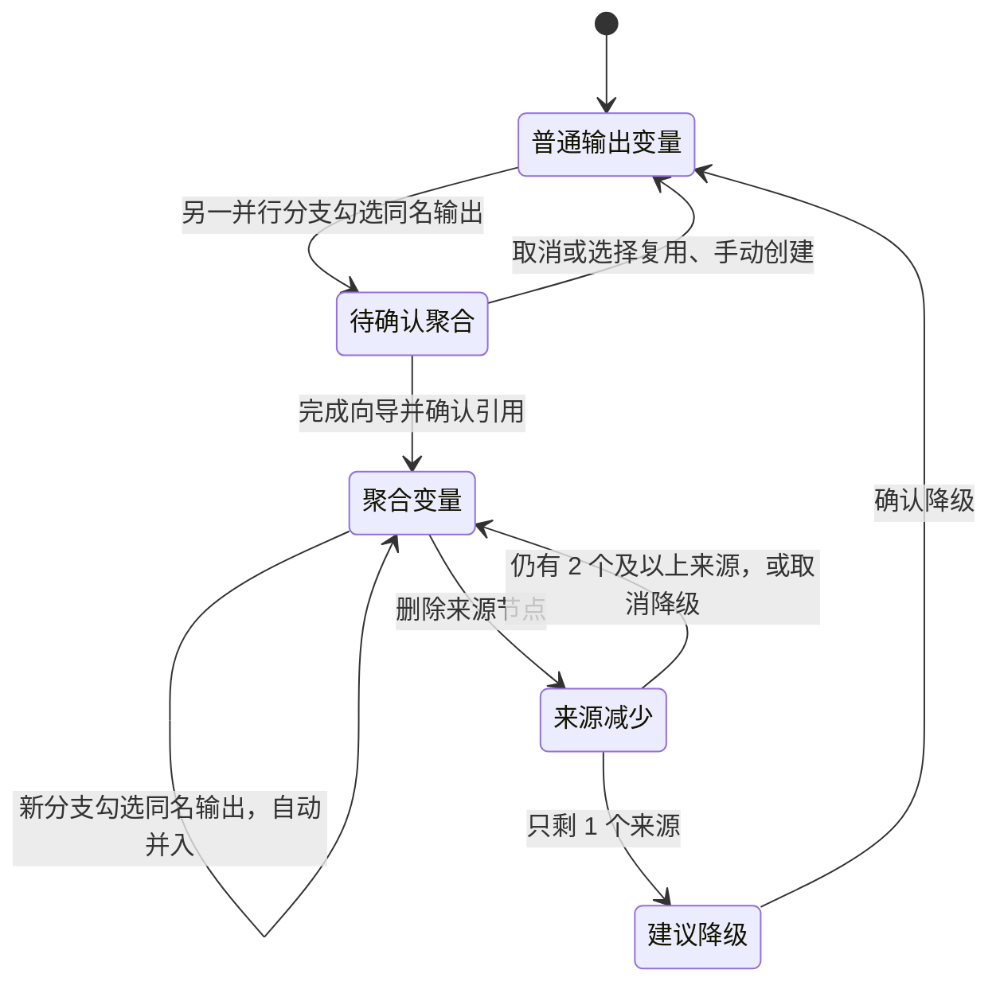

---

## 高保真设计稿

每张图右侧为编号标注，编号对应图中红色数字；灰色「i」为补充说明，橙色「?」为待确认项，汇总在文末。数据贯穿同一个流程「多区域资源巡检」：并行网关下的华南区、华北区（设计稿 06 起新增华东区）分支都调用「资源巡检」插件，输出 `result`（检查结果）和 `check_log`（巡检日志），汇合后由「汇总通知」「结果判断」使用。

### 01 · 同名输出：选择聚合

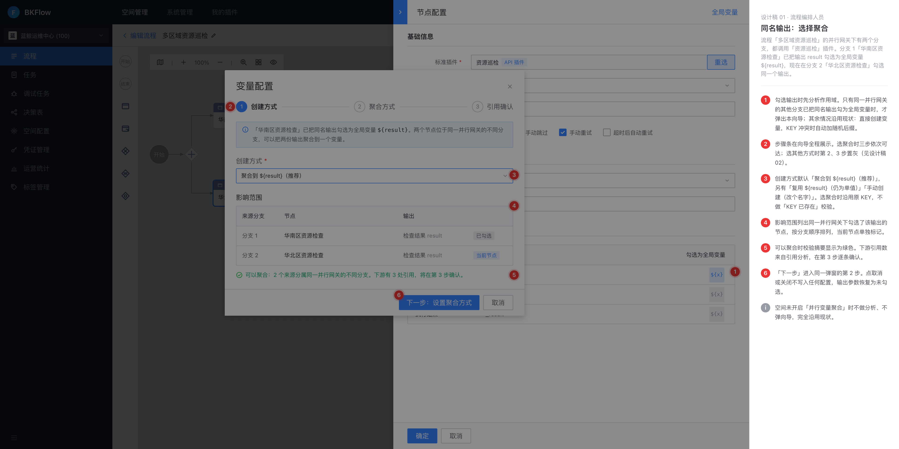

角色：流程编排人员。流程「多区域资源巡检」的并行网关下有两个分支，都调用「资源巡检」插件。分支 1「华南区资源检查」已把输出 result 勾选为全局变量 `${result}`，现在在分支 2「华北区资源检查」勾选同一个输出。

1. 勾选输出时先分析作用域。只有同一并行网关的其他分支已把同名输出勾为全局变量时，才弹出本向导；其余情况沿用现状：直接创建变量，KEY 冲突时自动加随机后缀。
2. 步骤条在向导全程展示。选聚合时三步依次可达；选其他方式时第 2、3 步置灰（见设计稿 02）。
3. 创建方式默认「聚合到 `${result}`（推荐）」，另有「复用 `${result}`（仍为单值）」「手动创建（改个名字）」。选聚合时沿用原 KEY，不做「KEY 已存在」校验。
4. 影响范围列出同一并行网关下勾选了该输出的节点，按分支顺序排列，当前节点单独标记。
5. 可以聚合时校验摘要显示为绿色。下游引用数来自引用分析，在第 3 步逐条确认。
6. 「下一步」进入同一弹窗的第 2 步。点取消或关闭不写入任何配置，输出参数恢复为未勾选。

- 说明：空间未开启「并行变量聚合」时不做分析、不弹向导，完全沿用现状。

### 02 · 不聚合：手动创建或复用

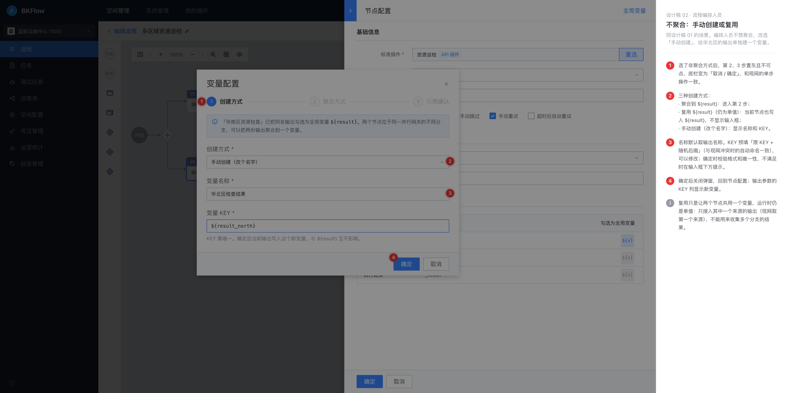

角色：流程编排人员。同设计稿 01 的场景。编排人员不想聚合，改选「手动创建」，给华北区的输出单独建一个变量。

1. 选了非聚合方式后，第 2、3 步置灰且不可点，底栏变为「取消 / 确定」，和现网的单步操作一致。
2. 三种创建方式：
   - 聚合到 `${result}`：进入第 2 步
   - 复用 `${result}`（仍为单值）：当前节点也写入 `${result}`，不显示输入框
   - 手动创建（改个名字）：显示名称和 KEY
3. 名称默认取输出名称。KEY 预填「原 KEY + 随机后缀」（与现网冲突时的自动命名一致），可以修改；确定时校验格式和唯一性，不满足时在输入框下方提示。
4. 确定后关闭弹窗，回到节点配置；输出参数的 KEY 列显示新变量。

- 说明：复用只是让两个节点共用一个变量，运行时仍是单值：只接入其中一个来源的输出（现网取第一个来源），不能用来收集多个分支的结果。

### 03 · 设置聚合方式

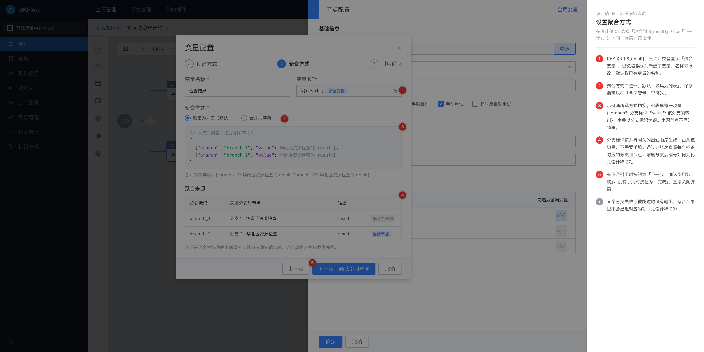

角色：流程编排人员。在设计稿 01 选择「聚合到 `${result}`」后点「下一步」，进入同一弹窗的第 2 步。

1. KEY 沿用 `${result}`，只读；类型显示「聚合变量」，避免被误认为新建了变量。名称可以改，默认取已有变量的名称。
2. 聚合方式二选一，默认「收集为列表」。保存后可以在「全局变量」里修改。
3. 示例随所选方式切换。列表里每一项是 `{"branch": 分支标识, "value": 该分支的输出}`；字典以分支标识为键。来源节点不写进值里。
4. 分支标识按并行网关的出线顺序生成，由系统填写，不需要手填。通过这张表查看每个标识对应的分支和节点；增删分支后编号如何变化见设计稿 07。
5. 有下游引用时按钮为「下一步：确认引用影响」；没有引用时按钮为「完成」，直接关闭弹窗。

- 说明：某个分支失败或被跳过时没有输出，聚合结果里不会出现对应的项（见设计稿 09）。

### 04 · 确认下游引用

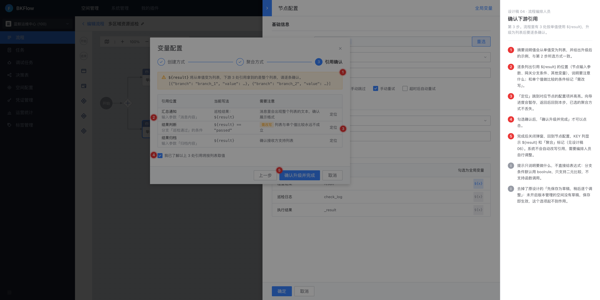

角色：流程编排人员。第 3 步。流程里有 3 处按单值使用 `${result}`，升级为列表后要逐条确认。

1. 摘要说明值会从单值变为列表，并给出升级后的示例，与第 2 步所选方式一致。
2. 逐条列出引用 `${result}` 的位置（节点输入参数、网关分支条件、其他变量），说明要注意什么；和单个值做比较的条件标记「需改写」。
3. 「定位」跳到对应节点的配置项并高亮。向导进度会暂存，返回后回到本步，已选的聚合方式不丢失。
4. 勾选确认后，「确认升级并完成」才可以点击。
5. 完成后关闭弹窗，回到节点配置，KEY 列显示 `${result}` 和「聚合」标记（见设计稿 06）。系统不会自动改写引用，需要编排人员自行调整。

- 说明：提示只说明要做什么，不直接给表达式：分支条件默认用 boolrule，只支持二元比较，不支持函数调用。
- 说明：去掉了原设计的「先保存为草稿，稍后逐个调整」：未开启版本管理的空间没有草稿，保存即生效，这个选项起不到作用。

### 05 · 同一分支重复输出

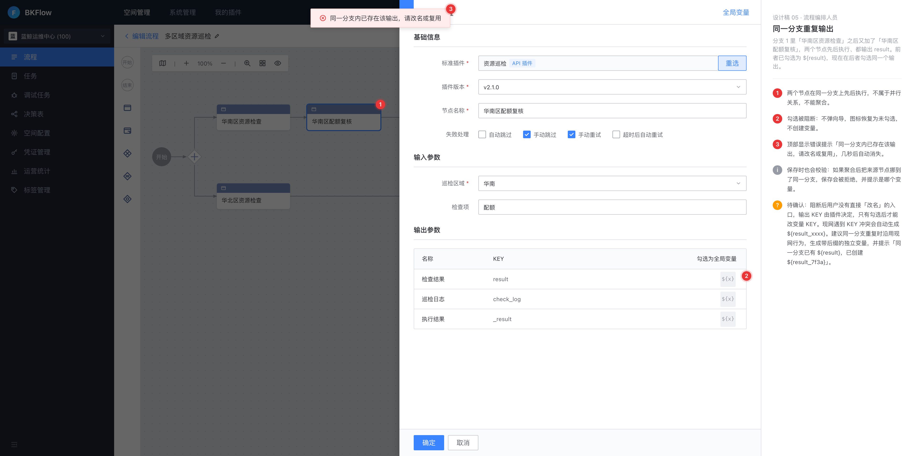

角色：流程编排人员。分支 1 里「华南区资源检查」之后又加了「华南区配额复核」，两个节点先后执行、都输出 result。前者已勾选为 `${result}`，现在在后者勾选同一个输出。

1. 两个节点在同一分支上先后执行，不属于并行关系，不能聚合。
2. 勾选被阻断：不弹向导，图标恢复为未勾选，不创建变量。
3. 顶部显示错误提示「同一分支内已存在该输出，请改名或复用」，几秒后自动消失。

- 说明：保存时也会校验：如果聚合后把来源节点挪到了同一分支，保存会被拒绝，并提示是哪个变量。
- **待确认**：阻断后用户没有直接「改名」的入口，输出 KEY 由插件决定，只有勾选后才能改变量 KEY。现网遇到 KEY 冲突会自动生成 `${result_xxxx}`。建议同一分支重复时沿用现网行为，生成带后缀的独立变量，并提示「同一分支已有 `${result}`，已创建 `${result_7f3a}`」。

### 06 · 新增分支自动并入

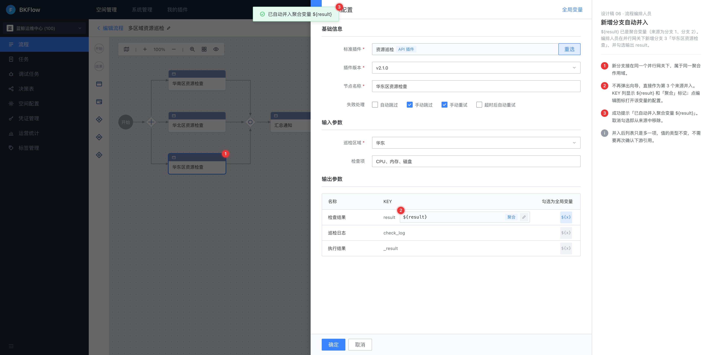

角色：流程编排人员。`${result}` 已是聚合变量（来源为分支 1、分支 2）。编排人员在并行网关下新增分支 3「华东区资源检查」，并勾选输出 result。

1. 新分支接在同一个并行网关下，属于同一聚合作用域。
2. 不再弹出向导，直接作为第 3 个来源并入。KEY 列显示 `${result}` 和「聚合」标记；点编辑图标打开该变量的配置。
3. 成功提示「已自动并入聚合变量 `${result}`」。取消勾选即从来源中移除。

- 说明：并入后列表只是多一项，值的类型不变，不需要再次确认下游引用。

### 07 · 删除聚合来源

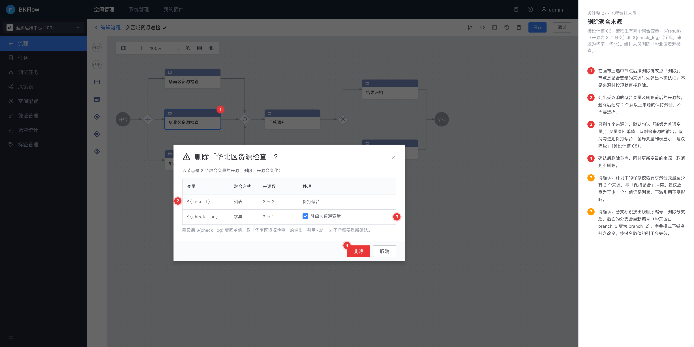

角色：流程编排人员。接设计稿 06。流程里有两个聚合变量：`${result}`（来源为 3 个分支）和 `${check_log}`（字典，来源为华南、华北）。编排人员删除「华北区资源检查」。

1. 在画布上选中节点后按删除键或点「删除」。节点是聚合变量的来源时先弹出本确认框；不是来源时按现状直接删除。
2. 列出受影响的聚合变量及删除前后的来源数。删除后还有 2 个及以上来源的保持聚合，不需要选择。
3. 只剩 1 个来源时，默认勾选「降级为普通变量」：变量变回单值，取剩余来源的输出。取消勾选则保持聚合，全局变量列表显示「建议降级」（见设计稿 08）。
4. 确认后删除节点，同时更新变量的来源；取消则不删除。

- **待确认**：计划中的保存校验要求聚合变量至少有 2 个来源，与「保持聚合」冲突。建议放宽为至少 1 个：值仍是列表，下游引用不受影响。
- **待确认**：分支标识按出线顺序编号，删除分支后，后面的分支会重新编号（华东区由 branch_3 变为 branch_2）。字典模式下键名随之改变，按键名取值的引用会失效。

### 08 · 全局变量列表中的聚合变量

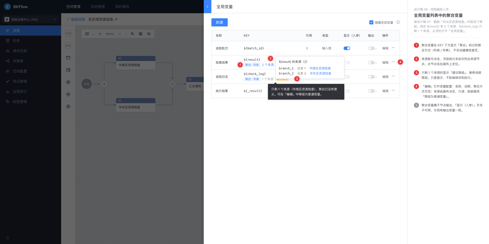

角色：流程编排人员。接设计稿 07：删除「华北区资源检查」时取消了降级。现在 `${result}` 有 2 个来源，`${check_log}` 只剩 1 个来源。从顶栏打开「全局变量」。

1. 聚合变量在 KEY 下方显示「聚合」标记和聚合方式（列表 / 字典），不另设健康检查页。
2. 来源数可点击，浮层按分支标识列出来源节点，点节点名在画布上定位。
3. 只剩 1 个来源时显示「建议降级」，悬停说明原因。只是提示，不影响保存和执行。
4. 「编辑」打开变量配置：名称、说明、聚合方式可改；来源由画布决定，只读；底部提供「降级为普通变量」。

- 说明：聚合变量属于节点输出，「显示（入参）」开关不可用，与现有输出变量一致。

### 09 · 运行结果：查看聚合值

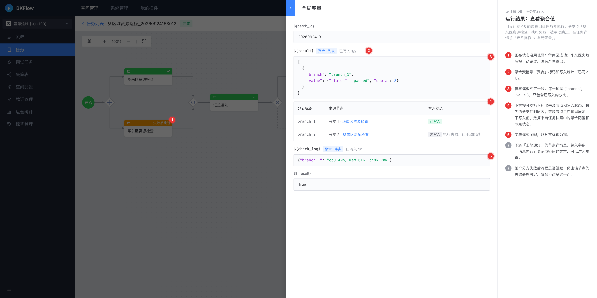

角色：任务执行人。用设计稿 08 的流程创建任务并执行。分支 2「华东区资源检查」执行失败，被手动跳过。在任务详情点「更多操作 → 全局变量」。

1. 画布状态沿用现网：华南区成功；华东区失败后被手动跳过，没有产生输出。
2. 聚合变量带「聚合」标记和写入统计「已写入 1/2」。
3. 值与模板约定一致：每一项是 `{"branch", "value"}`，只包含已写入的分支。
4. 下方按分支标识列出来源节点和写入状态，缺失的分支注明原因。来源节点只在这里展示，不写入值。数据来自任务快照中的聚合配置和节点状态。
5. 字典模式同理，以分支标识为键。

- 说明：下游「汇总通知」的节点详情里，输入参数「消息内容」显示渲染后的文本，可以对照排查。
- 说明：某个分支失败后流程是否继续，仍由该节点的失败处理决定，聚合不改变这一点。

---

## 待确认

以下问题会影响后端规则或存量兼容，评审时拍板：

- 设计稿 05（同一分支重复输出）：阻断后用户没有直接「改名」的入口，输出 KEY 由插件决定，只有勾选后才能改变量 KEY。现网遇到 KEY 冲突会自动生成 `${result_xxxx}`。建议同一分支重复时沿用现网行为，生成带后缀的独立变量，并提示「同一分支已有 `${result}`，已创建 `${result_7f3a}`」。
- 设计稿 07（删除聚合来源）：计划中的保存校验要求聚合变量至少有 2 个来源，与「保持聚合」冲突。建议放宽为至少 1 个：值仍是列表，下游引用不受影响。
- 设计稿 07（删除聚合来源）：分支标识按出线顺序编号，删除分支后，后面的分支会重新编号（华东区由 branch_3 变为 branch_2）。字典模式下键名随之改变，按键名取值的引用会失效。
