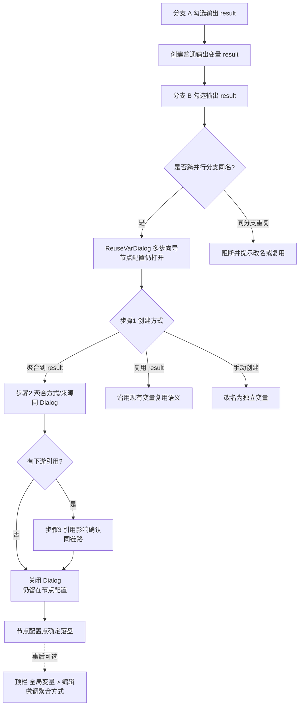
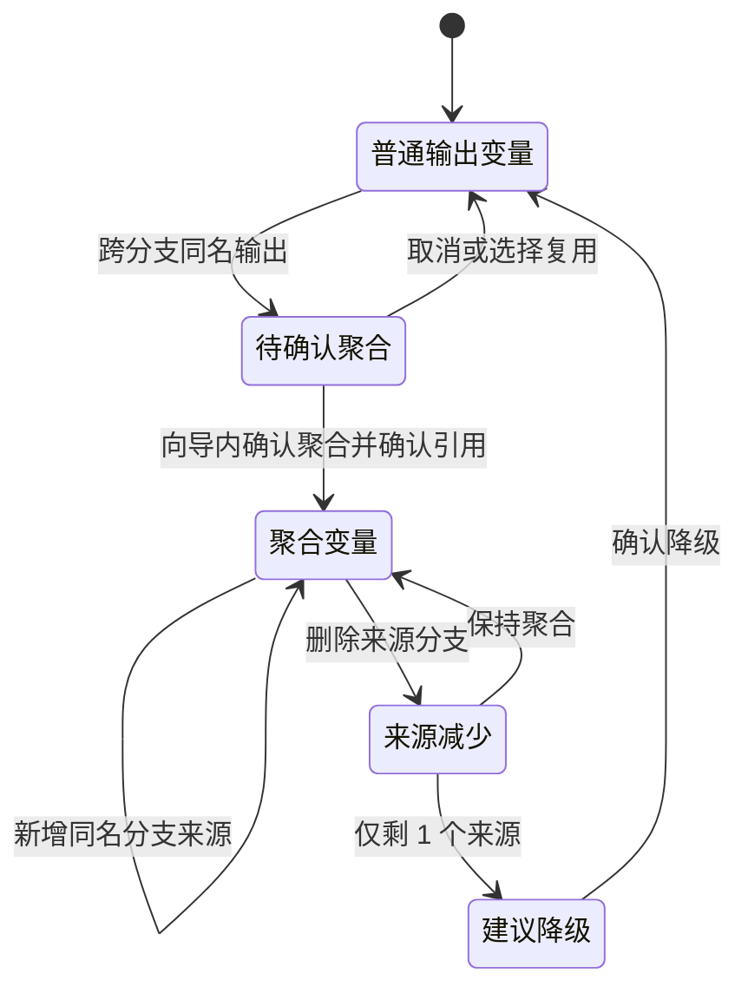
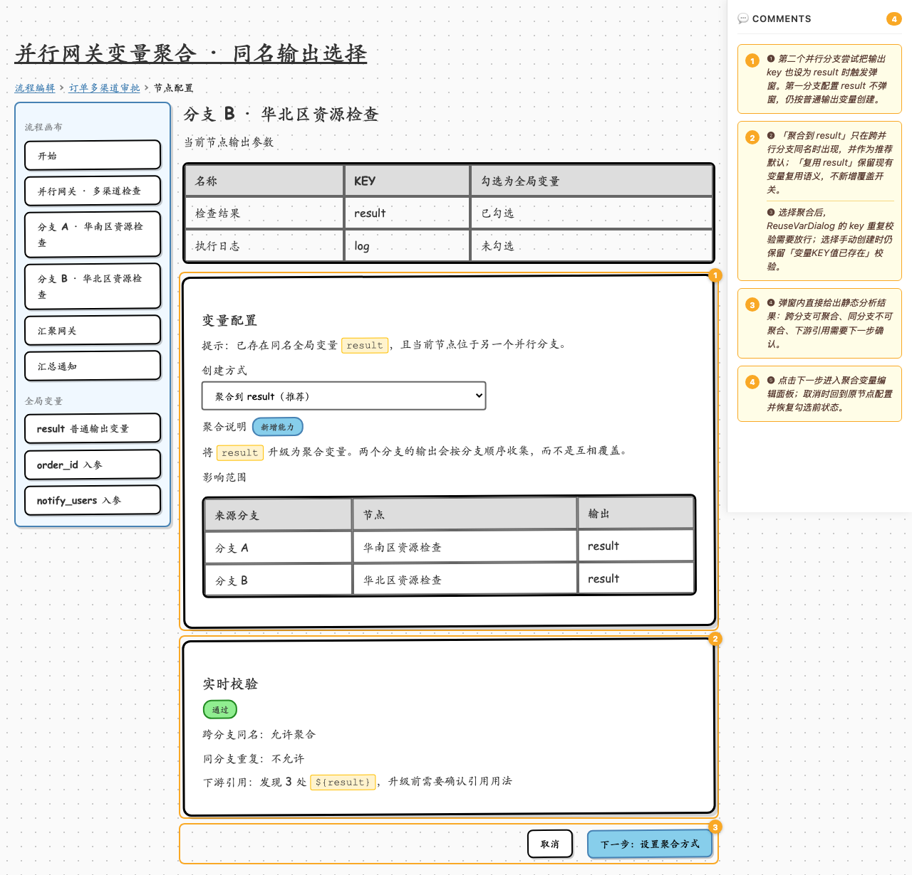
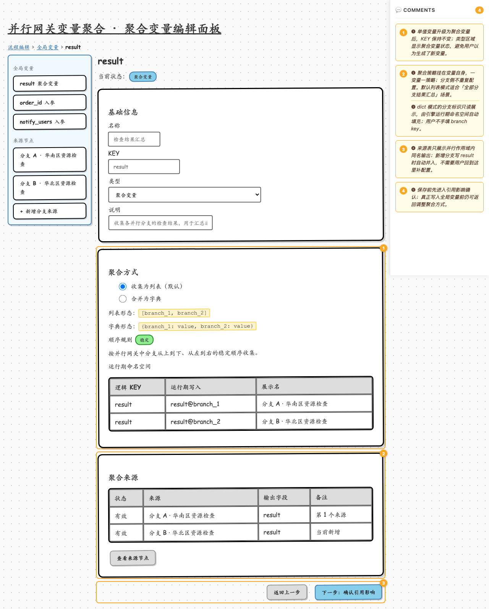
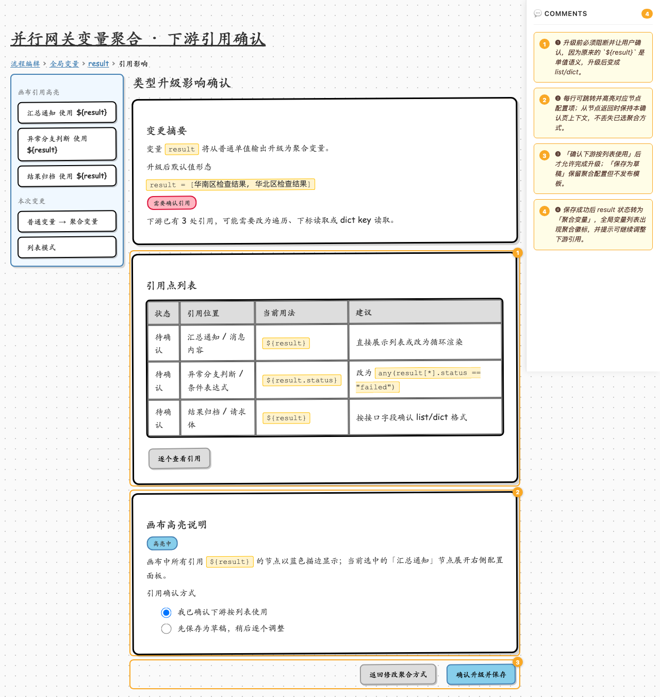
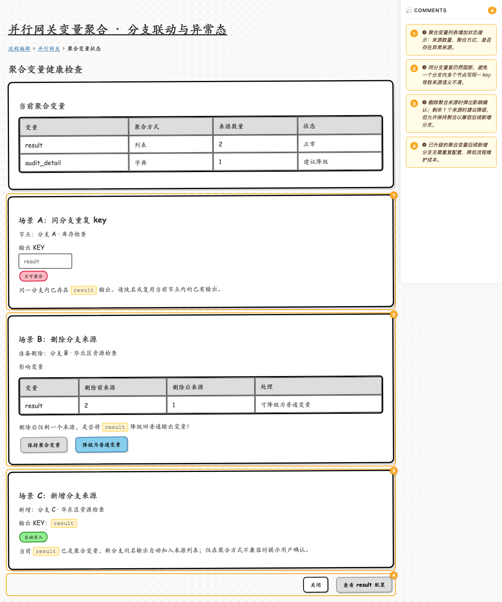
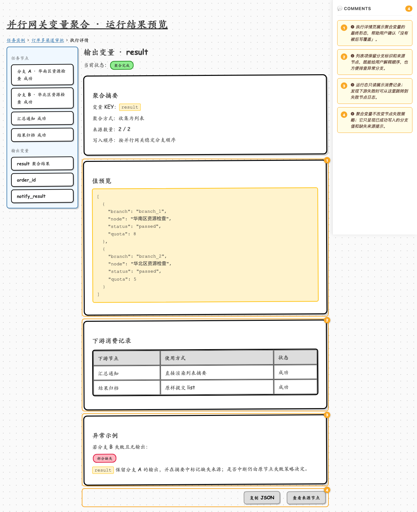

# 并行网关变量聚合 · 低保真交互原型

- 关联 spec：`docs/specs/2026-07-09-parallel-variable-aggregation-design.md`
- 关联 ADR：`docs/specs/2026-06-29-aggregate-variable-vs-node-adr.md`
- 关联 TAPD：`https://tapd.woa.com/tapd_fe/70120217/story/detail/1070120217135616034`
- 线框工具：[wiremd](https://github.com/teezeit/wiremd)，按 master 分支 `prototypes/README.md` 的最新流程产出
- 风格：`sketch` 低保真线框，仅表达结构、状态和交互细节；视觉以蓝鲸 bk-magic-vue 设计系统定稿
- **交互定稿（2026-07-09 · 方案 1）**：创建向导留在**节点配置**语境（ReuseVarDialog 多步）；不跳转「全局变量」侧滑。「全局变量 > 编辑」仅事后微调。

## 目录

| 路径 | 说明 |
|------|------|
| `README.md` | 概览 + 流程图 + 每屏截图 + 编号交互说明表 |
| `screens/*.md` | wiremd 线框源文件，是后续迭代的唯一真源 |
| `shots/*.png` | 各屏全页截图，本文件内嵌展示 |
| `designs/*.png` | 蓝鲸风格简易设计稿（含红色交互标注），基于线框 + 现网截图基准产出 |

## 预览与渲染

HTML 不保存进仓库，需要交互查看时按需现渲染：

```bash
cd prototypes/output/parallel-variable-aggregation

# 热更预览
npx -y @eclectic-ai/wiremd screens/ --serve 3000 --watch --show-comments

# 批量渲染为临时 HTML
mkdir -p html
for f in screens/*.md; do
  npx -y @eclectic-ai/wiremd "$f" --style sketch --show-comments -o "html/$(basename "$f" .md).html"
done

# 截图
mkdir -p shots
for f in html/*.html; do
  name=$(basename "$f" .html)
  npx playwright screenshot --full-page "file://$(pwd)/$f" "shots/$name.png"
done
```

---

## 全局交互流程

### 创建向导（方案 1：节点配置语境内多步）



### 聚合变量状态机



---

## 屏 1 · 同名输出选择（向导步骤 1）

第二个并行分支写入 `result` 时复用现有 `ReuseVarDialog`，在 `sameKeyExist` 场景新增「聚合到 result」选项。容器：节点配置侧滑 + 居中 Dialog（带遮罩）。



设计稿（选聚合）：[designs/01-output-conflict-dialog.png](designs/01-output-conflict-dialog.png)  
设计稿（不聚合）：[designs/01-non-aggregate-reuse.png](designs/01-non-aggregate-reuse.png)

| 编号 | 元素 | 交互说明 |
|------|------|----------|
| ❶ | 输出参数勾选 | 第二个并行分支尝试把输出 key 也设为 `result` 时触发弹窗；第一个分支仍直接创建普通变量。 |
| ❷ | 创建方式 | 「聚合到 result」只在跨并行分支同名时出现，并作为推荐默认；「复用 result」保留现有变量复用语义。 |
| ❸ | key 校验 | 选择聚合时放行 `value in constants` 判定；选择手动创建时仍校验「变量KEY值已存在」。 |
| ❹ | 实时校验 / 步骤条 | 选聚合时展示校验与步骤 2/3；**不聚合时步骤 2/3 置灰**，「下一步：设置聚合方式」禁用。 |
| ❺ | 底栏 | **选聚合**：可点「下一步」进步骤 2。**选复用/手动**：无多步向导，底栏仅为「取消 / 确定」（对齐现网），确定后关闭 Dialog。 |

### 不聚合时（复用 / 手动创建）

- 步骤指示：`1 创建方式` 高亮；`2 聚合方式`、`3 引用确认` **灰色不可点**
- 「下一步：设置聚合方式」**置灰禁用**（或直接不展示，改为「确定」）
- 选手动创建：展示名称/KEY 输入，确定时仍校验 KEY 不重复
- 选复用：确定后两节点引用同一全局变量，后写覆盖前写（现状）

## 屏 2 · 聚合方式设置（向导步骤 2）

仍在节点配置 + Dialog 内；`result` KEY 不变；聚合策略挂在变量自身。完成后若有下游引用进步骤 3，否则关闭 Dialog 回节点配置。



设计稿：[designs/02-aggregate-variable-panel.png](designs/02-aggregate-variable-panel.png)

| 编号 | 元素 | 交互说明 |
|------|------|----------|
| ❶ | 基础信息 | 单值变量升级为聚合变量后 KEY 保持不变，类型区域显示「聚合变量」。 |
| ❷ | 聚合方式 | 默认收集为列表；可切换为字典，一变量一策略。 |
| ❸ | 运行期命名空间 | branch key 只读展示，由引擎 fork 分支时自动填充，用户不手填。 |
| ❹ | 聚合来源 | 只展示并行作用域内的同名输出；后续新增分支写 `result` 自动并入。 |
| ❺ | 下一步 | 有下游引用则进步骤 3；否则完成并向导关闭，仍留在节点配置。可返回步骤 1。 |

## 屏 3 · 下游引用确认（向导步骤 3）

普通变量升级为 list/dict 语义前，高亮所有 `${result}` 引用点。确认后关闭向导，仍留在节点配置。



设计稿：[designs/03-reference-impact-confirm.png](designs/03-reference-impact-confirm.png)

| 编号 | 元素 | 交互说明 |
|------|------|----------|
| ❶ | 变更摘要 | 升级前阻断确认，说明 `${result}` 从单值变为列表或字典。 |
| ❷ | 引用点列表 | 每行可跳转并高亮对应节点配置项；从节点返回时保留确认上下文。 |
| ❸ | 确认方式 | 用户确认下游按列表使用后才允许完成升级；草稿模式不发布模板。 |
| ❹ | 完成 | 确认后关闭 Dialog，仍留在节点配置；全局变量列表出现聚合徽标。 |

## 屏 4 · 分支联动与异常态

**不是独立菜单页。** 三类场景叠在流程编辑现有操作上：

| 场景 | 入口 |
|------|------|
| A 同分支重复 | 节点配置 → 输出参数填/勾选同分支已有 KEY |
| B 删除来源 | 画布选中分支节点 → 删除 |
| C 新增来源 | 新分支节点配置 → 勾选已是聚合变量的 KEY |
| 健康状态 | 顶栏 → 全局变量侧滑列表（聚合徽标 / 建议降级） |



设计稿：[designs/04-branch-lifecycle-and-errors.png](designs/04-branch-lifecycle-and-errors.png)

| 编号 | 元素 | 交互说明 |
|------|------|----------|
| ❶ | 健康状态入口 | 顶栏「全局变量」侧滑列表展示来源数量、聚合方式、建议降级；非独立健康检查页。 |
| ❷ | 同分支重复 | 节点配置内阻断，不进聚合向导。 |
| ❸ | 删除来源 | 画布删除分支时弹影响确认；仅剩 1 个来源时建议降级但不强制。 |
| ❹ | 新增来源 | 新分支节点配置勾选同名 KEY 时自动并入。 |

## 屏 5 · 运行结果预览

入口：侧栏「任务」→ 任务实例 → **节点详情**（布局对齐现网 `96-task-execute-detail-node-detail.png`）。聚合终态展示在「执行记录」Tab 的输出/上下文中。



设计稿：[designs/05-execution-result-preview.png](designs/05-execution-result-preview.png)

| 编号 | 元素 | 交互说明 |
|------|------|----------|
| ❶ | 节点详情布局 | 左节点列表 + 右标题/完成态 + Tab（执行记录默认）；与现网一致。 |
| ❷ | 输出中的聚合值 | 执行记录内展示 `result` 列表终态，含分支标识与来源节点。 |
| ❸ | 调用日志 | 下游失败时可切「调用日志」Tab 排查。 |
| ❹ | 部分缺失 | 聚合不改变节点失败策略，只展示已写入值与缺失来源。 |

---

## 补充说明

1. 本原型基于「聚合变量类型」方案，不新增独立聚合节点。
2. **方案 1**：屏 1→2→3 为同一节点配置语境内的 Dialog 多步向导；「全局变量」侧滑仅事后微调，不作为创建下一步。
3. 屏 1 对齐现有 `ReuseVarDialog.vue`；屏 2/3 为向导扩展步骤（实现时可同 Dialog 内 step，或紧随的确认层）。
4. 线框仅表达结构、状态和交互闭环；视觉细节以 `designs/` 与 bk-magic-vue 为准。
