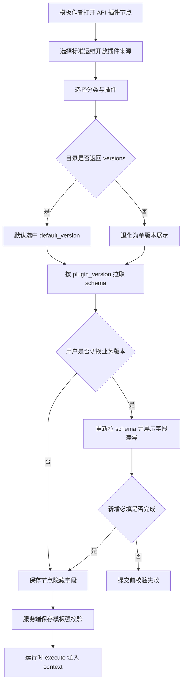
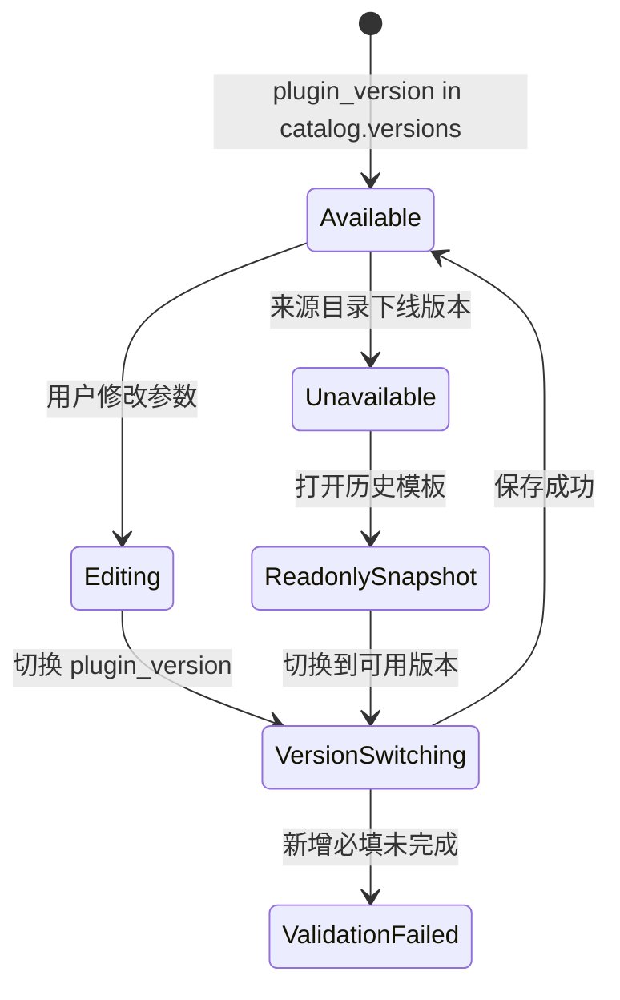
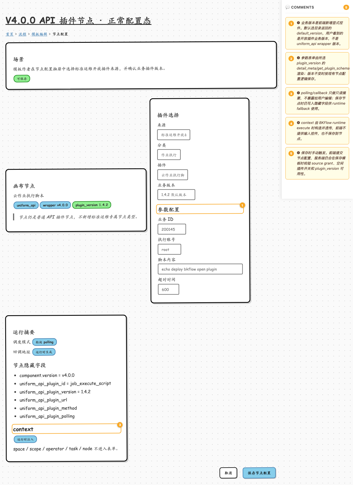
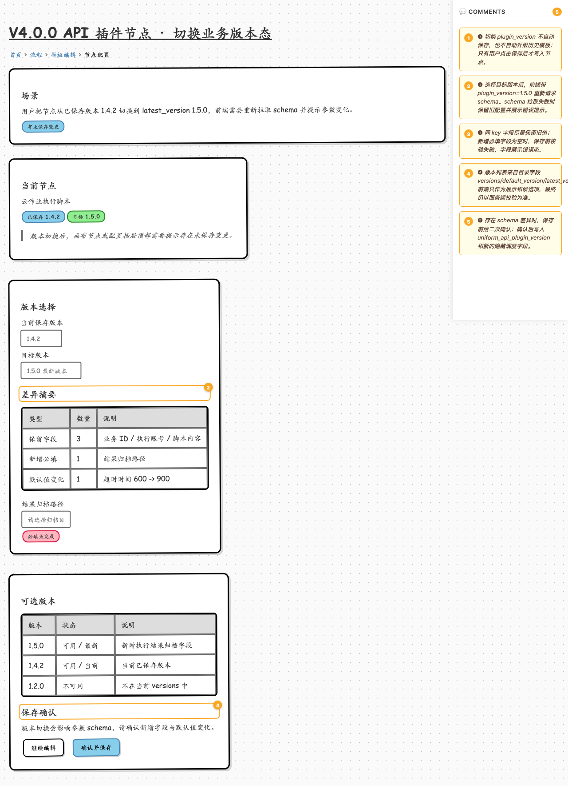
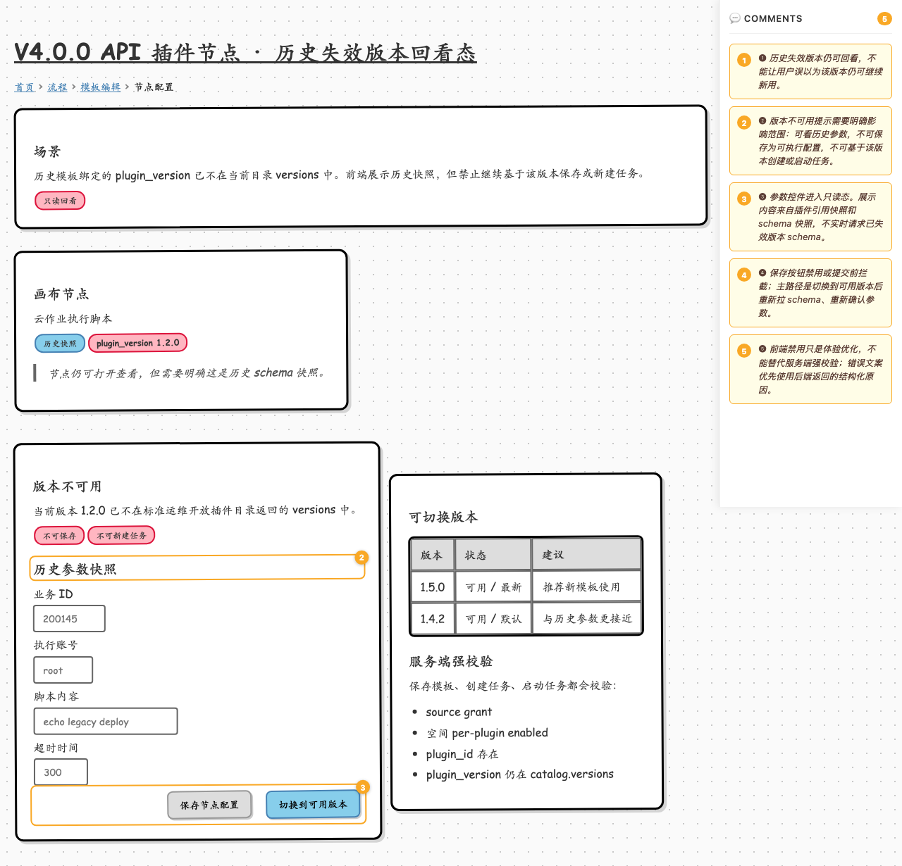

# V4.0.0 API 插件节点前端变动 wireframe

## 概览

本原型用于交付设计师与前端同学评审：当 BKFlow 节点使用 `uniform_api v4.0.0` API 插件时，模板编辑节点配置抽屉需要补齐哪些前端交互。

- 关联设计文档：[2026-06-26-sops-open-plugin-full-capability-design.md](../../../docs/specs/2026-06-26-sops-open-plugin-full-capability-design.md)
- 关联前端交互设计：[2026-04-20-sops-open-plugin-frontend-interaction-design.md](../../../docs/specs/2026-04-20-sops-open-plugin-frontend-interaction-design.md)
- 关联计划：[2026-06-26-sops-open-plugin-full-capability.md](../../../docs/plans/2026-06-26-sops-open-plugin-full-capability.md)
- 对接协议：[sops_open_plugin_frontend_contract.md](../../../docs/guide/sops_open_plugin_frontend_contract.md)

原型采用 wiremd 低保真线框，视觉样式由设计师按 bk-magic-vue 设计系统出高保真稿。`screens/*.md` 是唯一真源，HTML 为临时渲染产物，不入库。

## 产物清单

| 屏幕 | wiremd 源文件 | 截图 |
|------|---------------|------|
| 正常配置态 | [screens/01-normal-config.md](screens/01-normal-config.md) | [shots/01-normal-config.png](shots/01-normal-config.png) |
| 切换业务版本态 | [screens/02-version-switch.md](screens/02-version-switch.md) | [shots/02-version-switch.png](shots/02-version-switch.png) |
| 历史失效版本回看态 | [screens/03-unavailable-version.md](screens/03-unavailable-version.md) | [shots/03-unavailable-version.png](shots/03-unavailable-version.png) |

## 预览与渲染

```bash
cd prototypes/output/sops-open-plugin-v4-node-api-plugin

# 本地预览
npx -y @eclectic-ai/wiremd screens/ --serve 3000 --watch --show-comments

# 临时渲染 HTML，不提交 html/
mkdir -p html
for f in screens/*.md; do
  npx -y @eclectic-ai/wiremd "$f" --style sketch --show-comments -o "html/$(basename "$f" .md).html"
done

# 全页截图
mkdir -p shots
for f in html/*.html; do
  name=$(basename "$f" .html)
  npx playwright screenshot --full-page "file://$(pwd)/$f" "shots/$name.png"
done
```

## 全局交互流



## 版本状态机



## 01 正常配置态



| 编号 | 元素 | 交互说明 |
|------|------|----------|
| ❶ | 业务版本选择器 | 业务版本是前端新增显式控件。默认选目录返回的 `default_version`，用户看到的是开放插件业务版本，不是 `uniform_api` wrapper 版本。 |
| ❷ | 参数配置区 | 参数表单由所选 `plugin_version` 的 `detail_meta/get_plugin_schema` 渲染；版本不变时按现有节点配置逻辑保存。 |
| ❸ | 调度模式摘要 | `polling/callback` 只做只读摘要，不暴露给用户编辑；保存节点时仍写入隐藏字段供 runtime fallback 使用。 |
| ❹ | context 说明 | `context` 由 BKFlow runtime execute 时构造并透传，前端不提供输入控件，也不保存到节点。 |
| ❺ | 保存按钮 | 保存时手动触发。前端提交节点配置，服务端仍会在保存模板时校验 source grant、空间插件开关和 `plugin_version` 可用性。 |

## 02 切换业务版本态



| 编号 | 元素 | 交互说明 |
|------|------|----------|
| ❶ | 节点未保存状态 | 切换 `plugin_version` 不自动保存，也不自动升级历史模板；只有用户点击保存后才写入节点。 |
| ❷ | 目标版本选择 | 选择目标版本后，前端带 `plugin_version=1.5.0` 重新请求 schema。schema 拉取失败时保留旧配置并展示错误提示。 |
| ❸ | 字段差异与校验 | 同 key 字段尽量保留旧值；新增必填字段为空时，保存前校验失败，字段展示错误态。 |
| ❹ | 版本列表 | 版本列表来自目录字段 `versions/default_version/latest_version`。前端只作为展示和候选项，最终仍以服务端校验为准。 |
| ❺ | 保存确认 | 存在 schema 差异时，保存前给二次确认；确认后写入 `uniform_api_plugin_version` 和新的隐藏调度字段。 |

## 03 历史失效版本回看态



| 编号 | 元素 | 交互说明 |
|------|------|----------|
| ❶ | 历史快照节点 | 历史失效版本仍可回看，不能让用户误以为该版本仍可继续新用。 |
| ❷ | 版本不可用提示 | 版本不可用提示需要明确影响范围：可看历史参数，不可保存为可执行配置，不可基于该版本创建或启动任务。 |
| ❸ | 历史参数快照 | 参数控件进入只读态。展示内容来自插件引用快照和 schema 快照，不实时请求已失效版本 schema。 |
| ❹ | 切换到可用版本 | 保存按钮禁用或提交前拦截；主路径是切换到可用版本后重新拉 schema、重新确认参数。 |
| ❺ | 服务端强校验 | 前端禁用只是体验优化，不能替代服务端强校验；错误文案优先使用后端返回的结构化原因。 |

## 前端实现边界

- `component.version` 表示 `uniform_api` wrapper 版本，例如 `v4.0.0`。
- `uniform_api_plugin_version` 表示开放插件业务版本，必须随节点保存。
- `context` 不入表单、不保存节点；由 BKFlow runtime 在 execute 时注入。
- `polling/callback` 只读展示，具体配置继续作为隐藏字段写入节点。
- 历史失效版本可回看、不可继续新用；前端只优化体验，最终以后端校验为准。
