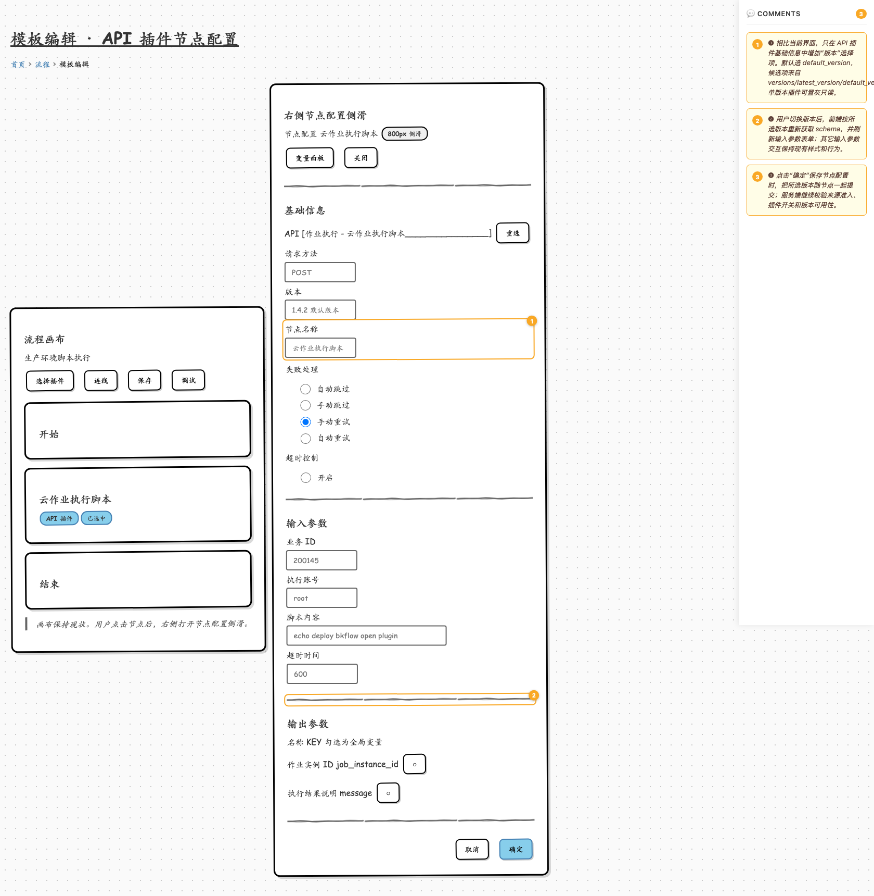

# API 插件节点增加版本选择 wireframe

## 概览

本原型只表达一个前端变动：在 API 插件节点配置里增加“版本”选择项。线框按当前模板编辑页的画布 + `NodeConfig` 右侧 800px 侧滑来模拟，保留基础信息、输入参数、输出参数和底部操作区；其它能力如 `context` 透传、polling/callback 调度配置、服务端强校验不在页面上新增复杂 UI。

- 关联设计文档：[2026-06-26-sops-open-plugin-full-capability-design.md](../../../docs/specs/2026-06-26-sops-open-plugin-full-capability-design.md)
- 关联前端交互设计：[2026-04-20-sops-open-plugin-frontend-interaction-design.md](../../../docs/specs/2026-04-20-sops-open-plugin-frontend-interaction-design.md)
- 对接协议：[sops_open_plugin_frontend_contract.md](../../../docs/guide/sops_open_plugin_frontend_contract.md)

## 产物清单

| 屏幕 | wiremd 源文件 | 截图 |
|------|---------------|------|
| 节点配置增加版本选择 | [screens/01-node-config-version.md](screens/01-node-config-version.md) | [shots/01-node-config-version.png](shots/01-node-config-version.png) |

## 交互流

## 原型图

| 编号 | 元素 | 交互说明 |
|------|------|----------|
| ❶ | 版本选择 | 仅新增“版本”选择项。默认选 `default_version`；列表来自 `versions/latest_version/default_version`。单版本插件可展示为只读选择态。 |
| ❷ | 参数配置 | 用户切换版本后，前端按新版本重新获取 schema 并刷新参数表单；其余节点配置交互保持现状。 |
| ❸ | 保存 | 保存时把用户选择的版本随节点配置提交；服务端继续做来源准入、插件开关和版本可用性校验。 |

## 前端边界

- 不新增标准运维专属节点类型。
- 不在表单里展示或编辑 `context`。
- 不额外设计调度模式、历史失效版本治理、版本差异对比 UI。
- 当前阶段只要求前端支持选择并保存 API 插件业务版本。
