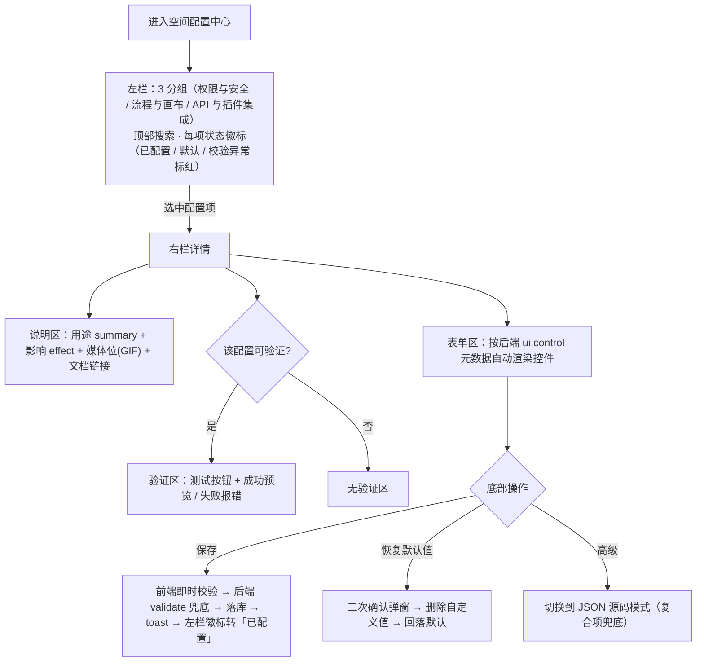
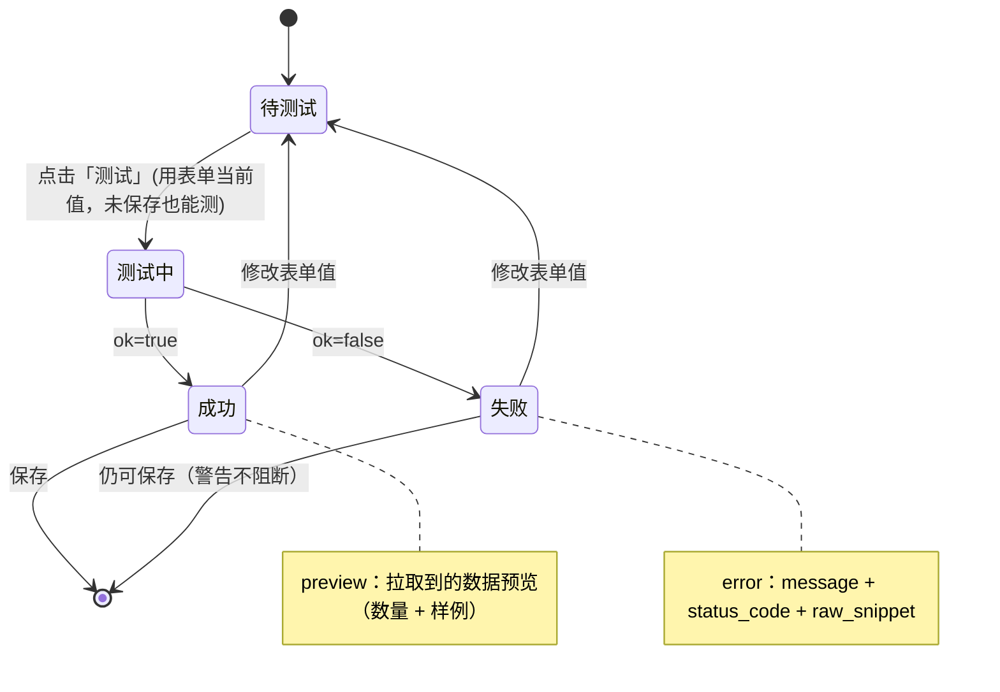
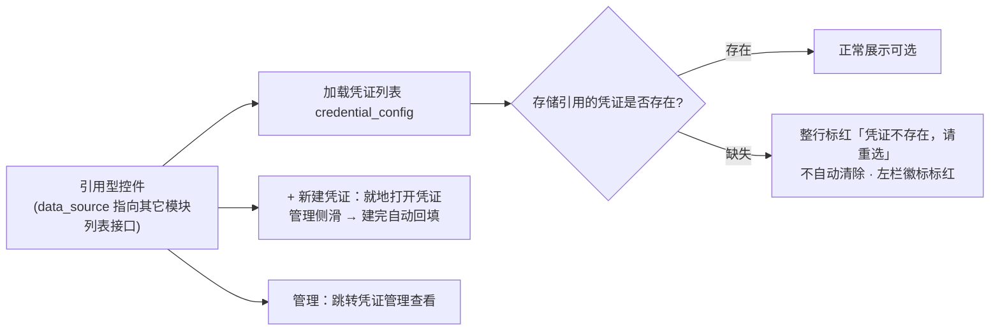
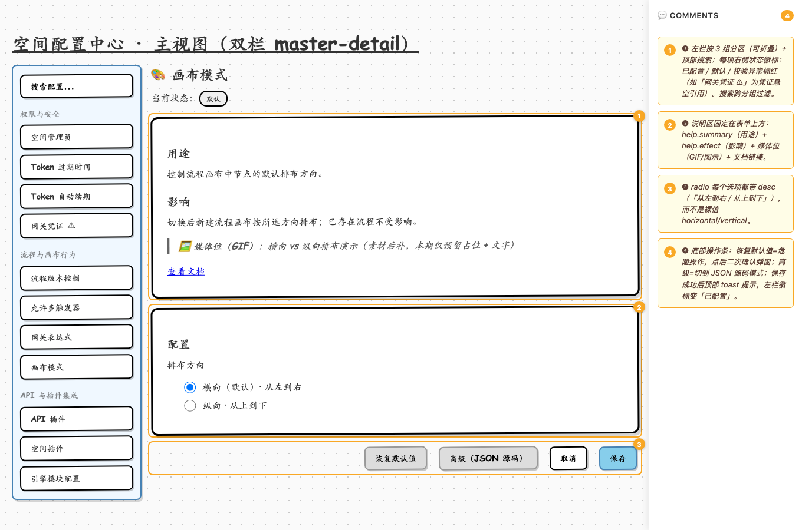
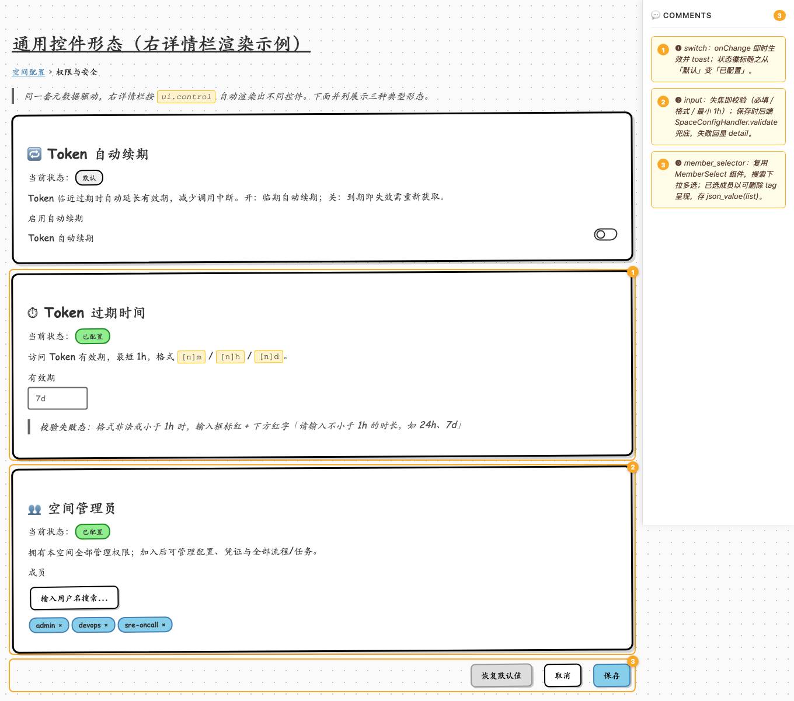
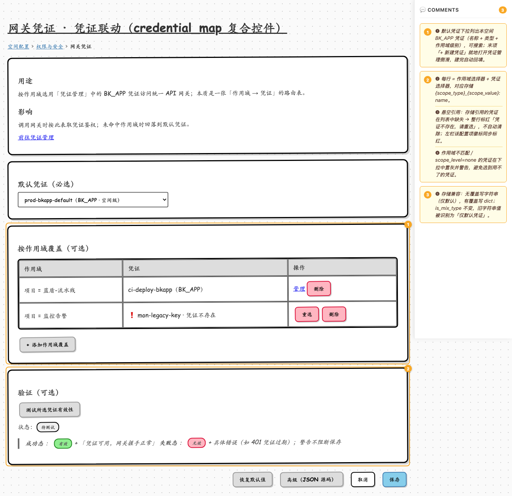
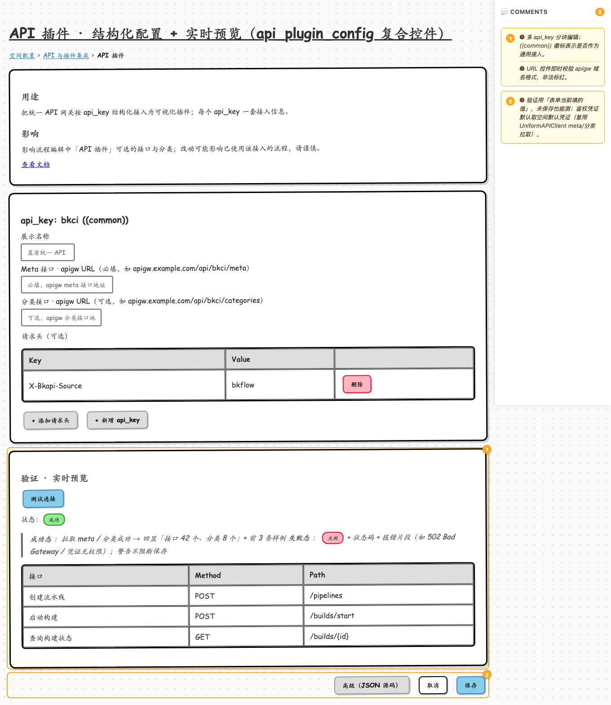
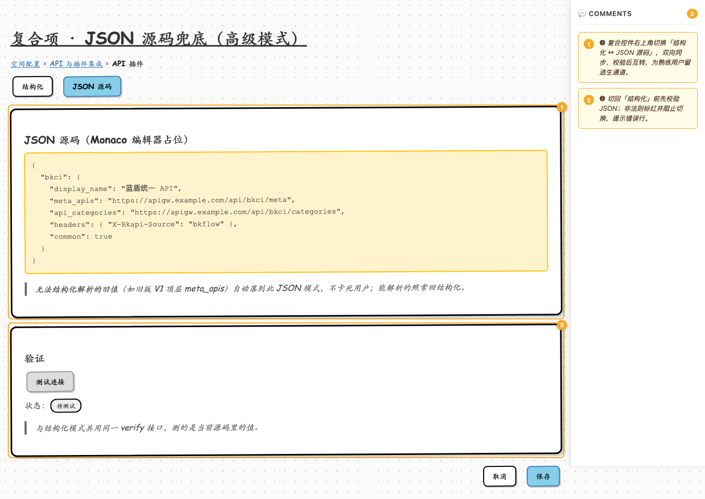

# 空间配置改版 · 低保真交互原型

- 关联设计文档：`docs/specs/2026-07-06-space-config-redesign-design.md`
- 关联实现计划：`docs/plans/2026-07-06-space-config-redesign.md`
- 线框工具：[wiremd](https://github.com/teezeit/wiremd)（"Wireframe 界的 Mermaid"，纯文本 → HTML，可 diff、可导 Figma）
- 风格：`sketch`（Balsamiq 手绘风），可切换 `wireframe` 灰模 / `clean` 简约

## 目录

| 路径 | 说明 |
|------|------|
| `README.md` | 概览 + 流程图 + 每屏截图 + 编号交互说明表 |
| `screens/*.md` | wiremd 线框**源文件**（可版本化 diff、AI 迭代、导出 Figma、按需渲染成 HTML） |
| `shots/*.png` | 各屏全页截图（本文件内嵌用） |
| `designs/*.png` | 蓝鲸风格简易设计稿（含红色交互标注），基于线框产出 |

## 预览与渲染

截图见本文件与 `shots/`。HTML 不随仓库保存，需要交互查看时用 `screens/*.md` 现渲染：

```bash
# 热更迭代：本地起服务，改 screens/*.md 自动刷新
npx -y @eclectic-ai/wiremd screens/ --serve 3000 --watch --show-comments

# 渲染所有屏为 HTML（sketch 手绘风；可换 --style wireframe/clean）
for f in screens/*.md; do npx -y @eclectic-ai/wiremd "$f" --style sketch --show-comments -o "html/$(basename "$f" .md).html"; done

# 导出 Figma：生成 JSON 后用 wiremd Figma 插件导入为可编辑 frames
npx -y @eclectic-ai/wiremd screens/04-api-plugin-config.md --format json -o api-plugin.json
```

---

## 全局交互流程

### 双栏配置中心 · 导航与操作流



### 验证（verify）· 状态机



### 引用型控件（credential_map 等）· 数据联动



---

## 屏 1 · 配置中心主视图（双栏 master-detail）

选中「画布模式」为例，展示左栏分组导航 + 右栏说明/表单/操作的完整骨架。



| 编号 | 元素 | 交互说明 |
|------|------|----------|
| ❶ | 左栏分组列表 | 按 3 组分区（可折叠）+ 顶部搜索；每项右侧状态徽标：`已配置`（自定义值）/ `默认` / 校验异常标红（如「网关凭证 ⚠」为凭证悬空引用）。搜索跨分组过滤。 |
| ❷ | 说明区 | 固定在表单上方：`help.summary`（用途）+ `help.effect`（影响）+ 媒体位（GIF/图示占位，素材后补）+ 文档链接。 |
| ❸ | radio 单选 | 每个选项都带 desc（「从左到右 / 从上到下」），而非裸值 `horizontal/vertical`。 |
| ❹ | 底部操作条 | `恢复默认值`=危险操作，点后二次确认弹窗；`高级`=切 JSON 源码模式；`保存`成功后顶部 toast，左栏徽标转「已配置」。 |

## 屏 2 · 通用控件形态（右详情栏）

同一套元数据驱动，右详情栏按 `ui.control` 自动渲染。并列展示 switch / input（校验失败态）/ member_selector 三种典型形态。



| 编号 | 元素 | 交互说明 |
|------|------|----------|
| ❶ | switch 开关（Token 自动续期） | onChange 即时生效并 toast；状态徽标随之从「默认」变「已配置」。 |
| ❷ | input 输入（Token 过期时间） | 失焦即校验（必填 / 格式 / 最小 1h）；失败时输入框标红 + 下方红字提示；保存时后端 `SpaceConfigHandler.validate` 兜底，失败回显 `detail`。 |
| ❸ | member_selector（空间管理员） | 复用前端 `MemberSelect` 组件：搜索下拉多选；已选成员以可删除 tag 呈现，存 `json_value(list)`。 |

## 屏 3 · 网关凭证 · 凭证联动（credential_map 复合控件）

体现与「凭证管理」的完整联动：默认凭证 + 按作用域覆盖 + 悬空引用标红 + 就近新建 + 验证。



| 编号 | 元素 | 交互说明 |
|------|------|----------|
| ❶ | 默认凭证下拉 | 列出本空间 BK_APP 凭证（名称 + 类型 + 作用域级别），可搜索；末项「+ 新建凭证」就地打开凭证管理侧滑，建完自动回填。 |
| ❷ | 作用域覆盖行 | 每行 = 作用域选择器 + 凭证选择器，对应存储 `{scope_type}_{scope_value}: name`；可增删行。 |
| ❸ | 悬空引用（标红行） | 存储引用的凭证在列表中缺失 → 整行标红「凭证不存在，请重选」，不自动清除；左栏该配置项徽标同步标红。 |
| ❹ | 作用域校验 | 作用域不匹配 / `scope_level=none` 的凭证在下拉中置灰并警告，避免选到用不了的凭证。 |
| ❺ | 存储兼容 | 无覆盖写字符串（仅默认），有覆盖写 dict；`is_mix_type` 不变，旧字符串值被识别为「仅默认凭证」。 |

## 屏 4 · API 插件 · 结构化配置 + 实时预览（api_plugin_config 复合控件）

按 api_key 分块结构化编辑，common 通用开关独立成区；每个 api_key 各自「测试」，验证区回显被测 api_key 拉取到的接口/分类预览。



| 编号 | 元素 | 交互说明 |
|------|------|----------|
| ❶ | 通用设置 · common | 跨**全部** api_key 生效的通用开关（`exclude_none_fields` 空字段过滤 / `enable_api_parameter_conversion` 参数类型转换），独立成区，不隶属任何单个 api_key。 |
| ❷ | URL 控件 | 即时校验 apigw 域名格式，非法标红。 |
| ❸ | 按 api_key 测试 | 每个 api_key 分块自带「测试该 api_key」按钮，按 api_key 粒度验证（后端 `verify` 即以单个 api_key 为单位），便于精确定位是哪一个接入出错；可「+ 新增 api_key」。 |
| ❹ | 验证 · 实时预览 | 用「表单当前填的值」，未保存也能测；鉴权凭证默认取空间默认凭证（复用 `UniformAPIClient` meta/分类拉取）；预览区回显**被测 api_key**（当前测试：bkci）的结果：成功显示数量 + 前 3 条样例，失败显示状态码 + 报错片段，警告不阻断保存。 |

## 屏 5 · 复合项 · JSON 源码兜底（高级模式）

复合控件的「结构化 ↔ JSON 源码」逃生通道，兼容无法结构化解析的旧值。



| 编号 | 元素 | 交互说明 |
|------|------|----------|
| ❶ | 结构化 ↔ JSON 源码切换 | 复合控件右上角切换；双向同步、校验后互转，为熟练用户留逃生通道。 |
| ❷ | 切回结构化前校验 | 切回「结构化」前先校验 JSON；非法则标红并阻止切换，提示错误行。无法结构化解析的旧值（如旧版 V1 顶层 `meta_apis`）自动落到此 JSON 模式，不卡死用户。 |

---

## 补充说明

1. **媒体位**：屏 1 的「GIF 占位」等媒体位本期仅预留占位 + 文字说明，`canvas_mode`、`gateway_expression` 最该补图，素材后补。
2. **视觉细节**：线框只表达结构与交互，配色 / 字体 / 圆角 / 间距等以蓝鲸 bk-magic-vue 设计系统为准。
3. **全状态**：覆盖主视图 + 通用控件 + 两个复合控件 + JSON 兜底；每屏的成功 / 失败 / 异常态已在截图与说明表中标注。
4. **可迭代**：所有屏来自 `screens/*.md` 纯文本源，改一行即可重渲染。
