# 流程模板版本差异可视化对比（发布前 Diff）· 低保真交互原型

- 分支：`feat/template-version-diff-design`
- 关联方案同步：[docs/specs/2026-07-09-template-version-diff-design-sync.md](https://github.com/dengyh/BKFlow/blob/feat/template-version-diff-design/docs/specs/2026-07-09-template-version-diff-design-sync.md)
- 本目录（GitHub）：[prototypes/output/template-version-diff](https://github.com/dengyh/BKFlow/tree/feat/template-version-diff-design/prototypes/output/template-version-diff)
- 关联 TAPD 父需求：[流程模板版本差异可视化对比（发布前 Diff）](https://tapd.woa.com/tapd_fe/70120217/story/detail/1070120217135668437)
- 关联 TAPD 设计子需求：[原型评审与高保真设计稿](https://tapd.woa.com/tapd_fe/70120217/story/detail/1070120217135883392)
- 线框工具：[wiremd](https://github.com/teezeit/wiremd)，风格为 `sketch`；低保真只表达结构与交互，视觉细节交给设计稿定稿

## 目录

| 路径 | 说明 |
|------|------|
| `README.md` | 概览 + 流程图 + 每屏截图 + 编号交互说明表 |
| `screens/*.md` | wiremd 线框源文件，可 diff、可迭代、可导出 Figma |
| `shots/*.png` | 每屏全页截图，供 README 和 TAPD 评审使用 |
| `designs/*.png` | 蓝鲸风格简易设计稿（含红色交互标注），基于线框 + 现网截图基准产出 |

## 预览与渲染

HTML 不随仓库保存，需要交互查看时现渲染：

```bash
cd prototypes/output/template-version-diff

# 热更预览
npx -y @eclectic-ai/wiremd screens/ --serve 3000 --watch --show-comments

# 批量渲染
mkdir -p html
for f in screens/*.md; do
  npx -y @eclectic-ai/wiremd "$f" --style sketch --show-comments -o "html/$(basename "$f" .md).html"
done

# 全页截图
mkdir -p shots
for f in html/*.html; do
  name=$(basename "$f" .html)
  npx playwright screenshot --full-page "file://$(pwd)/$f" "shots/$name.png"
done
```

## 全局交互流程

> **前提**：仅当空间已开启 `FlowVersioning` 时，流程编辑顶栏才有「发布」入口与发布确认弹窗。未开启版本控制时**不存在**本系列发布确认 / Diff 弹窗（无屏 6）。

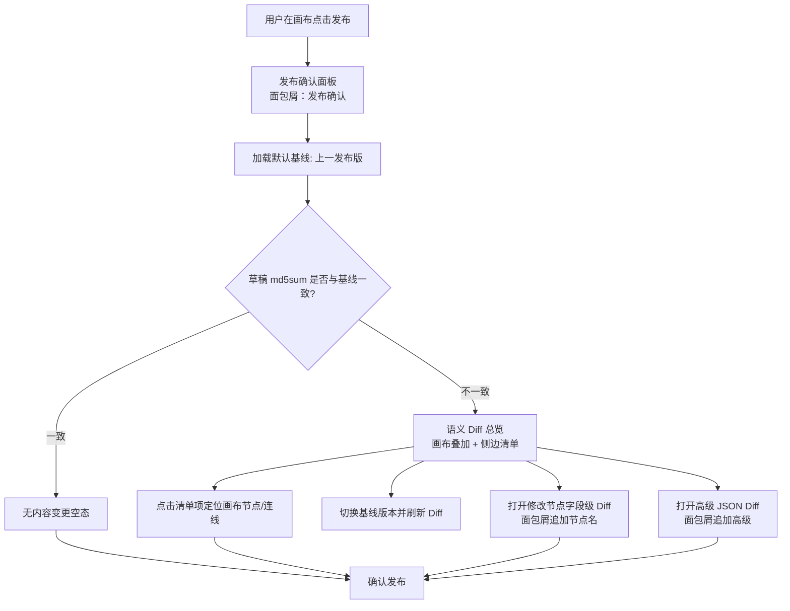

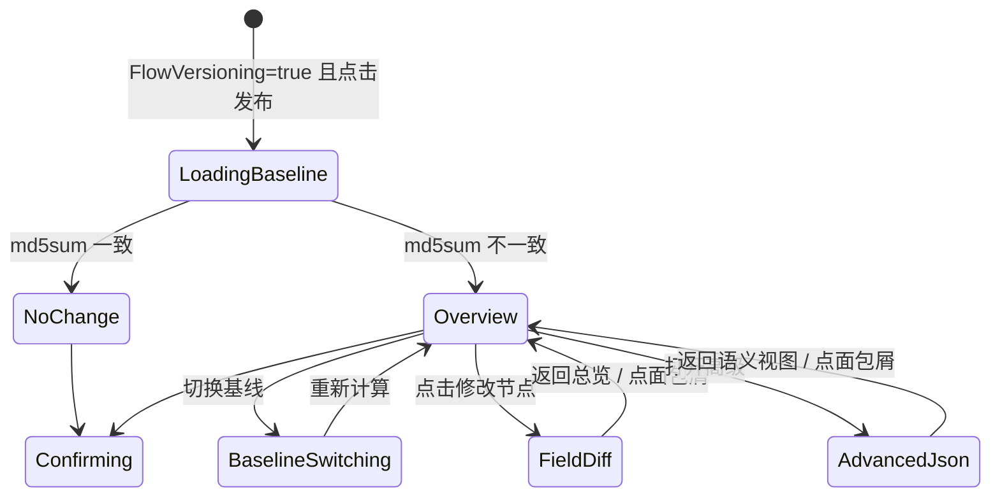

## 弹窗内面包屑（全屏统一）

发布确认 Dialog 标题栏下方（或标题旁）展示当前位置，便于从清单钻入节点 Diff / 高级视图后回退：

| 屏 | 面包屑 |
|----|--------|
| 01 总览 | `发布确认` |
| 02 基线切换 | `发布确认` |
| 03 字段级 Diff | `发布确认 / 版本差异总览 / 灰度发布`（末级为当前节点名；前级可点击返回） |
| 04 高级 JSON | `发布确认 / 版本差异总览 / 高级 Diff` |
| 05 无变更 | `发布确认` |

## 屏 1 · 发布确认与版本差异总览

内嵌在发布确认面板中的主态：左侧画布叠加语义差异，右侧变更清单用于定位。

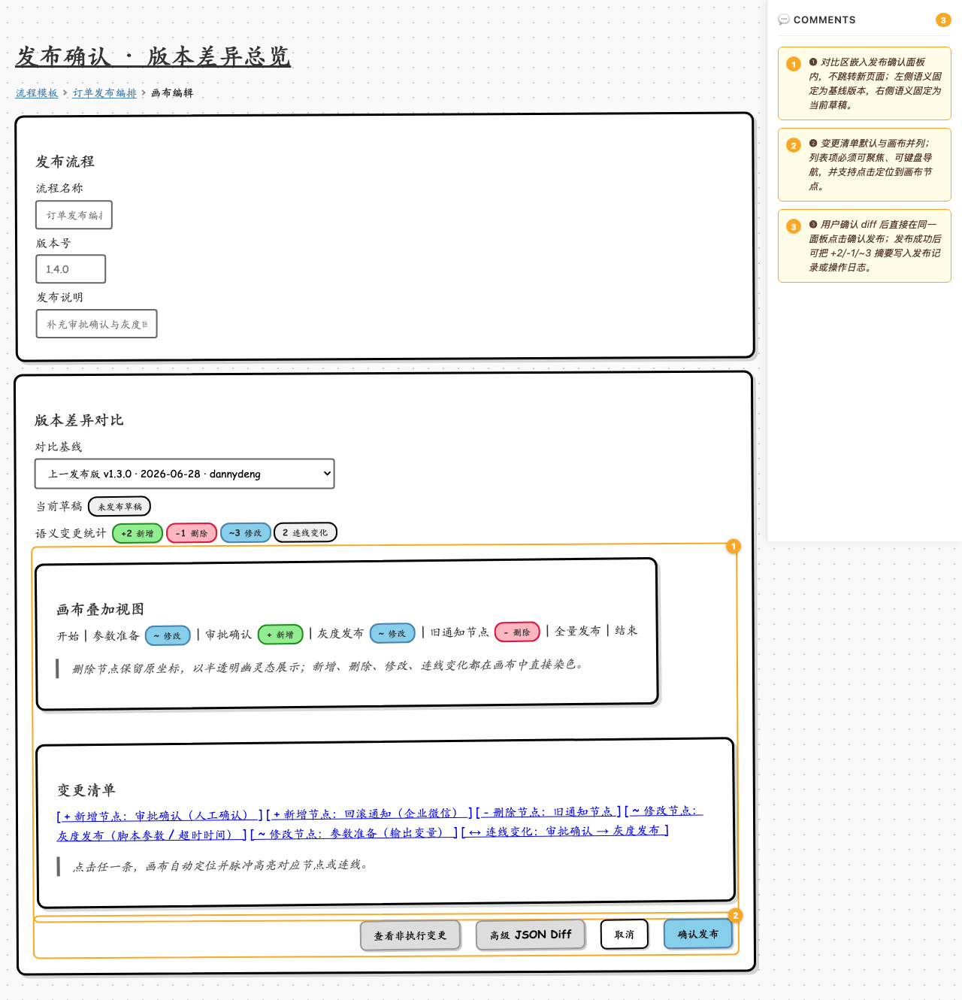

设计稿：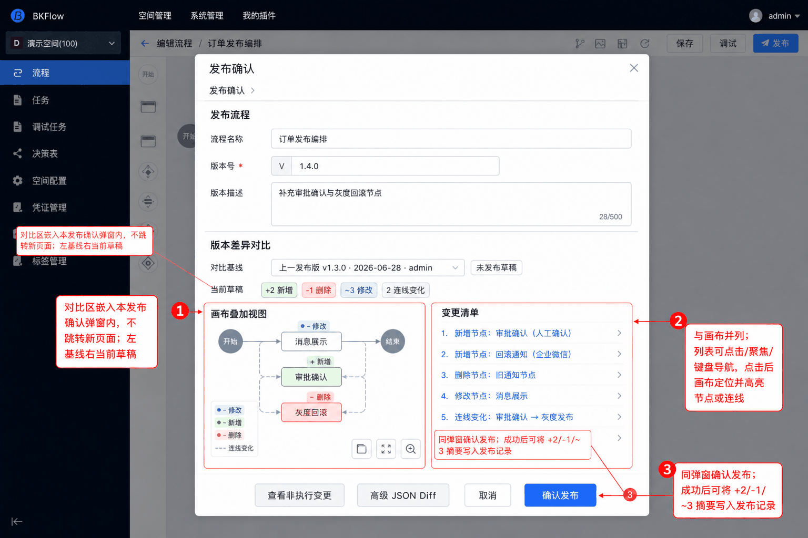

| 编号 | 元素 | 交互说明 |
|------|------|----------|
| ❶ | 对比区 | 嵌入发布确认面板内，不跳转新页面；左侧语义固定为基线版本，右侧语义固定为当前草稿。 |
| ❷ | 变更清单 | 默认与画布并列；列表项可点击、可聚焦、可键盘导航，点击后画布定位并高亮对应节点或连线。 |
| ❸ | 确认发布 | 用户确认 diff 后直接在同一面板发布；发布成功后可把 `+2/-1/~3` 摘要写入发布记录或操作日志。 |

## 屏 2 · 基线切换与列表导航

展示非上一发布版基线、改动很多时的清单分组/搜索，以及画布焦点定位。

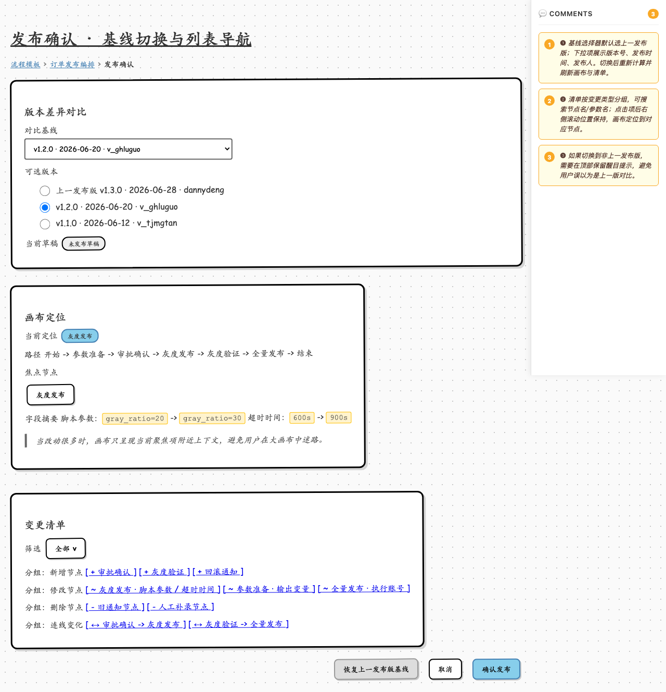

设计稿：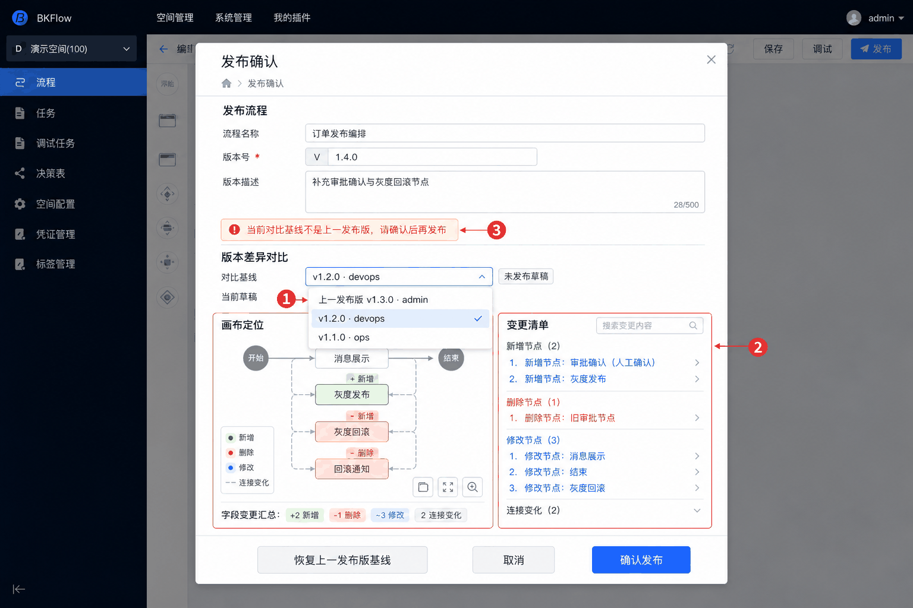

| 编号 | 元素 | 交互说明 |
|------|------|----------|
| ❶ | 基线选择器 | 默认选上一发布版；下拉项展示版本号、发布时间、发布人。切换后重新计算并刷新画布与清单。 |
| ❷ | 变更清单 | 按新增、修改、删除、连线变化分组；支持按节点名/参数名搜索；点击项后保持列表滚动位置。 |
| ❸ | 非默认基线提示 | 如果切换到非上一发布版，需要保留醒目提示，避免误以为仍在和上一版对比。 |

## 屏 3 · 字段级 Diff

从画布节点或清单项进入，展示修改节点内部参数、变量、失败策略等执行语义字段变化。

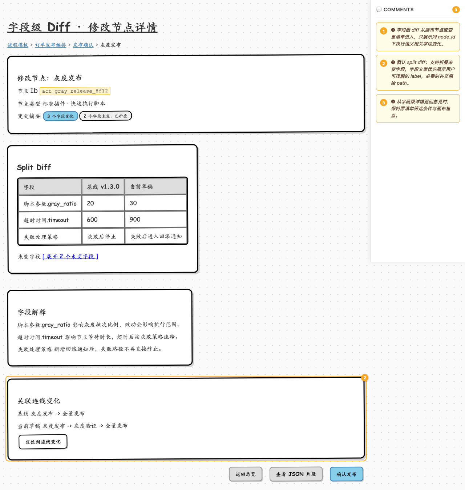

设计稿：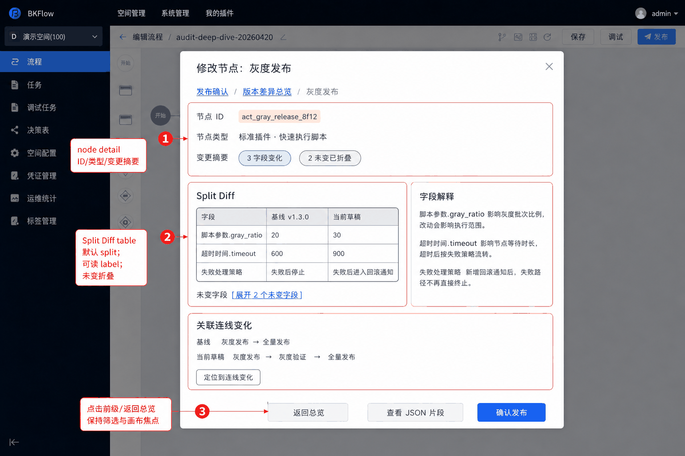

| 编号 | 元素 | 交互说明 |
|------|------|----------|
| ❶ | 修改节点详情 | 只展示同 `node_id` 下执行语义相关字段变化，避免位置变化噪音混入。 |
| ❷ | Split Diff | 默认 split diff；字段文案优先展示用户可理解的 label，必要时补充原始 path；未变字段默认折叠。 |
| ❸ | 面包屑 / 返回总览 | 面包屑 `发布确认 / 版本差异总览 / 灰度发布`；点击前级或「返回总览」后保持原清单筛选条件与画布焦点。 |

## 屏 4 · JSON Diff 与非执行变更

高级用户/排障场景：打开原始 JSON path，同时把 `canvas_pipeline_tree` 视觉变更折叠展示。

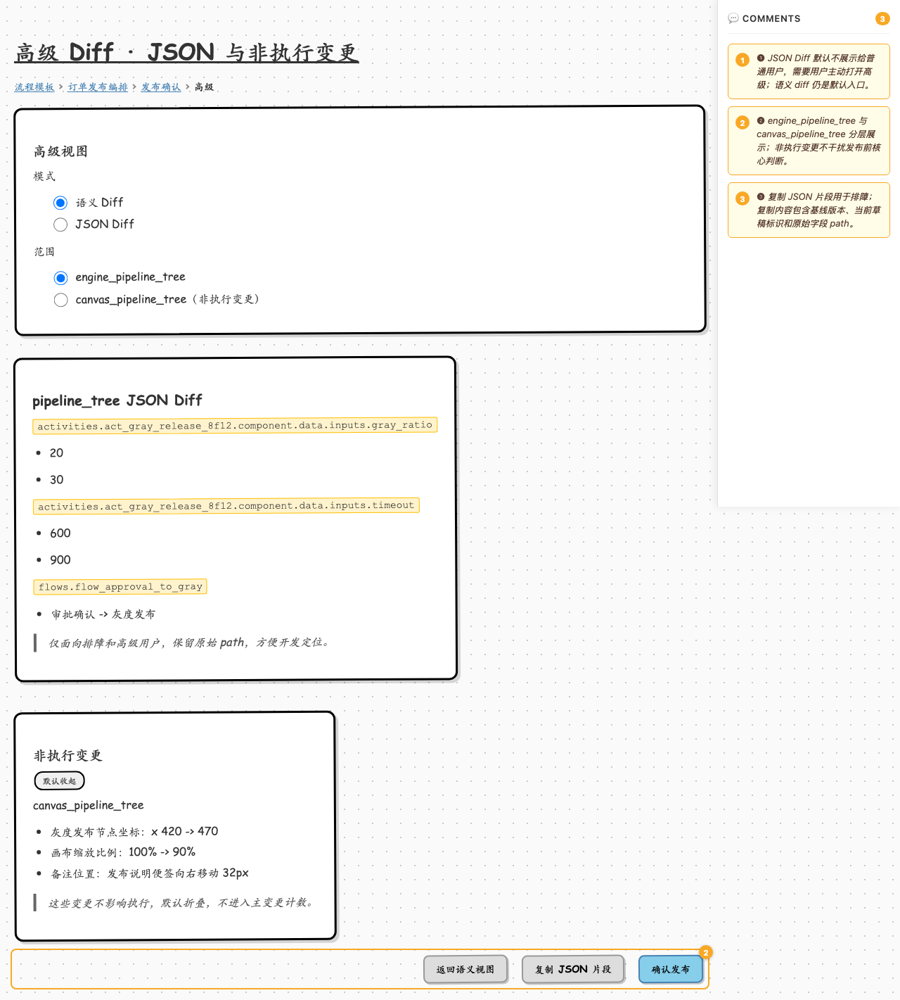

设计稿：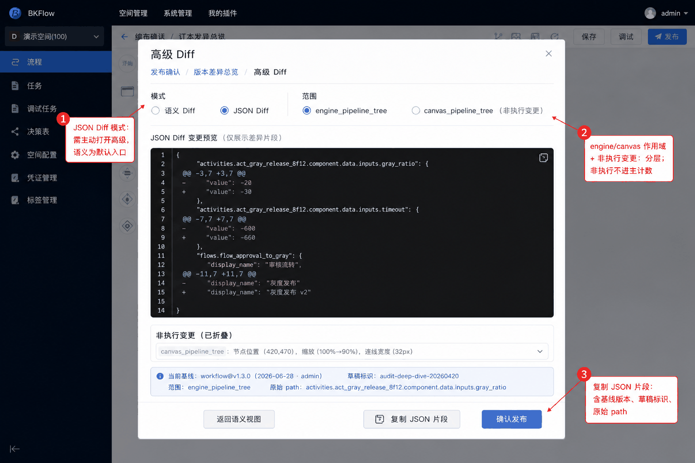

| 编号 | 元素 | 交互说明 |
|------|------|----------|
| ❶ | 高级视图入口 | JSON Diff 默认不展示给普通用户，需要主动打开高级；语义 diff 仍是默认入口。 |
| ❷ | Diff 分层 | `engine_pipeline_tree` 与 `canvas_pipeline_tree` 分层展示；非执行变更默认折叠，不进入主变更计数。 |
| ❸ | 复制 JSON 片段 | 复制内容包含基线版本、当前草稿标识和原始字段 path，便于排障。 |

## 屏 5 · 无内容变更

`md5sum` 一致时展示空态，说明当前草稿和所选基线无内容差异。

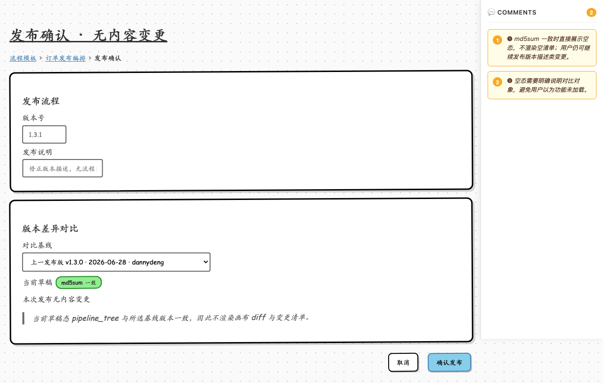

设计稿：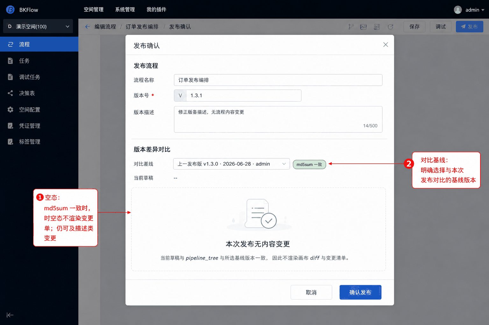

| 编号 | 元素 | 交互说明 |
|------|------|----------|
| ❶ | 无变更空态 | `md5sum` 一致时直接展示空态，不渲染空清单；用户仍可继续发布版本描述类变更。 |
| ❷ | 对比对象说明 | 空态需要明确说明对比对象，避免用户以为功能未加载。 |

## 交付说明

1. 原型覆盖 P0 主态、基线切换、改动很多场景、字段级 Diff、JSON 高级视图、无变更空态。
2. **不覆盖** `FlowVersioning=false`：未开启版本控制时无「发布」弹窗，故无对应设计稿。
3. 全屏发布确认 Dialog 内须有面包屑，钻入节点 Diff / 高级视图时追加层级，前级可点击返回。
4. 视觉稿需补充：发布确认面板布局、四类画布高亮样式、删除节点幽灵态、清单与画布联动动效、字段级 diff 样式、JSON 高级视图。
5. 线框源是唯一真源；若设计师需要导入 Figma，可对 `screens/*.md` 单屏执行 `npx -y @eclectic-ai/wiremd screens/01-release-confirm-diff-overview.md --format json -o 01-release-confirm-diff-overview.json`。
