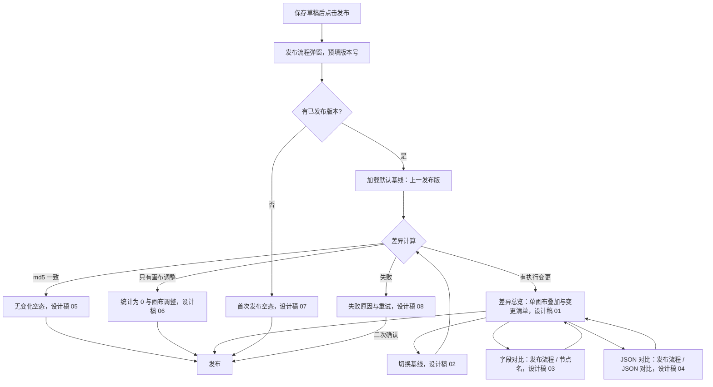
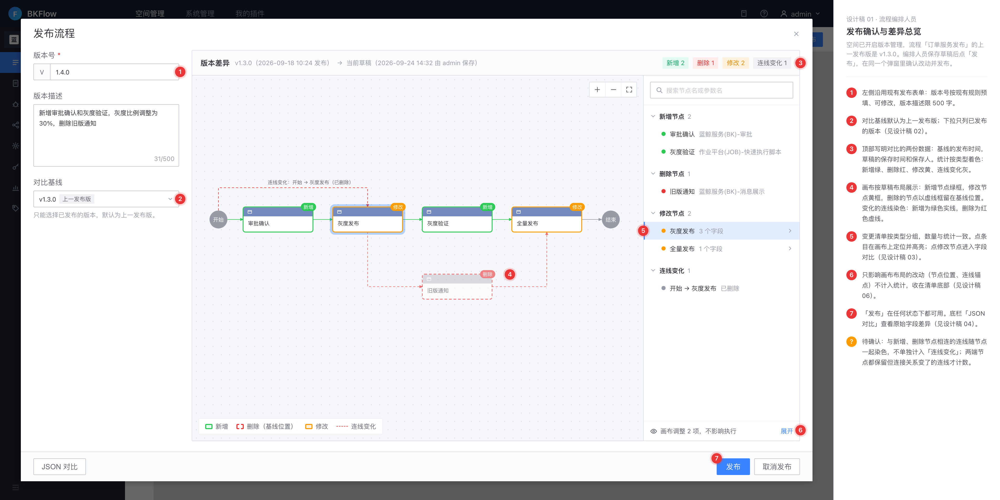
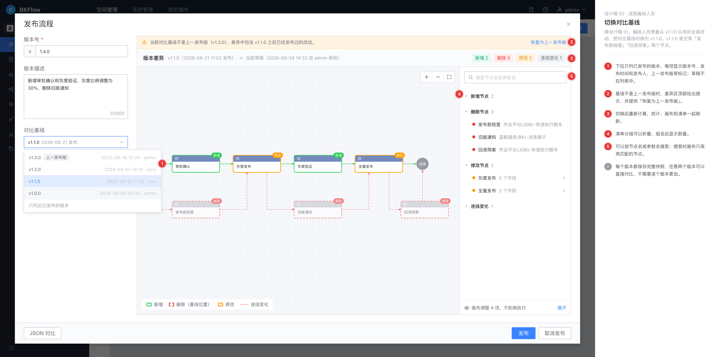
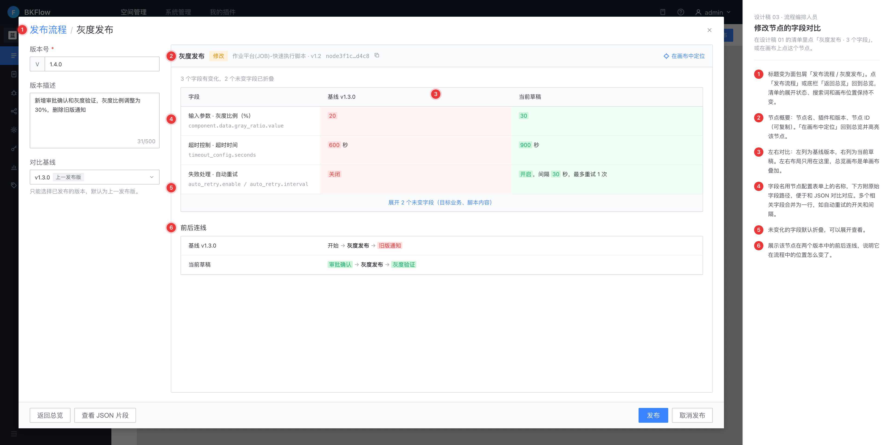
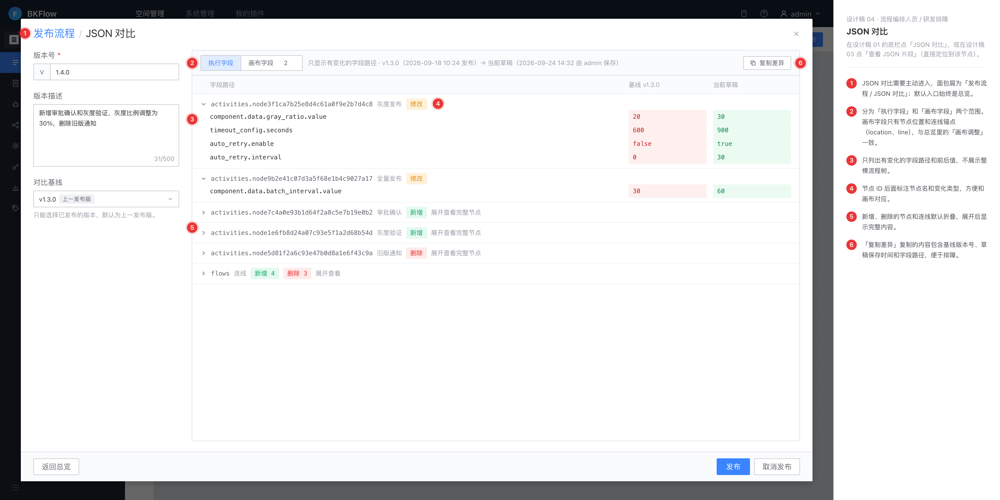
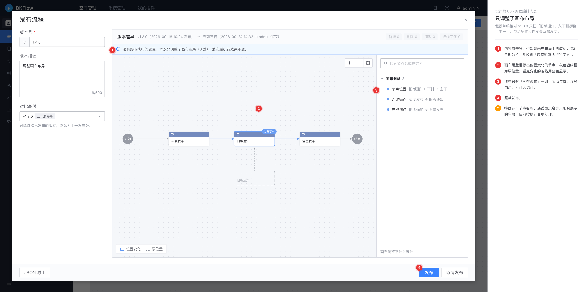
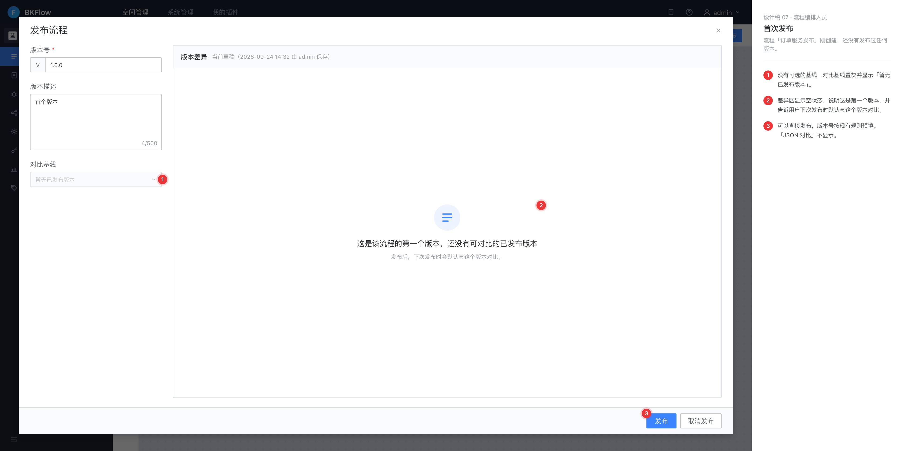
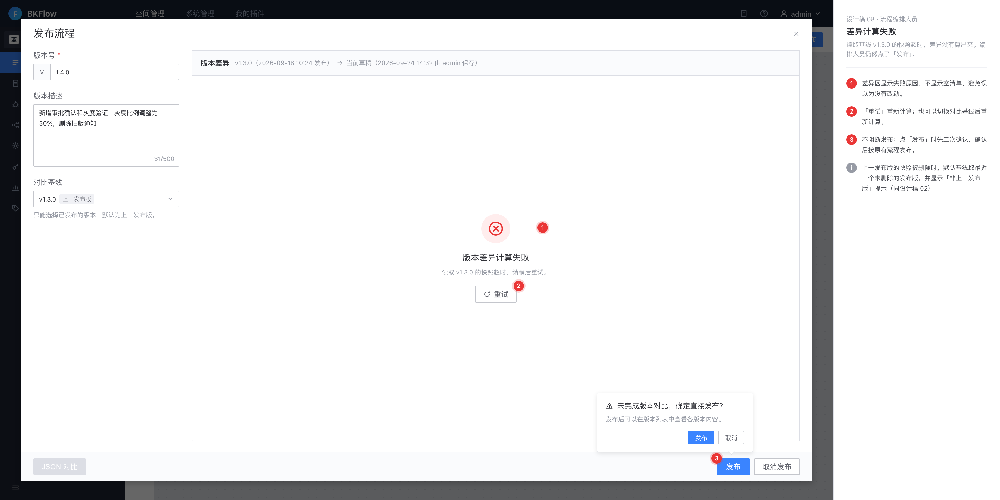

# 流程版本发布前差异对比 · 交互原型与高保真设计稿

- 关联方案同步：`docs/specs/2026-07-09-template-version-diff-design-sync.md`
- 关联 TAPD 父需求：[流程模板版本差异可视化对比（发布前 Diff）](https://tapd.woa.com/tapd_fe/70120217/story/detail/1070120217135668437)
- 关联 TAPD 设计子需求：[原型评审与高保真设计稿](https://tapd.woa.com/tapd_fe/70120217/story/detail/1070120217135883392)
- 高保真稿用 HTML/CSS 按蓝鲸 MagicBox 视觉规范编写，布局参照现网 BKFlow（深色顶栏与导航、流程编辑页、发布弹窗），浏览器 2 倍图截图
- 2026-09-24：低保真线框与简易稿升级为高保真稿，并按评审意见修订（总览改为单画布叠加、面包屑统一为「发布流程 / …」、补充只调整布局、首次发布、计算失败三种状态）；线框已移除，交互与文案以 `hifi/` 为准

## 目录

| 路径 | 说明 |
|------|------|
| `README.md` | 设计要点 + 流程图 + 高保真稿与逐项标注说明 |
| `hifi/*.html` | 高保真页面源文件（`style.css`、`frame.js` 为公共框架，`flow.js` 画布，`ext.css`、`diff.js` 为本需求扩展） |
| `designs/*.png` | 高保真设计稿（3840 宽，右侧为标注说明） |

## 预览与渲染

```bash
cd prototypes/output/template-version-diff

# 浏览器直接打开 hifi/*.html 即可预览；截图：
bash hifi/shoot.sh          # 全部页面
bash hifi/shoot.sh 02 04    # 指定页面
```

---

## 已确认的设计要点

1. **生效范围**：只在开启版本控制（`FlowVersioning`）的空间提供；未开启时没有「发布」入口，也没有本弹窗。
2. **入口**：流程编辑页保存草稿后点「发布」，差异对比嵌在「发布流程」弹窗内，不跳转页面；左侧沿用现有版本号、版本描述表单。
3. **对比对象**：对比基线（默认上一发布版，可切换任意已发布版本）与当前已保存的草稿（标明保存时间和保存人）。
4. **总览画布**：单画布叠加，按草稿布局绘制。新增绿框、修改黄框、删除的节点以红色虚线框留在基线位置；新增连线为绿色实线，删除连线为红色虚线。左右对比只用在字段对比里。
5. **统计口径**：新增 / 删除 / 修改 / 连线变化四类，与清单分组数量一致。只影响画布布局的改动（节点位置 `location`、连线锚点 `line`）不计入统计，收在清单底部的「画布调整」。
6. **下钻**：字段对比的面包屑为「发布流程 / 节点名」，字段用节点配置表单上的名称并附原始路径；JSON 对比的面包屑为「发布流程 / JSON 对比」，分「执行字段 / 画布字段」两个范围，只列有变化的路径。
7. **特殊状态**：无变化、只调整布局、首次发布、计算失败各有独立状态；「发布」始终可用，计算失败时发布前二次确认。

## 全局交互流程



| 状态 | 弹窗标题 / 面包屑 |
|------|------------------|
| 总览、切换基线、无变化、只调整布局、首次发布、计算失败 | `发布流程` |
| 字段对比 | `发布流程 / 灰度发布`（末级为节点名，点「发布流程」或「返回总览」回到总览） |
| JSON 对比 | `发布流程 / JSON 对比` |

---

## 高保真设计稿

每张图右侧为编号标注，编号对应图中红色数字；灰色「i」为补充说明，橙色「?」为待确认项，汇总在文末。数据贯穿同一个流程「订单服务发布」：上一发布版 v1.3.0 为「开始 → 灰度发布 → 旧版通知 → 全量发布 → 结束」；当前草稿新增「审批确认」「灰度验证」，删除「旧版通知」，并修改了「灰度发布」「全量发布」的参数。

### 01 · 发布确认与差异总览



角色：流程编排人员。空间已开启版本管理，流程「订单服务发布」的上一发布版是 v1.3.0。编排人员保存草稿后点「发布」，在同一个弹窗里确认改动并发布。

1. 左侧沿用现有发布表单：版本号按现有规则预填、可修改，版本描述限 500 字。
2. 对比基线默认为上一发布版；下拉只列已发布的版本（见设计稿 02）。
3. 顶部写明对比的两份数据：基线的发布时间，草稿的保存时间和保存人。统计按类型着色：新增绿、删除红、修改黄、连线变化灰。
4. 画布按草稿布局展示：新增节点绿框，修改节点黄框，删除的节点以虚线框留在基线位置。变化的连线染色：新增为绿色实线，删除为红色虚线。
5. 变更清单按类型分组，数量与统计一致。点条目在画布上定位并高亮；点修改节点进入字段对比（见设计稿 03）。
6. 只影响画布布局的改动（节点位置、连线锚点）不计入统计，收在清单底部（见设计稿 06）。
7. 「发布」在任何状态下都可用。底栏「JSON 对比」查看原始字段差异（见设计稿 04）。

- **待确认**：与新增、删除节点相连的连线随节点一起染色，不单独计入「连线变化」；两端节点都保留但连接关系变了的连线才计数。

### 02 · 切换对比基线



角色：流程编排人员。接设计稿 01。编排人员想看从 v1.1.0 以来的全部改动，把对比基线切换为 v1.1.0。v1.1.0 里还有「发布前检查」「回滚预案」两个节点。

1. 下拉只列已发布的版本，每项显示版本号、发布时间和发布人，上一发布版带标记；草稿不在列表中。
2. 基线不是上一发布版时，差异区顶部给出提示，并提供「恢复为上一发布版」。
3. 切换后重新计算，统计、画布和清单一起刷新。
4. 清单分组可以折叠，组名后显示数量。
5. 可以按节点名或参数名搜索；搜索时画布只高亮匹配的节点。

- 说明：每个版本都保存完整快照，任意两个版本可以直接对比，不需要逐个版本累加。

### 03 · 修改节点的字段对比



角色：流程编排人员。在设计稿 01 的清单里点「灰度发布 · 3 个字段」，或在画布上点这个节点。

1. 标题变为面包屑「发布流程 / 灰度发布」。点「发布流程」或底栏「返回总览」回到总览，清单的展开状态、搜索词和画布位置保持不变。
2. 节点概要：节点名、插件和版本、节点 ID（可复制）。「在画布中定位」回到总览并高亮该节点。
3. 左右对比：左列为基线版本，右列为当前草稿。左右布局只用在这里，总览画布是单画布叠加。
4. 字段名用节点配置表单上的名称，下方附原始字段路径，便于和 JSON 对比对应。多个相关字段合并为一行，如自动重试的开关和间隔。
5. 未变化的字段默认折叠，可以展开查看。
6. 展示该节点在两个版本中的前后连线，说明它在流程中的位置怎么变了。

### 04 · JSON 对比



角色：流程编排人员 / 研发排障。在设计稿 01 的底栏点「JSON 对比」，或在设计稿 03 点「查看 JSON 片段」（直接定位到该节点）。

1. JSON 对比需要主动进入，面包屑为「发布流程 / JSON 对比」；默认入口始终是总览。
2. 分为「执行字段」和「画布字段」两个范围。画布字段只有节点位置和连线锚点（location、line），与总览里的「画布调整」一致。
3. 只列出有变化的字段路径和前后值，不展示整棵流程树。
4. 节点 ID 后面标注节点名和变化类型，方便和画布对应。
5. 新增、删除的节点和连线默认折叠，展开后显示完整内容。
6. 「复制差异」复制的内容包含基线版本号、草稿保存时间和字段路径，便于排障。

### 05 · 内容没有变化


角色：流程编排人员。假设草稿保存后没有任何改动，与上一发布版 v1.3.0 完全一致。

1. 直接显示空状态，不渲染空画布和空清单。文案只说结论，不出现技术术语。
2. 仍然可以切换对比基线，查看与更早版本的差异。
3. 仍然可以发布，版本号照常预填。
4. 没有差异时「JSON 对比」置灰。

### 06 · 只调整了画布布局



角色：流程编排人员。假设草稿相对 v1.3.0 只把「旧版通知」从下排挪到了主干上，节点配置和连接关系都没变。

1. 内容有差异，但都是画布布局上的改动。统计全部为 0，并说明「没有影响执行的变更」。
2. 画布用蓝框标出位置变化的节点，灰色虚线框为原位置；锚点变化的连线用蓝色显示。
3. 清单只有「画布调整」一组：节点位置、连线锚点，不计入统计。
4. 照常发布。

- **待确认**：节点名称、连线显示名等只影响展示的字段，目前按执行变更处理。

### 07 · 首次发布



角色：流程编排人员。流程「订单服务发布」刚创建，还没有发布过任何版本。

1. 没有可选的基线，对比基线置灰并显示「暂无已发布版本」。
2. 差异区显示空状态，说明这是第一个版本，并告诉用户下次发布时默认与这个版本对比。
3. 可以直接发布，版本号按现有规则预填。「JSON 对比」不显示。

### 08 · 差异计算失败



角色：流程编排人员。读取基线 v1.3.0 的快照超时，差异没有算出来。编排人员仍然点了「发布」。

1. 差异区显示失败原因，不显示空清单，避免误以为没有改动。
2. 「重试」重新计算；也可以切换对比基线后重新计算。
3. 不阻断发布：点「发布」时先二次确认，确认后按原有流程发布。

- 说明：上一发布版的快照被删除时，默认基线取最近一个未删除的发布版，并显示「非上一发布版」提示（同设计稿 02）。

---

## 待确认

以下问题会影响后端规则或存量兼容，评审时拍板：

- 设计稿 01（发布确认与差异总览）：与新增、删除节点相连的连线随节点一起染色，不单独计入「连线变化」；两端节点都保留但连接关系变了的连线才计数。
- 设计稿 06（只调整了画布布局）：节点名称、连线显示名等只影响展示的字段，目前按执行变更处理。
